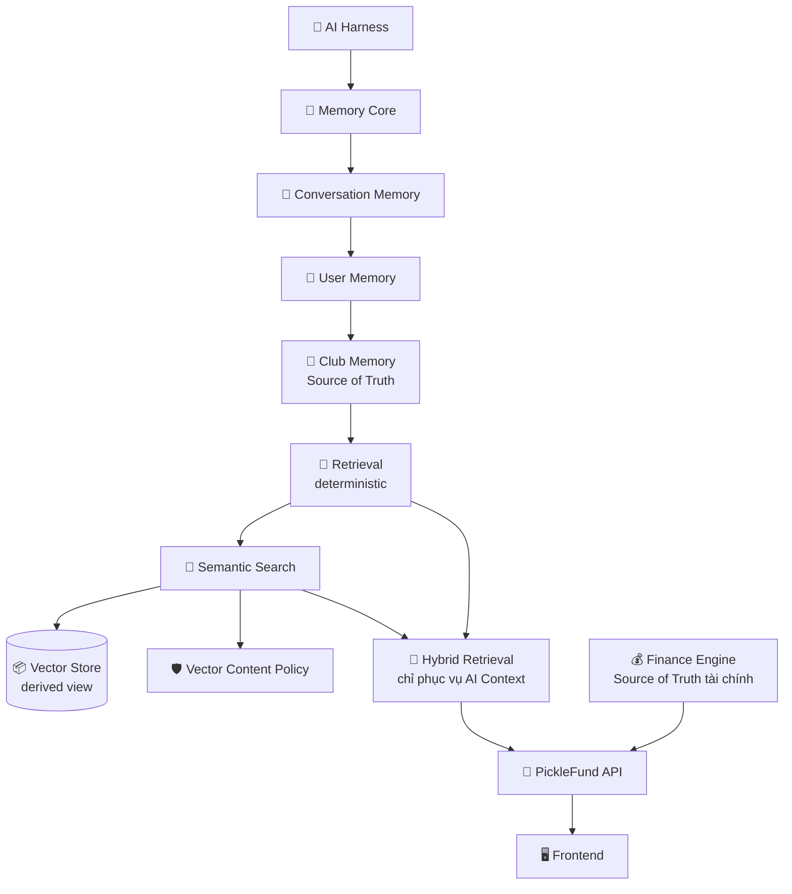

# 📌 PickleFund — PROJECT STATUS

> 🧭 **Trang chủ trạng thái dự án** — dành cho Chủ dự án, thành viên mới, Claude Code, Codex và các AI Agent tương lai.
> Tài liệu phản ánh **đúng trạng thái hiện tại**, không mô tả tính năng chưa triển khai như đã hoàn thành.

**Cập nhật:** 2026-06-30 · **Nhánh:** `main` · **Tag:** `v2.1-sprint2`

---

## 1. 📇 Thông tin dự án

| Mục | Giá trị |
|---|---|
| 🏷️ **Tên dự án** | PickleFund |
| 🎯 **Mục tiêu** | Nền tảng **AI Teammate** cho quản lý & vận hành CLB Pickleball, sẵn sàng mở rộng thành **AI Commerce Platform**. |
| 🔖 **Phiên bản hiện tại** | v2.1 |
| 🏁 **Tag hiện tại** | `v2.1-sprint2` |
| 📦 **Repository** | https://github.com/tunglt6-spec/picklefund |

---

## 2. ✅ Trạng thái dự án

| Hạng mục | Trạng thái |
|---|---|
| Sprint 1 | ✅ Hoàn thành |
| Sprint 2 | ✅ Core Stable · ✅ UI Stable |
| └ Epic 2.1 — Memory Core | ✅ PASS |
| └ Epic 2.2 — Conversation + User Memory | ✅ PASS |
| └ Epic 2.3 — Club Memory + Deterministic Retrieval | ✅ PASS |
| └ Epic 2.4 — Vector Layer | ✅ PASS |
| Technical Baseline v2.0 | ✅ PASS |
| Commit / Tag / Push GitHub | ✅ Hoàn thành |
| └ Epic 2.5 — Dashboard 3.0 (Light Theme & Commercial UI) | ✅ PASS |
| Sprint 3 — Maika AI | ⬜ Chưa bắt đầu |

**Sprint hiện tại:** ➡ Sprint 3 — Maika AI (Ready)

---

## 3. 🏗️ Kiến trúc hiện tại

Luồng tổng thể từ lớp AI tới giao diện:



> 📝 **Ghi chú thực tế:** Vector Store hiện là **in-memory cosine** (derived view). Embedding mặc định là **local hash** (không gọi API ngoài). Backend vector production (PGVector/Qdrant/…) là **deferred** — chưa triển khai.

---

## 4. 📐 Các nguyên tắc kỹ thuật

- 🧩 **Zero Refactor** — mỗi Epic bổ sung thành phần mới, không refactor phần đã đóng.
- 💰 **Finance Isolation** — AI/vector không tính toán tài chính.
- 🏸 **Club Isolation** — mọi truy hồi scope theo `clubId`, không rò rỉ chéo club.
- 📦 **Vector Store = Derived View** — dựng lại được từ Club Memory.
- 🏦 **Finance Engine = Source of Truth** cho mọi con số tài chính.
- 🔒 **PII phải redact** trước khi embed (email/điện thoại/CCCD/số tài khoản).
- 🚫 **Finance content phải block** khỏi embedding/semantic/cache/DLQ.
- 🥇 **Deterministic Retrieval ưu tiên**.
- ➕ **Semantic chỉ supplement** — không override dữ liệu nghiệp vụ.

---

## 5. 🔄 Quy trình phát triển chuẩn

```
Thiết kế
   ↓
Claude Code triển khai
   ↓
Build + Test
   ↓
Codex Audit
   ↓
(Nếu FAIL) → Claude sửa → Codex Re-Audit
   ↓
PASS
   ↓
Technical Baseline (nếu là mốc lớn) → Codex Audit tài liệu
   ↓
Commit
   ↓
Tag
   ↓
Push GitHub
   ↓
Epic tiếp theo
```

> ⛔ **Không được bỏ qua bất kỳ bước nào.** Không tự duyệt (self-approve) thay Codex.

---

## 6. 📱 Quy định triển khai UI

Mọi Epic liên quan giao diện **bắt buộc triển khai đồng bộ** trên 4 nền tảng:

- 🖥️ **Desktop**
- 🌐 **Mobile Web**
- 🍎 **iOS**
- 🤖 **Android**

> ⚠️ Không được để **Desktop có / Mobile không có** (hoặc ngược lại). Tính năng giao diện phải đồng nhất trên mọi nền tảng.

---

## 7. 🗺️ Roadmap

```
Sprint 2 ✅ Hoàn thành
   ↓
Epic 2.5 — Dashboard Light Theme
   ↓
Codex Audit
   ↓
Sprint 2 UI Stable
   ↓
Sprint 3 — Maika AI Organization
   ↓
AI Commerce Platform
```

> 🔭 Các mốc sau Sprint 2 (Epic 2.5, Sprint 3, AI Commerce Platform) **chưa bắt đầu** — chỉ là định hướng.

---

## 8. 🔗 Liên kết tài liệu

| Tài liệu | Đường dẫn |
|---|---|
| 📖 README docs | [docs/README.md](README.md) |
| 🧱 Technical Baseline v2.0 | [technical-baseline-v2.0/README.md](technical-baseline-v2.0/README.md) |
| 📰 Sprint 2 Release Notes | [technical-baseline-v2.0/05-sprint2-release-notes.md](technical-baseline-v2.0/05-sprint2-release-notes.md) |
| 🧠 AI Memory Architecture | [technical-baseline-v2.0/01-ai-memory-architecture.md](technical-baseline-v2.0/01-ai-memory-architecture.md) |
| 🔀 Hybrid Retrieval | [technical-baseline-v2.0/02-hybrid-retrieval-flow.md](technical-baseline-v2.0/02-hybrid-retrieval-flow.md) |
| 💰 Finance Isolation | [technical-baseline-v2.0/04-finance-isolation.md](technical-baseline-v2.0/04-finance-isolation.md) |
| 🛡️ Vector Layer Security | [technical-baseline-v2.0/03-vector-layer-security.md](technical-baseline-v2.0/03-vector-layer-security.md) |

---

## 9. ⚠️ Ranh giới sự thật (không ghi sai)

Trạng thái **CHƯA triển khai** tính đến thời điểm này — không được mô tả như đã hoàn thành:

- ⬜ Sprint 3 **chưa** hoàn thành.
- ⬜ Epic 2.5 **chưa** triển khai.
- ⬜ Dashboard mới (light theme) **chưa** hoàn thành.
- ⬜ Maika AI **chưa** triển khai.
- ⬜ PGVector **chưa** triển khai.
- ⬜ Qdrant **chưa** triển khai.
- ⬜ AI **không** tự tính toán tài chính (Finance Engine là nguồn duy nhất).

---

> 🧾 Tài liệu này là **trang điều hành** của PickleFund. Mỗi khi hoàn thành một Epic/Sprint hoặc đóng một Technical Baseline, cập nhật lại §2 (Trạng thái) và §7 (Roadmap) cho khớp thực tế.
