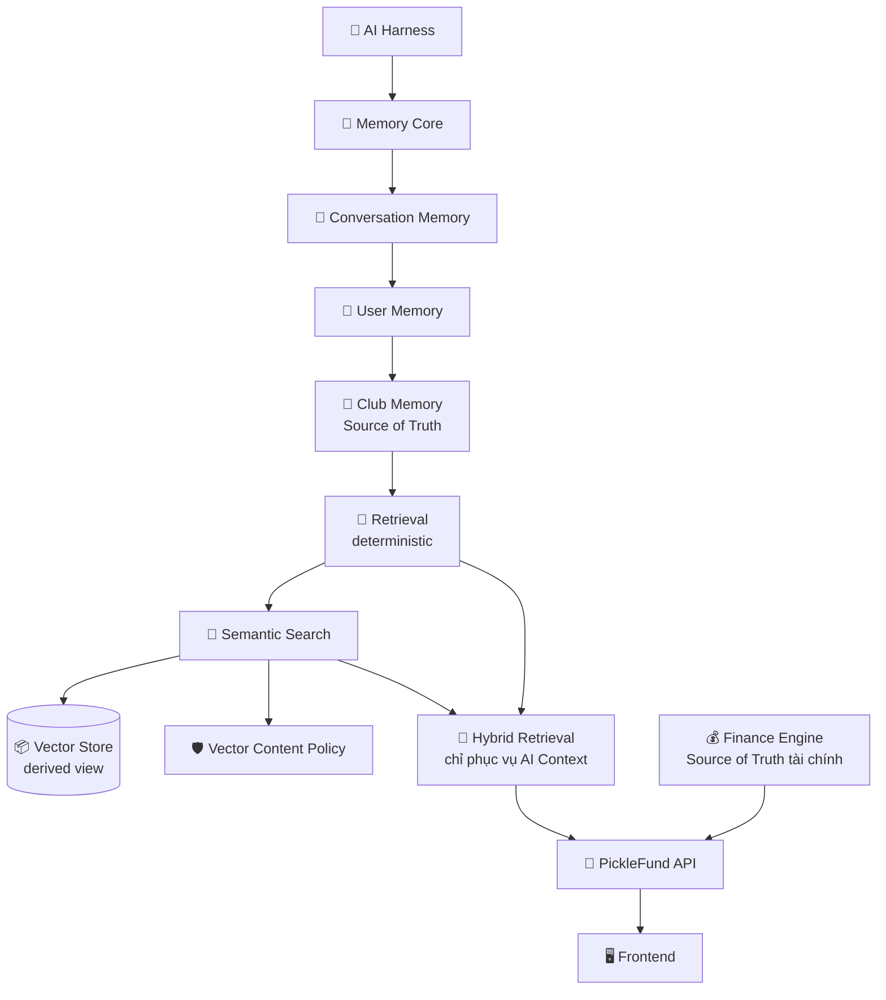

# 📌 PickleFund — PROJECT STATUS

> 🧭 **Trang chủ trạng thái dự án** — dành cho Chủ dự án, thành viên mới, Claude Code, Codex và các AI Agent tương lai.
> Tài liệu phản ánh **đúng trạng thái hiện tại**, không mô tả tính năng chưa triển khai như đã hoàn thành.

**Cập nhật:** 2026-06-30 · **Nhánh:** `main` · **Tag:** `v2.1-sprint2-ui` (Sprint 2 UI Stable)

---

## 1. 📇 Thông tin dự án

| Mục | Giá trị |
|---|---|
| 🏷️ **Tên dự án** | PickleFund |
| 🎯 **Mục tiêu** | Nền tảng **AI Teammate** cho quản lý & vận hành CLB Pickleball, sẵn sàng mở rộng thành **AI Commerce Platform**. |
| 🔖 **Phiên bản hiện tại** | v2.1 |
| 🏁 **Tag hiện tại** | `v2.1-sprint2-ui` (Sprint 2 UI Stable) · Core: `v2.1-sprint2` |
| 📦 **Repository** | https://github.com/tunglt6-spec/picklefund |

---

## 2. ✅ Trạng thái dự án

| Hạng mục | Trạng thái |
|---|---|
| ⚖️ GOV-01 — Project Governance Baseline v2.1 | ✅ Accepted / Official — Single Source of Truth |
| 🎨 UDP-01 — Design Foundation (Design Source of Truth) | ✅ Codex PASS / CLOSED |
| 🧩 UDP-01 Amendment #01 — Workspace State DoD | ✅ Accepted / Codex PASS |
| 🧩 UDP-01 Amendment #02 — Design Pattern First Rule | ✅ Accepted / Codex PASS |
| ✨ VDS-01 — Visual Design System v2.1 (Visual Constitution) | ✅ Accepted / Codex PASS |
| 🧊 DESIGN-01 — Design Foundation Freeze | ✅ Freeze Declaration (tokens + shared components đóng băng) |
| 📐 DASH-01 — Enterprise Dashboard Pattern | ✅ Codex PASS / Accepted |
| 🎨 UI-02 — Dashboard 4.0 | ✅ Codex PASS / CLOSED (màn Tổng quan theo DASH-01 + UDP-01 — Golden Reference) |
| 👥 UIP-03 — Member Workspace Pattern | ✅ Accepted / Codex PASS (Design Pattern Document, docs-only) |
| 🎨 UI-03 — Member Management Workspace | ✅ Codex PASS / CLOSED (màn Thành viên theo UIP-03 + UDP-01) |
| 👥 UIP-04 — Finance Workspace Pattern | ✅ Accepted / Codex PASS (Design Pattern Document, docs-only) |
| 🎨 UI-04 — Finance Workspace | ✅ Codex PASS / CLOSED (màn Tài chính theo UIP-04; Backend Summary = Source of Truth) |
| 📊 UIP-05 — Reports Center Pattern | ✅ Accepted / Codex PASS (Design Pattern Document, docs-only) |
| 🎨 UI-05 — Reports Center | ✅ Codex PASS / CLOSED (màn Báo cáo theo UIP-05 + VDS-01; Backend Summary = Source of Truth) |
| 🏆 UIP-06 — Tournament Center Pattern | 🟢 READY TO START (Design Pattern trước UI-06 theo Amendment #02; chưa mở) |
| 🎨 UI-06 — Tournament Center | ⛔ BLOCKED — until UIP-06 Official |
| Sprint 1 | ✅ Hoàn thành |
| Sprint 2 | ✅ Core Stable · ✅ UI Stable |
| └ Epic 2.1 — Memory Core | ✅ PASS |
| └ Epic 2.2 — Conversation + User Memory | ✅ PASS |
| └ Epic 2.3 — Club Memory + Deterministic Retrieval | ✅ PASS |
| └ Epic 2.4 — Vector Layer | ✅ PASS |
| Technical Baseline v2.0 | ✅ PASS |
| Commit / Tag / Push GitHub | ✅ Hoàn thành |
| └ Epic 2.5 — Dashboard 3.0 (Light Theme & Commercial UI) | ✅ PASS |
| Sprint 3 — Maika AI (Governance Layer) | ✅ PASS / CLOSED |
| └ Epic 3.1 — Maika Core (Club Intelligence Manager) | ✅ PASS / CLOSED |
| └ Epic 3.2 — Organization Intelligence | ✅ PASS / CLOSED |
| └ Epic 3.3 — Workflow Planning | ✅ PASS / CLOSED |
| └ Epic 3.4 — AI Action Layer | ✅ PASS / CLOSED |
| └ Epic 3.5 — Human Approval Engine | ✅ PASS / CLOSED |
| └ Sprint 3 — Final Governance Audit | ✅ PASS |
| Sprint 4 — ADR-01 Execution Engine Architecture | ✅ Codex PASS (tài liệu thiết kế) |
| Sprint 4 — ADR-02 Execution Governance Model | ✅ Codex PASS (tài liệu quản trị) |
| Sprint 4 — ADP-01 Decision to Proceed | ✅ APPROVED FOR LIMITED IMPLEMENTATION |
| └ Epic 4.1 — Execution Ticket Framework | ✅ PASS / CLOSED (framework-only, không execute) |
| Sprint 4 — ADR-03 Execution State Strategy | ✅ Codex PASS / Accepted (chuẩn bị Epic 4.2) |
| └ Epic 4.2 — Execution State Machine | ⛔ BLOCKED (chưa mở; chờ quyết định triển khai riêng theo Execution Gate; Execution Readiness vẫn NOT READY) |
| Sprint 4 — Execution Engine (implementation) | 🟡 PARTIALLY APPROVED (Epic 4.1 CLOSED) · Epic 4.2+ ⛔ BLOCKED |

**Sprint hiện tại:** Sprint 4 — Execution Foundation · **ADR-01 PASS · ADR-02 PASS · ADP-01 APPROVED · Epic 4.1 PASS/CLOSED** · Sprint 4 **PARTIALLY APPROVED** (Epic 4.2+ **BLOCKED**) · **Execution Readiness: NOT READY** (chưa có execution thật)

> ⚖️ **GOV-01 — Project Governance Baseline v2.1: Accepted / Official** ([Single Source of Truth](governance/GOV-01-project-governance-baseline-v2.1.md)). **Rule #17 (Governance Source of Truth) đã có hiệu lực** — tài liệu khác chỉ tham chiếu GOV-01, không định nghĩa lại rule. **Governance Pre-Audit Checklist (GOV-01 §9) là BẮT BUỘC** trước mỗi "READY FOR CODEX AUDIT". GOV-01 **không** thay đổi Execution Readiness (vẫn NOT READY) và **không** mở Epic 4.1.

> 🤖 **Maika (Epic 3.1 → 3.5) hiện tại đều READ-ONLY / không thực thi.**
>
> **Organization Intelligence (3.2)** read-only: `summary`/`entities`/`healthSignals`/`attentionSignals`/`dataQualitySignals`/`suggestedReadActions` (GET, mutates=false)/`safety`.
>
> **Workflow Planning (3.3)** preview/read-only: `status:preview` · `readOnly` · `mutates=false` · `requiresHumanApproval` · `suggestedReadActions` chỉ GET · `actionExecutionAllowed=false`/`writeOperationsAllowed=false`.
>
> **AI Action Layer (3.4)** chỉ hỗ trợ: **Action Proposal · Permission Check · Safety Check · Dry-run · AuditLogPreview**.
>
> **Human Approval Engine (3.5)** chỉ hỗ trợ: **policies · evaluate · preview · deterministic approval policy**. Mọi ApprovalRequest: `executionAllowed=false` · `approved=false` · `approvedBy=null` · `approvedAt=null` · `status=pending`.
>
> Maika (toàn bộ) KHÔNG hỗ trợ: Action Execution · API Write · DB Write · Email · Telegram · Notification · Workflow Execution · Job Queue · Background Worker.
>
> ✅ **Sprint 3 CLOSED** — Governance Layer (Epic 3.1 → 3.5) + **Sprint 3 Final Governance Audit PASS**.
>
> **Execution Readiness: CHƯA ĐẠT / NOT READY** — dù Sprint 3 đã đóng, Execution Readiness vẫn cần đủ điều kiện ADR-02 §9 (ADR-01+ADR-02 PASS, Epic 4.1–4.6 PASS, Sprint 4 Governance Audit PASS, không Critical/High finding). **Sprint 4 implementation: 🟡 PARTIALLY APPROVED** · Epic 4.1 ✅ PASS / CLOSED (framework-only) · Epic 4.2+ ⛔ BLOCKED.
>
> 📝 **Sprint 4 (chỉ tài liệu):** [ADR-01](sprint4-execution-engine/ADR-01-execution-engine-architecture.md) ✅ Codex PASS · [ADR-02](sprint4-execution-engine/ADR-02-execution-governance-model.md) ✅ Codex PASS · [ADP-01 Decision to Proceed](sprint4-execution-engine/ADP-01-decision-to-proceed.md) ✅ **APPROVED FOR LIMITED IMPLEMENTATION**. Maika hiện ở **Maturity Level 2 (Dry Run)**; Level 4 (Autonomous) bị cấm.
>
> ✅ **Epic 4.1 (Execution Ticket Framework): PASS / CLOSED** — framework-only (Execution Ticket/State/Validation/Guard/Metadata + repository in-memory volatile), **KHÔNG execute/write/connector/finance**. **Epic 4.2+ vẫn BLOCKED.** Sprint 4 implementation = **PARTIALLY APPROVED**. Execution Engine chưa tồn tại; Execution Readiness **NOT READY**. **Maika chưa được phép execute.**
>
> ✅ **ADR-03 (Execution State Strategy): Codex PASS / Accepted** ([link](sprint4-execution-engine/ADR-03-execution-state-strategy.md)) — chuẩn bị cho Epic 4.2 (chọn **Pure State Machine**, không event-driven/queue/worker/persistence). ADR-03 **không** thay đổi Execution Readiness; **Epic 4.2 chưa mở** (chờ quyết định triển khai riêng).
>
> Maika **VẪN CHƯA được phép**: execute action · gọi API Write · ghi DB · gửi Email/Telegram/Notification · chạy Workflow/Automation · tạo Job Queue/Background Worker.
> Mọi số liệu tài chính lấy trực tiếp từ PickleFund API (Finance Engine = Source of Truth); Maika KHÔNG tính/kết luận tài chính.

---

## 3. 🏗️ Kiến trúc hiện tại

Luồng tổng thể từ lớp AI tới giao diện:



> 📝 **Ghi chú thực tế:** Vector Store hiện là **in-memory cosine** (derived view). Embedding mặc định là **local hash** (không gọi API ngoài). Backend vector production (PGVector/Qdrant/…) là **deferred** — chưa triển khai.

---

## 4. 📐 Nguyên tắc kỹ thuật & quản trị

Technical Governance và Project Governance tuân thủ **GOV-01** (Single Source of Truth). Tài liệu này **không** định nghĩa lại rule.

Chi tiết xem:
- [docs/governance/GOV-01-project-governance-baseline-v2.1.md](governance/GOV-01-project-governance-baseline-v2.1.md)
- và Technical Baseline tương ứng: [docs/technical-baseline-v2.0/README.md](technical-baseline-v2.0/README.md).

---

## 5. 🔄 Quy trình phát triển

Quy trình Delivery Pipeline và Governance Workflow được định nghĩa trong **GOV-01** (Rule 12 và §6). Xem [GOV-01](governance/GOV-01-project-governance-baseline-v2.1.md).

---

## 6. 📱 Quy định triển khai UI

Quy định đồng bộ UI đa nền tảng (Desktop / Mobile Web / iOS / Android) được định nghĩa trong **GOV-01 Rule 11 (Feature Parity Rule)**. Xem [GOV-01](governance/GOV-01-project-governance-baseline-v2.1.md).

---

## 7. 🗺️ Roadmap

```
Sprint 2 ✅ Hoàn thành (Core Stable)
   ↓
Epic 2.5 — Dashboard 3.0 (Light Theme) ✅ PASS
   ↓
Codex Re-Audit ✅ PASS
   ↓
Sprint 2 UI Stable ✅
   ↓
Sprint 3 — Maika AI (Governance Layer)  ✅ PASS / CLOSED
   ├─ Epic 3.1 — Maika Core (read-only) ✅ PASS / CLOSED
   ├─ Epic 3.2 — Organization Intelligence (read-only) ✅ PASS / CLOSED
   ├─ Epic 3.3 — Workflow Planning (preview/read-only) ✅ PASS / CLOSED
   ├─ Epic 3.4 — AI Action Layer (proposal/dry-run) ✅ PASS / CLOSED
   ├─ Epic 3.5 — Human Approval Engine (evaluate/preview) ✅ PASS / CLOSED
   └─ Sprint 3 — Final Governance Audit ✅ PASS
   ↓
Sprint 4 — ADR-01 Execution Engine Architecture ✅ Codex PASS
   ↓
Sprint 4 — ADR-02 Execution Governance Model ✅ Codex PASS
   ↓
Sprint 4 — ADP-01 Decision to Proceed ✅ APPROVED FOR LIMITED IMPLEMENTATION
   ↓
Sprint 4 — Epic 4.1 Execution Ticket Framework  ✅ PASS / CLOSED (framework-only; không execute)
   ↓
Sprint 4 — ADR-03 Execution State Strategy ✅ Codex PASS / Accepted
   ↓
Sprint 4 — Epic 4.2 Execution State Machine  ⛔ BLOCKED (chưa mở; chờ quyết định triển khai riêng theo Execution Gate; Execution Readiness vẫn NOT READY)
   ↓
Sprint 4 — Epic 4.3+ / Execution Engine  ⛔ BLOCKED (Execution Readiness vẫn NOT READY)
   ↓
AI Commerce Platform  🔭 Planned
```

> 🔭 Các mốc sau **Sprint 2 UI Stable**:
> - **Sprint 3 – Maika AI (Governance Layer)** ✅ **PASS / CLOSED** — Epic 3.1 → 3.5 ✅ PASS; **Sprint 3 Final Governance Audit ✅ PASS** (read-only, không execute).
> - **Sprint 4 – ADRs/ADP:** ADR-01 ✅ PASS; ADR-02 ✅ PASS; **ADP-01 ✅ APPROVED**; **ADR-03 ✅ Codex PASS / Accepted** (chuẩn bị Epic 4.2 — Pure State Machine).
> - **Sprint 4 – Epic 4.1** ✅ PASS / CLOSED (framework-only); **Epic 4.2 ⛔ BLOCKED** (chờ quyết định triển khai riêng theo Execution Gate); Epic 4.3+ BLOCKED; Execution Readiness vẫn NOT READY.
> - **Design Program:** UDP-01 Foundation ✅ **CLOSED** → DESIGN-01 🧊 **Freeze** → DASH-01 ✅ **Codex PASS / Accepted** (Dashboard Pattern) → **UI-02 Dashboard 4.0 ✅ Codex PASS / CLOSED** (Golden Reference) → **UIP-03 Member Workspace Pattern ✅ Accepted / Codex PASS** → **UI-03 Member Management Workspace ✅ Codex PASS / CLOSED** → **UDP-01 Amendment #01 ✅ Accepted / Codex PASS** → **UDP-01 Amendment #02 ✅ Accepted / Codex PASS** → **UIP-04 Finance Workspace Pattern ✅ Accepted / Codex PASS** → **UI-04 Finance Workspace ✅ Codex PASS / CLOSED** → **VDS-01 Visual Design System ✅ Accepted / Codex PASS** → **UIP-05 Reports Center Pattern ✅ Accepted / Codex PASS** → **UI-05 Reports Center ✅ Codex PASS / CLOSED** → **UIP-06 Tournament Center Pattern 🟢 READY TO START** → **UI-06 Tournament Center ⛔ BLOCKED** (until UIP-06 Official; chưa mở implementation).
> - **AI Commerce Platform (Planned)**

---

## 8. 🔗 Liên kết tài liệu

| Tài liệu | Đường dẫn |
|---|---|
| 📖 README docs | [docs/README.md](README.md) |
| 🧱 Technical Baseline v2.0 | [technical-baseline-v2.0/README.md](technical-baseline-v2.0/README.md) |
| 📰 Sprint 2 Release Notes | [technical-baseline-v2.0/05-sprint2-release-notes.md](technical-baseline-v2.0/05-sprint2-release-notes.md) |
| 🧠 AI Memory Architecture | [technical-baseline-v2.0/01-ai-memory-architecture.md](technical-baseline-v2.0/01-ai-memory-architecture.md) |
| 🔀 Hybrid Retrieval | [technical-baseline-v2.0/02-hybrid-retrieval-flow.md](technical-baseline-v2.0/02-hybrid-retrieval-flow.md) |
| 💰 Finance Isolation | [technical-baseline-v2.0/04-finance-isolation.md](technical-baseline-v2.0/04-finance-isolation.md) |
| 🛡️ Vector Layer Security | [technical-baseline-v2.0/03-vector-layer-security.md](technical-baseline-v2.0/03-vector-layer-security.md) |

---

## 9. ⚠️ Ranh giới sự thật (không ghi sai)

**Đã hoàn thành (Codex PASS):**

- ✅ **Epic 2.5 — PASS** · Dashboard 3.0 (Light Theme) · thuộc **Sprint 2 UI Stable**.
- ✅ **Dashboard 3.0 (Light Theme) — Hoàn thành** · đã được **Codex Re-Audit PASS** · thuộc **Sprint 2 UI Stable**.
- ✅ **Epic 3.1 — Maika Core — PASS / CLOSED** · Club Intelligence Manager **READ-ONLY** (Hiểu → Lập kế hoạch → Đề xuất).
- ✅ **Epic 3.2 — Organization Intelligence — PASS / CLOSED** · READ-ONLY (summary/entities/signals/suggestedReadActions GET mutates=false/safety model).
- ✅ **Epic 3.3 — Workflow Planning — PASS / CLOSED** · chỉ **preview/read-only** (status:preview · readOnly · mutates=false · requiresHumanApproval · actionExecutionAllowed=false · writeOperationsAllowed=false).
- ✅ **Epic 3.4 — AI Action Layer — PASS / CLOSED** · chỉ **Action Proposal · Permission Check · Safety Check · Dry-run · AuditLogPreview** (executionStatus=not_executed · không execute/write/persist).
- ✅ **Epic 3.5 — Human Approval Engine — PASS / CLOSED** · chỉ **policies · evaluate · preview · deterministic approval policy** (executionAllowed=false · approved=false · approvedBy=null · approvedAt=null · status=pending).
- ✅ **Sprint 3 — Final Governance Audit — PASS** · **Sprint 3 CLOSED** (Governance Layer hoàn thành).
- ✅ **Sprint 4 ADR-01 — Codex PASS** (tài liệu kiến trúc Execution Engine).
- ✅ **Sprint 4 ADR-02 — Codex PASS** (tài liệu quản trị Execution).
- ✅ **Sprint 4 ADP-01 — APPROVED FOR LIMITED IMPLEMENTATION** — cho phép mở **duy nhất Epic 4.1**.
- ✅ **Sprint 4 Epic 4.1 — Execution Ticket Framework — PASS / CLOSED** · framework-only (ticket/state/validation/guard/metadata + repository in-memory volatile) · **KHÔNG execute/write/persist DB/connector/finance**.
- ✅ **Sprint 4 ADR-03 — Execution State Strategy — Codex PASS / Accepted** (tài liệu chiến lược state machine; Pure State Machine cho Epic 4.2).

Trạng thái **CHƯA triển khai / CHƯA được phép** tính đến thời điểm này — không được mô tả như đã hoàn thành:

- ⛔ Sprint 4 — Epic 4.2 Execution State Machine: **BLOCKED**, chưa mở (chờ quyết định triển khai riêng).
- ⛔ Sprint 4 — Epic 4.3+ / Execution Engine: **BLOCKED** (Execution Engine chưa tồn tại).
- ⛔ **Execution Readiness: CHƯA ĐẠT / NOT READY** — ADP-01 không thay đổi; cần đủ điều kiện ADR-02 §9 (ADR-01+ADR-02 PASS, Epic 4.1–4.6 PASS, Sprint 4 Governance Audit PASS).
- ⛔ Maika **CHƯA được phép**: execute action · gọi API Write · ghi DB · gửi Email/Telegram/Notification · chạy Workflow/Automation · tạo Job Queue/Background Worker.
- ⬜ AI Commerce Platform: **Planned**, chưa bắt đầu.
- ⬜ PGVector **chưa** triển khai.
- ⬜ Qdrant **chưa** triển khai.
- ⬜ AI **không** tự tính toán tài chính (Finance Engine là nguồn duy nhất).

---

> 🧾 Tài liệu này là **trang điều hành** của PickleFund. Mỗi khi hoàn thành một Epic/Sprint hoặc đóng một Technical Baseline, cập nhật lại §2 (Trạng thái) và §7 (Roadmap) cho khớp thực tế.
