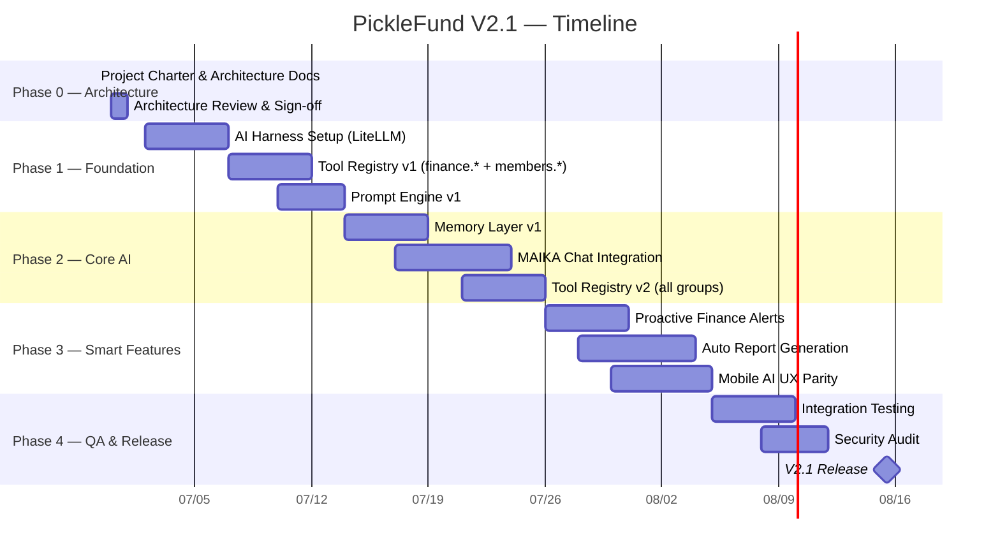

# 01 — PROJECT CHARTER
## PickleFund V2.1 — AI Brain Foundation

---

**Phiên bản:** 1.0.0
**Ngày:** 2026-06-29
**Trạng thái:** APPROVED
**Tác giả:** tunglt6-spec

---

## Lịch sử sửa đổi

| Phiên bản | Ngày | Tác giả | Mô tả |
|---|---|---|---|
| 1.0.0 | 2026-06-29 | tunglt6-spec | Khởi tạo — Phase 0 Architecture |

---

## Mục lục

1. [Vision](#1-vision)
2. [Mission](#2-mission)
3. [Business Goals](#3-business-goals)
4. [Technical Goals](#4-technical-goals)
5. [Success Criteria](#5-success-criteria)
6. [Out of Scope](#6-out-of-scope)
7. [Milestones](#7-milestones)
8. [Sprint Roadmap](#8-sprint-roadmap)
9. [Stakeholders](#9-stakeholders)
10. [Risks](#10-risks)
11. [Assumptions](#11-assumptions)
12. [Constraints](#12-constraints)
13. [Glossary](#13-glossary)
14. [Cross References](#14-cross-references)

---

## 1. Vision

PickleFund V2.1 là nền tảng **AI-augmented club finance management** đầu tiên tại Việt Nam dành cho các CLB thể thao không chuyên.

Mọi thành viên CLB — từ thủ quỹ đến thành viên thông thường — đều có thể tương tác với hệ thống tài chính thông qua ngôn ngữ tự nhiên, được trợ lý AI hướng dẫn, và vẫn đảm bảo dữ liệu tài chính được tính toán hoàn toàn bởi **Finance Engine RC1** (Source of Truth bất biến).

> "AI trả lời câu hỏi. Finance Engine tính toán sự thật."

---

## 2. Mission

Xây dựng **AI Brain** cho PickleFund — một lớp trí tuệ nhân tạo có khả năng:

- Trả lời câu hỏi nghiệp vụ từ dữ liệu thực
- Hướng dẫn thủ quỹ thực hiện các tác vụ phức tạp
- Tóm tắt và phân tích dữ liệu CLB tự động
- Nhắc nhở, cảnh báo, gợi ý hành động
- Tích hợp nhiều LLM provider qua AI Harness thống nhất

AI Brain **không** thay thế Finance Engine. AI Brain **đọc và diễn giải** dữ liệu từ Finance Engine.

---

## 3. Business Goals

| # | Mục tiêu | Chỉ số đo lường | Thời hạn |
|---|---|---|---|
| BG-01 | Giảm thời gian thủ quỹ xử lý báo cáo cuối kỳ | < 5 phút/kỳ (hiện tại ~30 phút) | Sprint 3 |
| BG-02 | Tăng tỷ lệ thành viên tự tra cứu công nợ | > 80% không cần hỏi thủ quỹ | Sprint 4 |
| BG-03 | Hỗ trợ đa CLB (SaaS expansion) | Onboard 3 CLB mới trong Q3 2026 | Sprint 5 |
| BG-04 | Tạo AI-powered financial report tự động | Gửi báo cáo PDF cuối kỳ tự động | Sprint 4 |
| BG-05 | Cảnh báo tài chính proactive | Thủ quỹ nhận alert trước khi quỹ âm | Sprint 3 |

---

## 4. Technical Goals

| # | Mục tiêu | Chi tiết |
|---|---|---|
| TG-01 | AI Harness đa LLM | LiteLLM gateway hỗ trợ Claude, GPT, Gemini, Ollama, OpenRouter |
| TG-02 | Tool Registry an toàn | AI chỉ gọi qua Tool Registry — không trực tiếp DB/Service |
| TG-03 | Prompt Engine có version | Prompt versioning, A/B testing, fallback |
| TG-04 | Memory Layer phân tầng | Conversation / Club / Member / Business / Long-term |
| TG-05 | Full Audit Trail | Mọi AI action đều log: timestamp, user, tool, model, prompt version |
| TG-06 | Permission-based AI | AI không tự sửa/xoá/tạo giao dịch khi chưa có human confirmation |
| TG-07 | Mobile parity | Mọi AI feature trên Desktop đều có tương đương trên Mobile |
| TG-08 | Finance Engine RC1 bất biến | AI không ghi đè bất kỳ output nào của Finance Engine |

---

## 5. Success Criteria

### Definition of Done — V2.1 Launch

| Tiêu chí | Mô tả |
|---|---|
| SC-01 | AI Brain trả lời đúng > 95% câu hỏi nghiệp vụ test set (50 câu) |
| SC-02 | Latency P95 < 3 giây cho mọi AI response (non-streaming) |
| SC-03 | Tool Registry coverage 100% API endpoints critical path |
| SC-04 | Zero unauthorized finance write operations |
| SC-05 | Audit log 100% AI actions |
| SC-06 | Mobile UI parity với Desktop (responsive 375px → 1920px) |
| SC-07 | LiteLLM failover < 2 giây khi primary model unavailable |
| SC-08 | Memory retention đúng theo policy (conversation: 24h, club: 90 ngày) |
| SC-09 | Finance Engine RC1 không bị sửa đổi (zero git diff trên finance calculator) |
| SC-10 | Backend tests: ≥ 175/175 PASS (không giảm) |

---

## 6. Out of Scope

Các hạng mục **KHÔNG** thuộc V2.1:

| # | Out of Scope | Lý do |
|---|---|---|
| OS-01 | Sửa đổi Finance Engine RC1 | Feature Freeze — Business Baseline bất biến |
| OS-02 | Thay đổi Database Schema | Stability — RC1 schema là final |
| OS-03 | Thay đổi API Contract RC1 | Backward compatibility |
| OS-04 | AI tự tính Quỹ Chính / Quỹ Phụ / Carry Forward / Club Assets | Forbidden pattern — Finance Engine là source of truth |
| OS-05 | Vector Database deployment | Chỉ thiết kế RAG architecture, không triển khai |
| OS-06 | AI multi-agent autonomous workflow | V2.2 roadmap |
| OS-07 | Voice interface | V2.3 roadmap |
| OS-08 | Billing / Payment Gateway | V2.2 commercial roadmap |
| OS-09 | Mobile native app (React Native / Flutter) | Current stack: PWA responsive |
| OS-10 | AI training / fine-tuning | Chỉ dùng API inference |

---

## 7. Milestones

---

## 8. Sprint Roadmap

### Sprint 1 (2026-07-02 → 2026-07-14): Foundation

| Task | Priority | Owner |
|---|---|---|
| AI Harness setup với LiteLLM | P0 | Backend |
| LiteLLM routing: Claude → GPT fallover | P0 | Backend |
| Tool Registry skeleton + finance.* group | P0 | Backend |
| Prompt Engine v1: template + persona | P1 | Backend |
| Backend unit tests cho Tool Registry | P1 | Backend |
| Desktop: AI chat widget placeholder | P2 | Frontend |

### Sprint 2 (2026-07-14 → 2026-07-26): Core AI

| Task | Priority | Owner |
|---|---|---|
| Memory Layer: Conversation + Club memory | P0 | Backend |
| MAIKA persona integration | P0 | Backend |
| Tool Registry: attendance.* + reports.* | P0 | Backend |
| Audit Log middleware | P0 | Backend |
| Desktop: MAIKA chat UI (full) | P1 | Frontend |
| Mobile: MAIKA chat UI parity | P1 | Frontend |

### Sprint 3 (2026-07-26 → 2026-08-05): Smart Features

| Task | Priority | Owner |
|---|---|---|
| Proactive finance alerts (cảnh báo quỹ âm) | P0 | Backend |
| Auto end-of-period report generation | P1 | Backend |
| Memory Layer: Member + Business memory | P1 | Backend |
| Tool Registry: notifications.* + settings.* | P1 | Backend |
| Desktop: Finance Insight panel | P1 | Frontend |
| Mobile: Finance Insight parity | P1 | Frontend |

### Sprint 4 (2026-08-05 → 2026-08-15): QA & Release

| Task | Priority | Owner |
|---|---|---|
| Integration testing (AI + Finance Engine) | P0 | QA |
| Security audit: permission boundary | P0 | Security |
| Performance testing: AI latency P95 | P0 | QA |
| Mobile regression testing | P0 | QA |
| Release documentation update | P1 | All |
| V2.1 deployment | P0 | DevOps |

---

## 9. Stakeholders

| Vai trò | Tên / Nhóm | Trách nhiệm |
|---|---|---|
| Product Owner | tunglt6-spec | Phê duyệt design, prioritization |
| Lead Developer | tunglt6-spec | Architecture, implementation |
| Finance Domain Expert | tunglt6-spec | Xác nhận business rules |
| End Users | Thủ quỹ CLB | User acceptance testing |
| End Users | Thành viên CLB | AI chat feedback |

---

## 10. Risks

| # | Rủi ro | Mức độ | Xác suất | Biện pháp giảm thiểu |
|---|---|---|---|---|
| R-01 | LLM API downtime (Claude/GPT) | Cao | Trung bình | LiteLLM failover + Ollama local fallback |
| R-02 | AI hallucination về số liệu tài chính | Rất cao | Cao | AI chỉ đọc từ Tool Registry — không tự tính |
| R-03 | Cost vượt ngân sách LLM API | Trung bình | Trung bình | Token logging + rate limiting + cost tracking |
| R-04 | Memory layer lưu dữ liệu nhạy cảm | Cao | Thấp | Encryption at rest + GDPR-ready design |
| R-05 | AI thực hiện giao dịch chưa xác nhận | Rất cao | Thấp | Human confirmation required cho mọi write operation |
| R-06 | Mobile UX tụt hậu so với Desktop | Trung bình | Trung bình | Parallel development + shared components |
| R-07 | Prompt injection attacks | Cao | Trung bình | Input sanitization + safety rules trong Prompt Engine |

---

## 11. Assumptions

| # | Giả định |
|---|---|
| A-01 | Finance Engine RC1 không thay đổi trong suốt V2.1 |
| A-02 | API contract RC1 backward compatible |
| A-03 | LiteLLM hỗ trợ tất cả model targets (Claude, GPT, Gemini, Ollama) |
| A-04 | Redis đủ dung lượng cho Memory Layer (conversation cache) |
| A-05 | PostgreSQL schema RC1 là final — không migration mới |
| A-06 | Claude Sonnet 4.x là primary model trong Sprint 1-2 |
| A-07 | Internet connectivity ổn định cho LLM API calls |
| A-08 | Người dùng sử dụng tiếng Việt là chính |

---

## 12. Constraints

| # | Ràng buộc | Nguồn gốc |
|---|---|---|
| C-01 | Finance Engine RC1 là bất biến | Feature Freeze policy |
| C-02 | AI không gọi trực tiếp DB / Repository / Service | Security architecture |
| C-03 | AI không tự sửa/xoá/tạo giao dịch khi chưa có human confirmation | Permission policy |
| C-04 | Mọi AI action phải có audit log | Compliance |
| C-05 | Desktop và Mobile phải đồng bộ UX/UI | Product standard |
| C-06 | Không triển khai Vector DB trong V2.1 | Phạm vi Sprint |
| C-07 | Prompt Engine phải hỗ trợ versioning | Maintainability |
| C-08 | Ngôn ngữ chính: tiếng Việt | Target market |

---

## 13. Glossary

| Thuật ngữ | Định nghĩa |
|---|---|
| AI Brain | Toàn bộ lớp AI của PickleFund V2.1 — AI Harness + Tool Registry + Prompt Engine + Memory Layer |
| Finance Engine RC1 | Module tính toán tài chính PickleFund V2.0 RC1 — Source of Truth bất biến |
| AI Harness | Lớp trừu tượng hóa LLM — routing, failover, retry, cost tracking |
| Tool Registry | Danh sách công cụ AI được phép gọi — wrapper an toàn cho PickleFund API |
| Prompt Engine | Module xây dựng, version hóa, và inject prompt cho AI |
| Memory Layer | Lớp lưu trữ ngữ cảnh hội thoại và business context cho AI |
| MAIKA | AI Teammate persona chính của PickleFund — thủ quỹ AI |
| LiteLLM | Thư viện proxy đa LLM — gateway thống nhất cho Claude/GPT/Gemini/Ollama |
| Human Confirmation | Xác nhận từ người dùng trước khi AI thực hiện write operation |
| Carry Forward | Số dư Quỹ Chính từ kỳ đã đóng — computed by Finance Engine, không tự tính |
| Quỹ Chính | Common Fund — quỹ thu từ thành viên |
| Quỹ Phụ | Auxiliary Fund — quỹ độc lập (minigame, thưởng) |
| Source of Truth | Finance Engine RC1 — mọi số liệu tài chính phải từ đây |
| PWA | Progressive Web App — chiến lược mobile của PickleFund |

---

## 14. Cross References

| Tài liệu | Liên quan |
|---|---|
| [02_AI_ARCHITECTURE_SPECIFICATION.md](02_AI_ARCHITECTURE_SPECIFICATION.md) | Overall AI Platform architecture |
| [03_AI_HARNESS_DESIGN.md](03_AI_HARNESS_DESIGN.md) | Chi tiết AI Harness, LiteLLM |
| [04_TOOL_REGISTRY_SPECIFICATION.md](04_TOOL_REGISTRY_SPECIFICATION.md) | Tool Registry — permission boundary |
| [05_PROMPT_ENGINE_SPECIFICATION.md](05_PROMPT_ENGINE_SPECIFICATION.md) | Prompt Engine — versioning, templates |
| [06_MEMORY_LAYER_SPECIFICATION.md](06_MEMORY_LAYER_SPECIFICATION.md) | Memory Layer — retention, privacy |
| Finance Engine RC1 | `backend/src/fund-periods/` — Source of Truth |
| Release Package | `release/v2.0.0-rc1-enterprise/` — baseline documentation |

---

*PickleFund V2.1 AI Brain Foundation — Project Charter v1.0.0*
