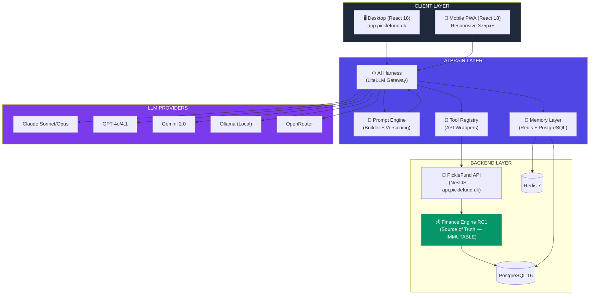
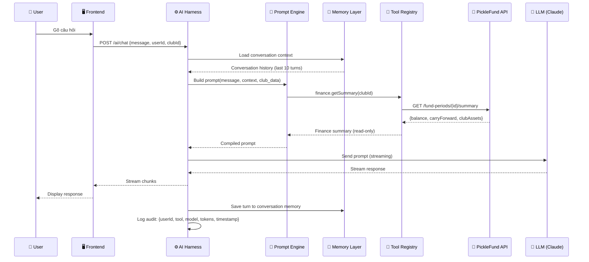
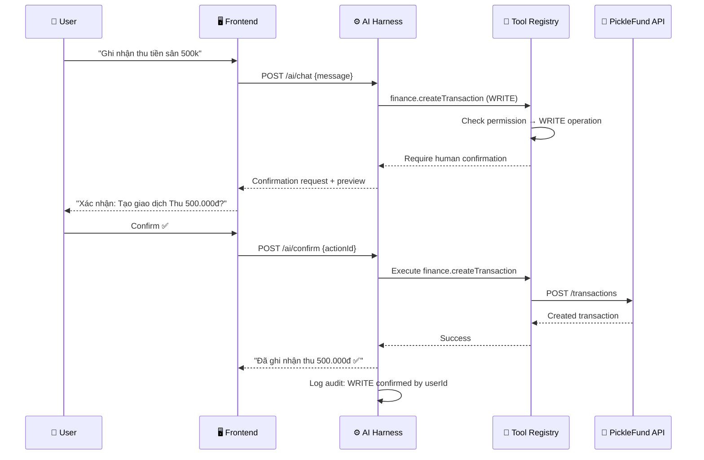
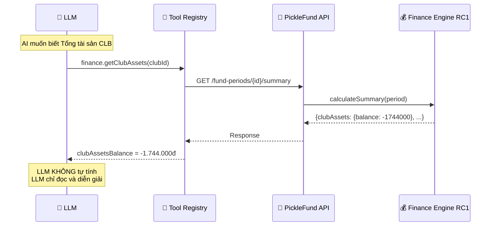
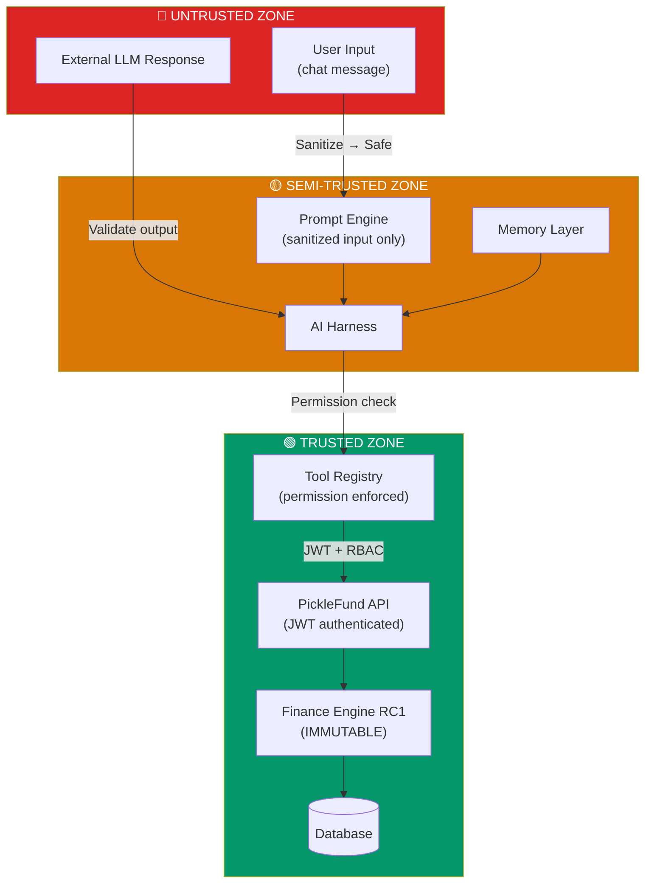
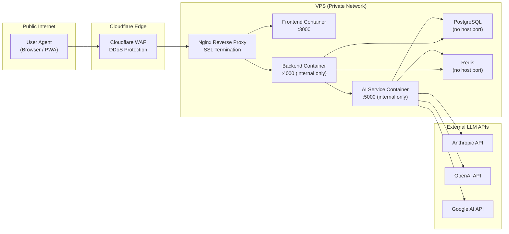
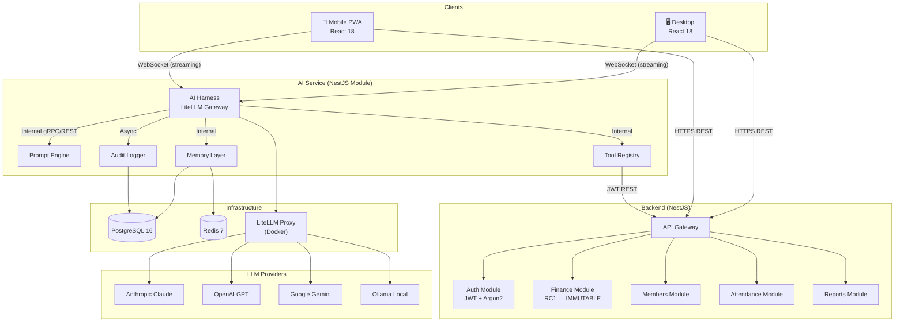
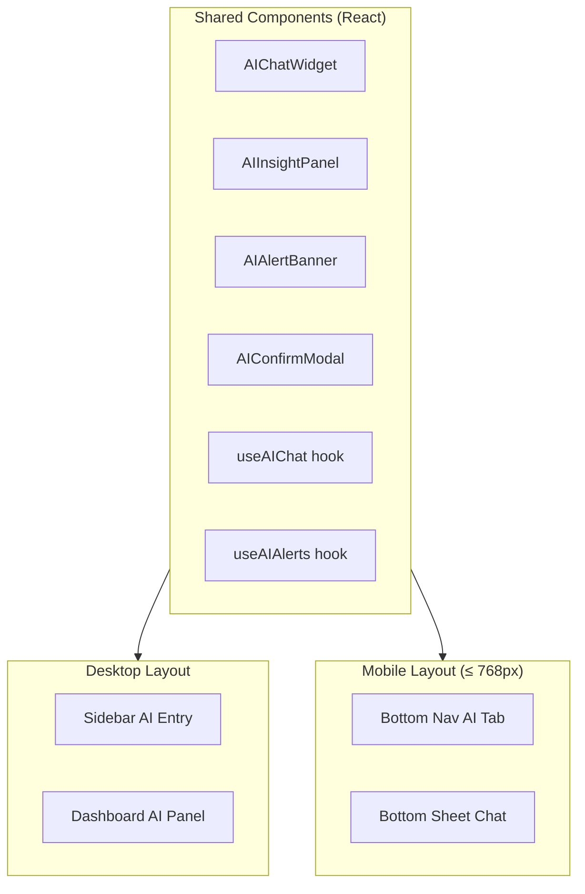
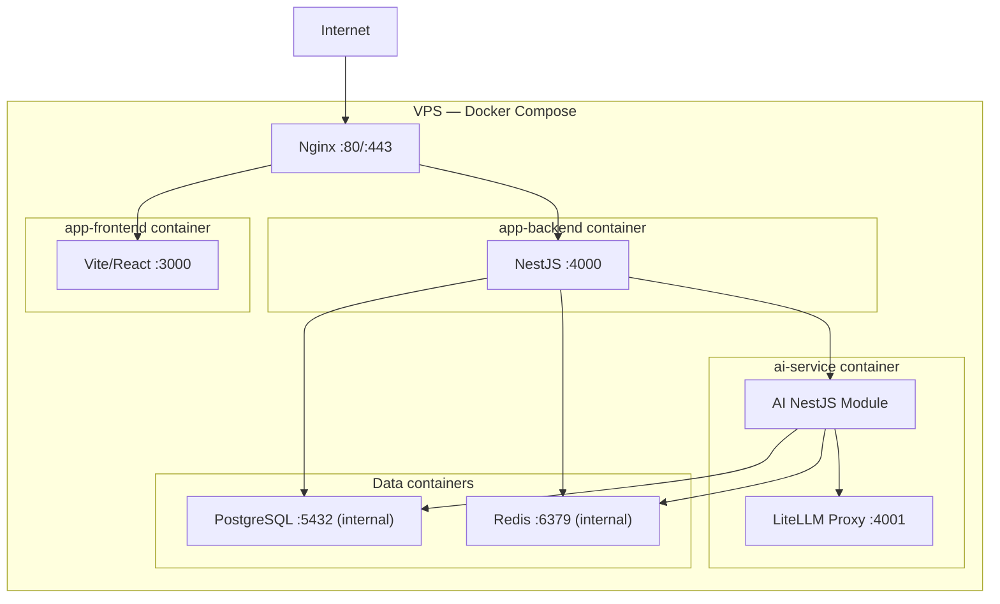

# 02 — AI ARCHITECTURE SPECIFICATION
## PickleFund V2.1 — AI Platform Architecture

---

**Phiên bản:** 1.0.0
**Ngày:** 2026-06-29
**Trạng thái:** APPROVED
**Tác giả:** tunglt6-spec

---

## Lịch sử sửa đổi

| Phiên bản | Ngày | Tác giả | Mô tả |
|---|---|---|---|
| 1.0.0 | 2026-06-29 | tunglt6-spec | Khởi tạo — Phase 0 Architecture |

---

## Mục lục

1. [Overall Architecture](#1-overall-architecture)
2. [AI Layers](#2-ai-layers)
3. [AI Components](#3-ai-components)
4. [Data Flow](#4-data-flow)
5. [Trust Boundary](#5-trust-boundary)
6. [Security Boundary](#6-security-boundary)
7. [Communication Diagram](#7-communication-diagram)
8. [Desktop & Mobile Integration](#8-desktop--mobile-integration)
9. [Deployment Architecture](#9-deployment-architecture)
10. [Architecture Decisions](#10-architecture-decisions)
11. [Glossary](#11-glossary)
12. [Cross References](#12-cross-references)

---

## 1. Overall Architecture

### 1.1 Sơ đồ tổng thể

### 1.2 Nguyên tắc nền tảng

| Nguyên tắc | Mô tả |
|---|---|
| **Read-First AI** | AI chỉ đọc dữ liệu từ Finance Engine qua Tool Registry |
| **Finance Engine là Source of Truth** | AI không tự tính bất kỳ chỉ số tài chính nào |
| **Permission-based** | Mọi write operation yêu cầu human confirmation |
| **Audit Everything** | Mọi AI action đều được log với đầy đủ metadata |
| **Mobile Parity** | Desktop và Mobile có cùng AI capabilities |
| **Graceful Degradation** | LLM failover — hệ thống hoạt động khi model primary không khả dụng |

---

## 2. AI Layers

```mermaid
graph LR
    subgraph L1["Layer 1: Interface"]
        L1A["Chat Widget"]
        L1B["Insight Panel"]
        L1C["Alert Banner"]
    end

    subgraph L2["Layer 2: AI Harness"]
        L2A["Request Router"]
        L2B["LiteLLM Gateway"]
        L2C["Cost Tracker"]
        L2D["Token Logger"]
    end

    subgraph L3["Layer 3: Prompt Engine"]
        L3A["Prompt Builder"]
        L3B["Persona Manager"]
        L3C["Context Injector"]
        L3D["Safety Filter"]
    end

    subgraph L4["Layer 4: Memory"]
        L4A["Conversation Memory"]
        L4B["Club Memory"]
        L4C["Business Memory"]
    end

    subgraph L5["Layer 5: Tool Registry"]
        L5A["finance.*"]
        L5B["members.*"]
        L5C["attendance.*"]
        L5D["reports.*"]
    end

    subgraph L6["Layer 6: Finance Engine RC1"]
        L6A["Fund Calculator"]
        L6B["Report Generator"]
        L6C["Carry Forward Engine"]
    end

    L1 --> L2 --> L3 --> L4
    L3 --> L5 --> L6
    L4 --> L3
```

### Mô tả từng layer

| Layer | Tên | Trách nhiệm |
|---|---|---|
| L1 | Interface | Hiển thị AI response cho user (Desktop + Mobile) |
| L2 | AI Harness | Routing LLM, retry, failover, cost tracking, streaming |
| L3 | Prompt Engine | Xây dựng prompt, inject context, safety, versioning |
| L4 | Memory | Lưu trữ và truy xuất ngữ cảnh hội thoại, CLB, nghiệp vụ |
| L5 | Tool Registry | Wrapper an toàn cho PickleFund API — permission gating |
| L6 | Finance Engine RC1 | Tính toán tài chính — IMMUTABLE — Source of Truth |

---

## 3. AI Components

### 3.1 AI Harness

Xem chi tiết tại [03_AI_HARNESS_DESIGN.md](03_AI_HARNESS_DESIGN.md).

**Tóm tắt:**
- Gateway thống nhất cho Claude, GPT, Gemini, Ollama, OpenRouter
- Routing theo model preference, cost, latency
- Failover tự động khi primary model không khả dụng
- Streaming support cho real-time response
- Token logging và cost tracking theo club/user

### 3.2 Prompt Engine

Xem chi tiết tại [05_PROMPT_ENGINE_SPECIFICATION.md](05_PROMPT_ENGINE_SPECIFICATION.md).

**Tóm tắt:**
- Prompt Builder với template system
- Persona Manager (MAIKA — AI Teammate)
- Business Context Injector (club data, finance summary)
- Safety Filter (input sanitization, output validation)
- Prompt Versioning (A/B testing, rollback)

### 3.3 Memory Layer

Xem chi tiết tại [06_MEMORY_LAYER_SPECIFICATION.md](06_MEMORY_LAYER_SPECIFICATION.md).

**Tóm tắt:**
- 5 loại memory: Conversation, Club, Member, Business, Temporary
- Redis cho hot memory (short-term)
- PostgreSQL cho cold memory (long-term)
- GDPR-ready: expiration + encryption

### 3.4 Tool Registry

Xem chi tiết tại [04_TOOL_REGISTRY_SPECIFICATION.md](04_TOOL_REGISTRY_SPECIFICATION.md).

**Tóm tắt:**
- 8 nhóm tool: attendance, finance, funds, members, reports, contracts, notifications, settings
- Permission gating: mỗi tool có danh sách role được phép
- Human confirmation required cho write operations
- Audit log mọi tool call

### 3.5 MAIKA — AI Teammate

MAIKA là AI persona chính của PickleFund:

| Thuộc tính | Giá trị |
|---|---|
| Tên | MAIKA |
| Vai trò | AI Treasurer Teammate |
| Ngôn ngữ chính | Tiếng Việt |
| Ngôn ngữ phụ | Tiếng Anh (nếu user hỏi bằng tiếng Anh) |
| Phạm vi | Tài chính CLB, thống kê, hướng dẫn, nhắc nhở |
| Không làm | Tự sửa dữ liệu, tự tính tài chính, trả lời ngoài phạm vi CLB |

---

## 4. Data Flow

### 4.1 Happy Path — Chat Query

### 4.2 Write Operation — Human Confirmation Required

### 4.3 Finance Query — Source of Truth Pattern

---

## 5. Trust Boundary

### Trust Rules

| Từ | Đến | Quy tắc |
|---|---|---|
| User Input | Prompt Engine | Sanitize HTML/injection, max length 4096 chars |
| LLM Output | AI Harness | Validate JSON structure, strip dangerous content |
| AI Harness | Tool Registry | Permission check per tool, role validation |
| Tool Registry | API | JWT token required, RBAC enforced |
| API | Finance Engine | Internal call — trusted, no external input injection |

---

## 6. Security Boundary

### Security Principles

| # | Principle | Implementation |
|---|---|---|
| SP-01 | Defense in Depth | Cloudflare → Nginx → JWT → RBAC → Tool Permission |
| SP-02 | Least Privilege | AI Service chỉ có read access mặc định |
| SP-03 | No Direct DB Access | AI không gọi DB trực tiếp |
| SP-04 | Secrets Management | API keys cho LLM qua environment variables |
| SP-05 | Audit Trail | Mọi AI call được log với userId, timestamp, tool |
| SP-06 | Input Validation | Sanitize user input trước khi đưa vào prompt |
| SP-07 | Output Validation | Validate LLM output trước khi thực thi tool call |
| SP-08 | Rate Limiting | Per-user, per-club AI request rate limiting |

---

## 7. Communication Diagram

---

## 8. Desktop & Mobile Integration

### 8.1 Shared AI Components

### 8.2 Responsive Breakpoints cho AI Components

| Breakpoint | Layout | AI Chat | AI Panel |
|---|---|---|---|
| 375px (Mobile S) | Single column | Bottom sheet | Inline collapse |
| 640px (Mobile L) | Single column | Bottom sheet | Inline expand |
| 768px (Tablet) | Hybrid | Side panel | Sidebar |
| 1024px (Desktop S) | Two column | Side panel | Fixed sidebar |
| 1440px (Desktop L) | Three column | Fixed panel | Full width |

### 8.3 Mobile-specific AI UX

- **AI Chat:** Bottom sheet (drag-up), persistent input bar
- **AI Alerts:** Toast notification (top), swipe to dismiss
- **AI Confirm:** Full-screen modal với large CTA buttons
- **AI Insight:** Collapsible card trên mobile dashboard

---

## 9. Deployment Architecture

### Docker Compose Services mới cho V2.1

| Service | Image | Port (internal) | Chức năng |
|---|---|---|---|
| `litellm-proxy` | `ghcr.io/berriai/litellm` | 4001 | LLM gateway |
| `ai-service` | custom NestJS | 5000 | AI Brain service |

---

## 10. Architecture Decisions

| # | Quyết định | Lý do | Thay thế đã xem xét |
|---|---|---|---|
| AD-01 | Dùng LiteLLM làm AI Harness | Đa LLM, open source, cost tracking tích hợp | Trực tiếp Anthropic SDK (vendor lock-in) |
| AD-02 | Tool Registry là lớp trung gian bắt buộc | Ngăn AI gọi trực tiếp DB — security boundary | Cho AI gọi API trực tiếp (không đủ an toàn) |
| AD-03 | Memory Layer dùng Redis + PostgreSQL | Redis cho hot cache, PG cho persistence | Chỉ dùng Redis (mất data khi restart) |
| AD-04 | AI Brain là NestJS Module riêng | Separation of concerns, scale độc lập | Nhúng vào main NestJS (coupling cao) |
| AD-05 | Prompt versioning từ đầu | A/B testing, rollback khi prompt regression | Hardcode prompt (không thể rollback) |
| AD-06 | Finance Engine RC1 bất biến | Stability, trust, audit | Cho AI mở rộng finance engine (rủi ro rất cao) |
| AD-07 | Human confirmation cho write ops | Prevent AI accidents | Auto-execute (rủi ro tạo giao dịch sai) |
| AD-08 | Mobile parity từ Sprint 1 | Product standard — không để mobile tụt hậu | Mobile sau (tạo ra technical debt) |

---

## 11. Glossary

| Thuật ngữ | Định nghĩa |
|---|---|
| AI Brain | Toàn bộ hệ thống AI PickleFund V2.1 |
| AI Harness | Lớp gateway LLM — abstraction layer |
| Tool Registry | Danh sách công cụ AI được phép dùng |
| Prompt Engine | Module xây dựng và quản lý prompt |
| Memory Layer | Lớp lưu trữ ngữ cảnh AI |
| Trust Boundary | Ranh giới tin cậy giữa các zone |
| Source of Truth | Finance Engine RC1 — dữ liệu tài chính chính thức |
| RBAC | Role-Based Access Control |
| LiteLLM | Proxy đa LLM open source |
| MAIKA | AI Teammate persona của PickleFund |

---

## 12. Cross References

| Tài liệu | Liên quan |
|---|---|
| [01_PROJECT_CHARTER.md](01_PROJECT_CHARTER.md) | Vision, Goals, Constraints |
| [03_AI_HARNESS_DESIGN.md](03_AI_HARNESS_DESIGN.md) | Chi tiết AI Harness, LiteLLM routing |
| [04_TOOL_REGISTRY_SPECIFICATION.md](04_TOOL_REGISTRY_SPECIFICATION.md) | Tool definitions, permissions |
| [05_PROMPT_ENGINE_SPECIFICATION.md](05_PROMPT_ENGINE_SPECIFICATION.md) | Prompt Builder, versioning |
| [06_MEMORY_LAYER_SPECIFICATION.md](06_MEMORY_LAYER_SPECIFICATION.md) | Memory types, retention |
| Finance Engine RC1 | `backend/src/fund-periods/calculators/` |
| Knowledge Base ADR-005 | `knowledge-base/08_ADR/ADR-005-AI-Teammate-Platform.md` |

---

*PickleFund V2.1 AI Brain Foundation — AI Architecture Specification v1.0.0*
