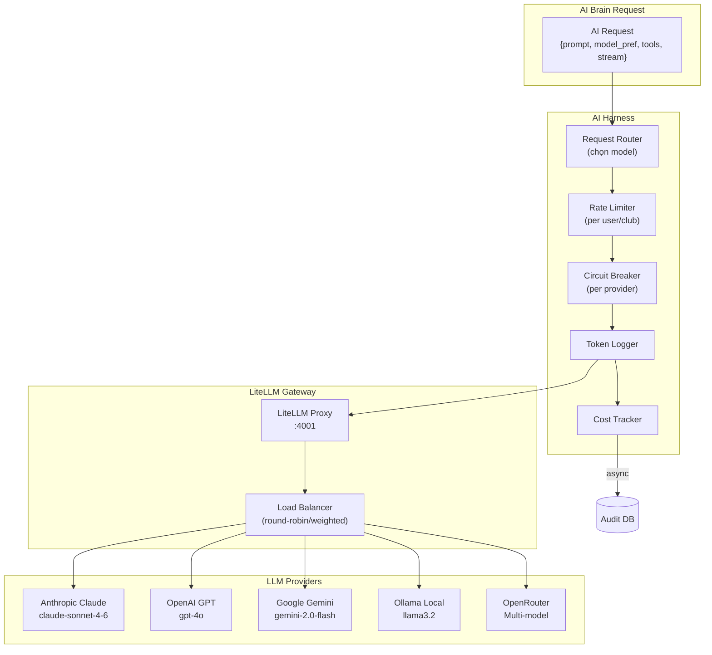
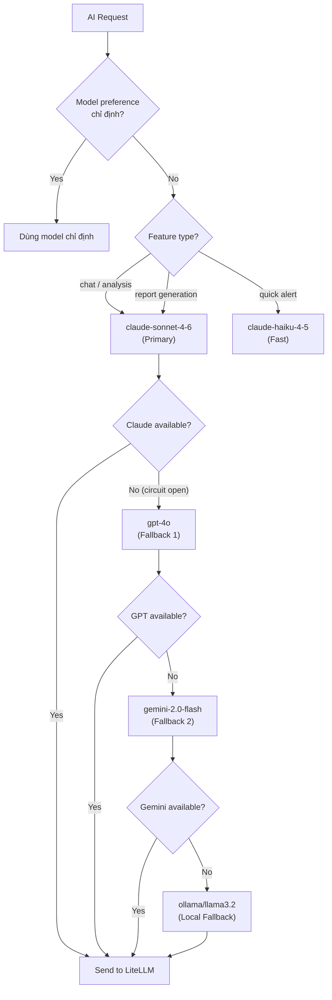
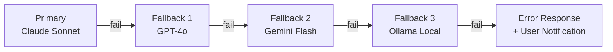
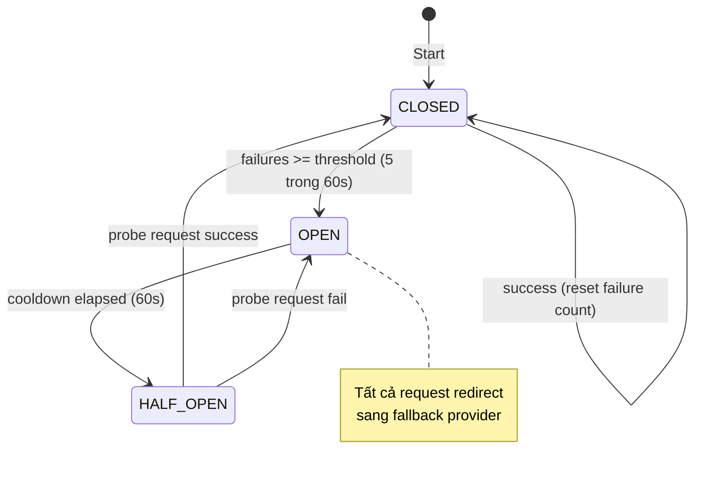
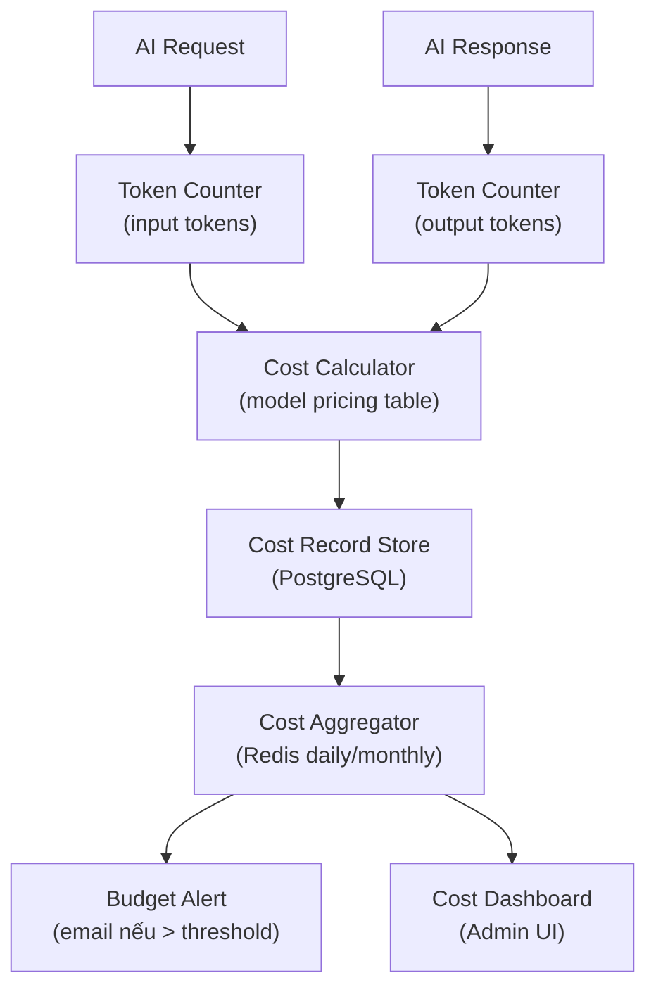
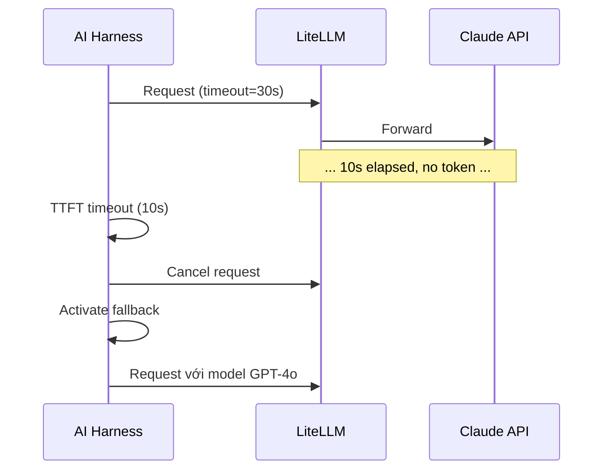
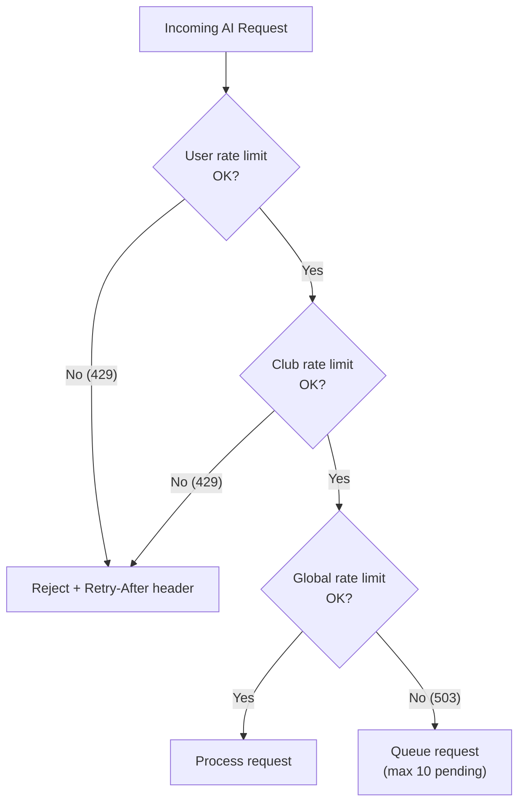
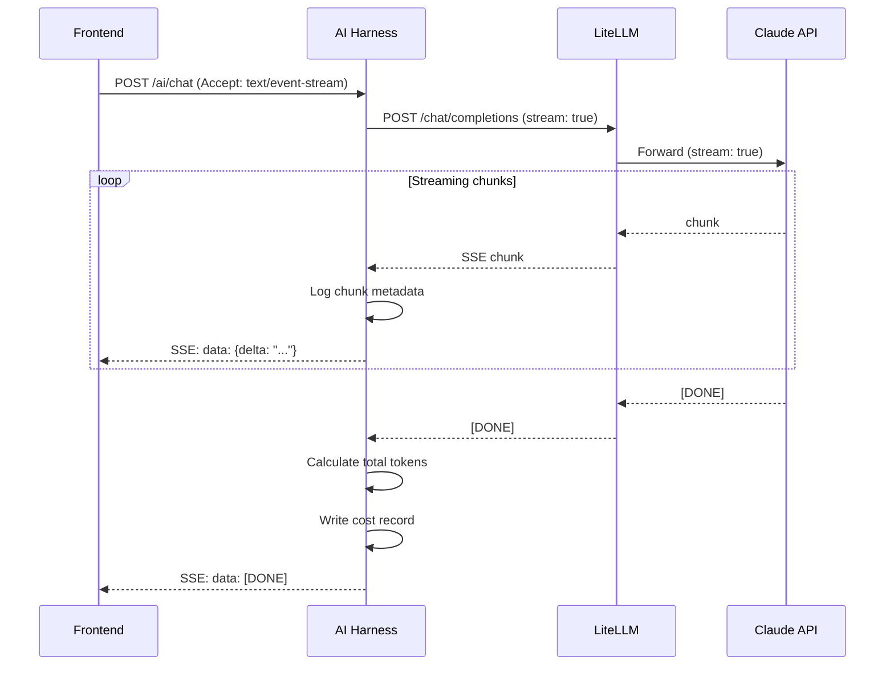
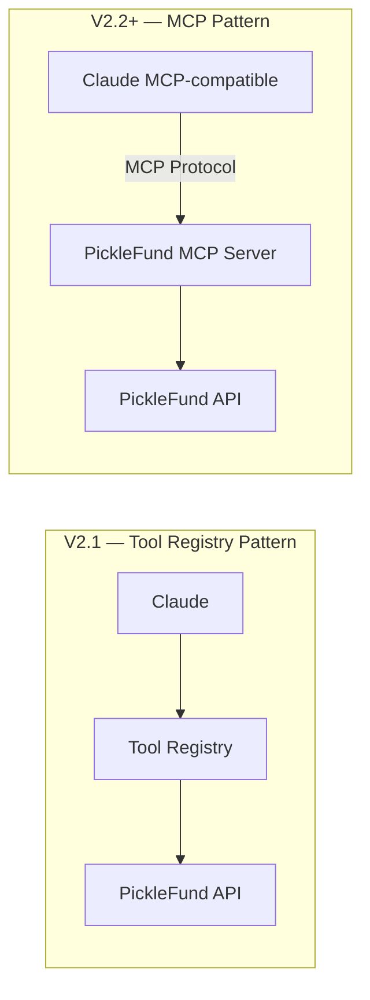
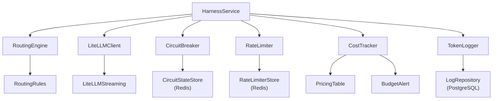

# 03 — AI HARNESS DESIGN
## PickleFund V2.1 — AI Harness với LiteLLM Gateway

---

**Phiên bản:** 1.0.0
**Ngày:** 2026-06-29
**Trạng thái:** APPROVED
**Tác giả:** tunglt6-spec

---

## Lịch sử sửa đổi

| Phiên bản | Ngày | Tác giả | Mô tả |
|---|---|---|---|
| 1.0.0 | 2026-06-29 | tunglt6-spec | Khởi tạo — Phase 0 Architecture |

---

## Mục lục

1. [Tổng quan AI Harness](#1-tổng-quan-ai-harness)
2. [LiteLLM Gateway](#2-litellm-gateway)
3. [Model Registry](#3-model-registry)
4. [Routing Engine](#4-routing-engine)
5. [Failover & Retry](#5-failover--retry)
6. [Cost Tracking](#6-cost-tracking)
7. [Token Logging](#7-token-logging)
8. [Timeout & Circuit Breaker](#8-timeout--circuit-breaker)
9. [Rate Limiting](#9-rate-limiting)
10. [Streaming](#10-streaming)
11. [Future MCP Compatibility](#11-future-mcp-compatibility)
12. [Module Architecture](#12-module-architecture)
13. [Configuration Specification](#13-configuration-specification)
14. [Architecture Decisions](#14-architecture-decisions)
15. [Glossary](#15-glossary)
16. [Cross References](#16-cross-references)

---

## 1. Tổng quan AI Harness

AI Harness là lớp trừu tượng hóa (abstraction layer) giữa PickleFund AI Brain và các LLM providers bên ngoài.

### Mục tiêu

- **Vendor Agnostic:** Code PickleFund không phụ thuộc vào bất kỳ LLM SDK cụ thể nào
- **Fault Tolerant:** Tự động chuyển sang model dự phòng khi primary fail
- **Cost Aware:** Track chi phí token theo club/user/feature
- **Observable:** Log toàn bộ request/response cho debug và audit
- **Scalable:** Hỗ trợ thêm model mới mà không cần sửa code AI Brain

### Sơ đồ tổng thể AI Harness



---

## 2. LiteLLM Gateway

### 2.1 Vai trò

LiteLLM Proxy là Docker container độc lập, đóng vai trò:
- **Unified API:** Một endpoint duy nhất cho mọi LLM provider
- **Load Balancer:** Phân phối request giữa các deployment của cùng model
- **Cost Tracking:** Tích hợp cost tracking tự động
- **Retry:** Built-in retry với exponential backoff

### 2.2 LiteLLM Config Schema

```yaml
# litellm_config.yaml — Không commit secret key thật
model_list:
  - model_name: "primary"
    litellm_params:
      model: "claude-sonnet-4-6"
      api_key: "${ANTHROPIC_API_KEY}"
      timeout: 30
      max_retries: 2

  - model_name: "primary"
    litellm_params:
      model: "gpt-4o"
      api_key: "${OPENAI_API_KEY}"
      timeout: 30
      max_retries: 2
      weight: 0  # chỉ dùng khi Claude fail

  - model_name: "fast"
    litellm_params:
      model: "gemini/gemini-2.0-flash"
      api_key: "${GEMINI_API_KEY}"
      timeout: 15
      max_retries: 1

  - model_name: "local"
    litellm_params:
      model: "ollama/llama3.2"
      api_base: "http://ollama:11434"
      timeout: 60

  - model_name: "router"
    litellm_params:
      model: "openrouter/anthropic/claude-3.5-sonnet"
      api_key: "${OPENROUTER_API_KEY}"
      timeout: 30

router_settings:
  routing_strategy: "least-busy"
  fallbacks:
    - {"primary": ["fast", "local"]}
  num_retries: 3
  retry_after: 5
  timeout: 30
  allowed_fails: 2
  cooldown_time: 60

litellm_settings:
  set_verbose: false
  json_logs: true
  success_callback: ["langfuse"]
  failure_callback: ["langfuse"]

general_settings:
  master_key: "${LITELLM_MASTER_KEY}"
  database_url: "${LITELLM_DATABASE_URL}"
```

### 2.3 API Contract (LiteLLM → PickleFund AI Service)

```
POST /chat/completions
Authorization: Bearer {LITELLM_MASTER_KEY}

Request:
{
  "model": "primary",
  "messages": [...],
  "tools": [...],
  "stream": true,
  "temperature": 0.1,
  "max_tokens": 4096,
  "metadata": {
    "user_id": "user-123",
    "club_id": "club-456",
    "feature": "chat",
    "prompt_version": "v1.2.0"
  }
}

Response (streaming):
data: {"choices": [{"delta": {"content": "..."}}]}
data: [DONE]
```

---

## 3. Model Registry

### 3.1 Model Catalog

| Model ID | Provider | Tier | Use Case | Context Window | Cost/1M tokens |
|---|---|---|---|---|---|
| `claude-sonnet-4-6` | Anthropic | Primary | Chat, Analysis, Reports | 200K | ~$3 input / $15 output |
| `claude-haiku-4-5` | Anthropic | Fast | Simple queries, alerts | 200K | ~$0.25 / $1.25 |
| `gpt-4o` | OpenAI | Fallback-1 | Chat, Analysis | 128K | ~$2.5 / $10 |
| `gemini-2.0-flash` | Google | Fast/Fallback | Quick responses | 1M | ~$0.075 / $0.3 |
| `llama3.2` | Ollama (Local) | Fallback-Last | Offline mode | 128K | Free (compute cost) |
| `openrouter/*` | OpenRouter | Flexible | Cost optimization | varies | varies |

### 3.2 Model Selection Logic



---

## 4. Routing Engine

### 4.1 Routing Rules

| Rule ID | Điều kiện | Action |
|---|---|---|
| R-01 | `feature == "chat"` | Route đến `claude-sonnet-4-6` |
| R-02 | `feature == "alert"` | Route đến `claude-haiku-4-5` |
| R-03 | `feature == "report"` | Route đến `claude-sonnet-4-6` |
| R-04 | `club.tier == "free"` | Route đến `gemini-2.0-flash` (tiết kiệm cost) |
| R-05 | `club.tier == "premium"` | Route đến `claude-sonnet-4-6` |
| R-06 | `user.monthly_tokens > 100000` | Throttle + notify |
| R-07 | `latency_required == "low"` | Route đến `gemini-2.0-flash` |
| R-08 | `offline_mode == true` | Route đến `ollama/llama3.2` |

### 4.2 Routing Interface

```typescript
// Interface — không code, chỉ thiết kế
interface RoutingContext {
  userId: string
  clubId: string
  feature: 'chat' | 'alert' | 'report' | 'summary'
  clubTier: 'free' | 'standard' | 'premium'
  modelPreference?: string
  latencyRequirement?: 'low' | 'standard' | 'high-quality'
  currentMonthTokens: number
}

interface RoutingDecision {
  model: string
  provider: string
  reason: string
  estimatedCost: number
  fallbackChain: string[]
}

interface AIHarnessRouter {
  route(context: RoutingContext): Promise<RoutingDecision>
  getAvailableModels(): string[]
  getCircuitStatus(provider: string): 'open' | 'half-open' | 'closed'
}
```

---

## 5. Failover & Retry

### 5.1 Failover Chain



### 5.2 Retry Policy

| Loại lỗi | Retry | Backoff | Max attempts |
|---|---|---|---|
| Rate Limit (429) | Có | Exponential (1s, 2s, 4s) | 3 |
| Server Error (500, 503) | Có | Fixed (2s) | 2 |
| Timeout | Có | None | 2 |
| Auth Error (401) | Không | — | 0 (fail fast) |
| Bad Request (400) | Không | — | 0 (fail fast) |
| Network Error | Có | Linear (1s) | 3 |

### 5.3 Circuit Breaker States



### 5.4 Circuit Breaker Config per Provider

| Provider | Failure Threshold | Cooldown | Probe Timeout |
|---|---|---|---|
| Anthropic Claude | 5 lỗi / 60s | 60s | 10s |
| OpenAI GPT | 5 lỗi / 60s | 60s | 10s |
| Google Gemini | 5 lỗi / 60s | 60s | 10s |
| Ollama Local | 3 lỗi / 30s | 30s | 30s |

---

## 6. Cost Tracking

### 6.1 Cost Tracking Architecture



### 6.2 Cost Record Schema

```
CostRecord:
  id: UUID
  timestamp: DateTime
  userId: string
  clubId: string
  feature: string           -- 'chat' | 'alert' | 'report'
  model: string             -- 'claude-sonnet-4-6'
  provider: string          -- 'anthropic'
  promptVersion: string     -- 'v1.2.0'
  inputTokens: number
  outputTokens: number
  totalTokens: number
  costUSD: number           -- USD
  costVND: number           -- VND (tỷ giá tại thời điểm)
  duration_ms: number
  cached: boolean           -- prompt cache hit
```

### 6.3 Budget Limits

| Scope | Limit | Alert at | Action |
|---|---|---|---|
| Per user / ngày | 50.000 tokens | 80% | Log warning |
| Per club / ngày | 200.000 tokens | 80% | Notify admin |
| Per club / tháng | 2.000.000 tokens | 90% | Hard throttle |
| Global / ngày | 10.000.000 tokens | 85% | Alert team |

---

## 7. Token Logging

### 7.1 Log Entry Schema

```
AITokenLog:
  id: UUID
  requestId: string         -- correlation ID
  timestamp: DateTime
  userId: string
  clubId: string
  model: string
  feature: string
  promptVersion: string
  inputTokens: number
  outputTokens: number
  latency_ms: number
  success: boolean
  errorCode?: string
  errorMessage?: string
  cached: boolean
  streamingMode: boolean
  toolCallCount: number     -- số lần AI gọi tool
  fallbackUsed: boolean
  fallbackFrom?: string
  fallbackTo?: string
```

### 7.2 Log Retention Policy

| Loại log | Retention | Storage |
|---|---|---|
| Real-time AI logs | 7 ngày | Redis |
| Token logs | 90 ngày | PostgreSQL |
| Cost records | 1 năm | PostgreSQL |
| Audit trail | 2 năm | PostgreSQL (archival) |

---

## 8. Timeout & Circuit Breaker

### 8.1 Timeout Config

| Giai đoạn | Timeout | Action khi timeout |
|---|---|---|
| Kết nối đến LiteLLM | 5s | Retry 1 lần |
| First token (TTFT) | 10s | Fallback to next model |
| Total streaming | 60s | Truncate + complete |
| Non-streaming response | 30s | Fallback to next model |
| Tool call | 15s | Error + notify AI |

### 8.2 Timeout Flow



---

## 9. Rate Limiting

### 9.1 Rate Limit Rules



### 9.2 Rate Limit Tiers

| Tier | Per Minute | Per Hour | Per Day | Burst |
|---|---|---|---|---|
| Free User | 5 req | 20 req | 50 req | 8 req |
| Standard User | 15 req | 100 req | 500 req | 20 req |
| Premium User | 30 req | 300 req | 2000 req | 50 req |
| Admin | 60 req | 1000 req | unlimited | 100 req |
| System (internal) | unlimited | unlimited | unlimited | unlimited |

### 9.3 Rate Limit Storage

- Redis sorted sets với sliding window algorithm
- Key pattern: `rl:{scope}:{id}:{window}` (e.g., `rl:user:user-123:minute`)
- TTL tự động theo window size

---

## 10. Streaming

### 10.1 Streaming Architecture



### 10.2 SSE Event Format

```
event: message
data: {"type": "delta", "content": "Quỹ Chính"}

event: message
data: {"type": "delta", "content": " hiện tại"}

event: tool_call
data: {"type": "tool_call", "tool": "finance.getSummary", "status": "calling"}

event: tool_result
data: {"type": "tool_result", "tool": "finance.getSummary", "success": true}

event: done
data: {"type": "done", "usage": {"input_tokens": 245, "output_tokens": 312}}
```

### 10.3 Mobile Streaming

- Mobile sử dụng cùng SSE endpoint như Desktop
- Hiển thị typing indicator khi đang nhận stream
- Auto-scroll khi nhận chunk mới
- Ngắt kết nối gracefully nếu user navigate away

---

## 11. Future MCP Compatibility

### 11.1 MCP Architecture Preview (V2.2+)

Model Context Protocol (MCP) sẽ cho phép AI trực tiếp kết nối với các data sources theo chuẩn Anthropic.



### 11.2 Migration Path

| Giai đoạn | Hành động |
|---|---|
| V2.1 | Tool Registry với JSON schema (OpenAI function calling format) |
| V2.2 | Thêm MCP Server adapter, giữ Tool Registry làm fallback |
| V2.3 | Full MCP migration, deprecate Tool Registry |

### 11.3 Compatibility Layer

Tool Registry sẽ được thiết kế theo format tương thích với OpenAI function calling:

```json
{
  "type": "function",
  "function": {
    "name": "finance__getSummary",
    "description": "Lấy tóm tắt tài chính CLB từ Finance Engine RC1",
    "parameters": {
      "type": "object",
      "properties": {
        "clubId": {"type": "string"},
        "periodId": {"type": "string", "description": "ID kỳ quỹ"}
      },
      "required": ["clubId"]
    }
  }
}
```

Format này tương thích với: Claude (tool use), GPT (function calling), Gemini (function declarations), LiteLLM (unified).

---

## 12. Module Architecture

### 12.1 AI Harness Module Structure

```
ai-harness/
├── harness.module.ts           -- NestJS module definition
├── harness.service.ts          -- Core harness service
├── router/
│   ├── routing.engine.ts       -- Model selection logic
│   ├── routing.rules.ts        -- Rule definitions
│   └── routing.context.ts      -- Context types
├── litellm/
│   ├── litellm.client.ts       -- HTTP client wrapper
│   ├── litellm.config.ts       -- Config loader
│   └── litellm.streaming.ts    -- SSE streaming handler
├── circuit-breaker/
│   ├── circuit-breaker.ts      -- Circuit breaker implementation
│   └── circuit-state.store.ts  -- State storage (Redis)
├── rate-limiter/
│   ├── rate-limiter.ts         -- Rate limiting logic
│   └── rate-limiter.store.ts   -- Sliding window store (Redis)
├── cost-tracker/
│   ├── cost-tracker.ts         -- Cost calculation
│   ├── pricing.table.ts        -- Model pricing
│   └── budget-alert.ts         -- Budget alert trigger
├── token-logger/
│   ├── token-logger.ts         -- Token logging
│   └── log.repository.ts       -- DB write
└── interfaces/
    ├── harness.interface.ts
    ├── model.interface.ts
    └── routing.interface.ts
```

### 12.2 Dependency Graph



---

## 13. Configuration Specification

### 13.1 Environment Variables

| Variable | Required | Default | Mô tả |
|---|---|---|---|
| `LITELLM_BASE_URL` | Có | — | LiteLLM proxy URL (internal) |
| `LITELLM_MASTER_KEY` | Có | — | API key cho LiteLLM proxy |
| `ANTHROPIC_API_KEY` | Có | — | Claude API key |
| `OPENAI_API_KEY` | Không | — | GPT fallback key |
| `GEMINI_API_KEY` | Không | — | Gemini fallback key |
| `OPENROUTER_API_KEY` | Không | — | OpenRouter key |
| `OLLAMA_BASE_URL` | Không | `http://ollama:11434` | Ollama local |
| `AI_DEFAULT_MODEL` | Không | `claude-sonnet-4-6` | Default model |
| `AI_TIMEOUT_MS` | Không | `30000` | Request timeout |
| `AI_MAX_RETRIES` | Không | `2` | Max retry count |
| `AI_RATE_LIMIT_ENABLED` | Không | `true` | Enable rate limiting |
| `AI_COST_TRACKING_ENABLED` | Không | `true` | Enable cost tracking |

### 13.2 Feature Flags

| Flag | Default | Mô tả |
|---|---|---|
| `AI_STREAMING_ENABLED` | `true` | Server-sent events streaming |
| `AI_CIRCUIT_BREAKER_ENABLED` | `true` | Circuit breaker per provider |
| `AI_BUDGET_ALERTS_ENABLED` | `true` | Budget alert emails |
| `AI_CACHE_ENABLED` | `true` | Prompt caching (giảm cost) |
| `AI_FALLBACK_TO_LOCAL` | `false` | Cho phép fallback Ollama local |

---

## 14. Architecture Decisions

| # | Quyết định | Lý do |
|---|---|---|
| AD-H-01 | LiteLLM làm gateway thay vì SDK từng provider | Single interface, vendor agnostic, built-in cost tracking |
| AD-H-02 | Circuit breaker per provider | Tránh cascade failure khi 1 provider gặp sự cố |
| AD-H-03 | SSE streaming thay vì polling | Real-time UX, reduce latency for long responses |
| AD-H-04 | Redis cho circuit breaker và rate limiter state | Shared state giữa multiple AI service instances |
| AD-H-05 | Cost tracking async (không chặn main path) | Tránh làm chậm AI response vì logging |
| AD-H-06 | Sliding window rate limiting | Mượt mà hơn fixed window, fair per user |
| AD-H-07 | Tool Registry format tương thích MCP | Forward compatibility với Anthropic MCP standard |

---

## 15. Glossary

| Thuật ngữ | Định nghĩa |
|---|---|
| AI Harness | Lớp trừu tượng hóa LLM — gateway thống nhất |
| LiteLLM | Open source LLM proxy hỗ trợ đa provider |
| Circuit Breaker | Pattern ngăn cascade failure — tự động redirect khi provider lỗi |
| Rate Limiting | Giới hạn số request per user/club/global |
| TTFT | Time To First Token — độ trễ đến khi nhận token đầu tiên |
| SSE | Server-Sent Events — streaming protocol |
| MCP | Model Context Protocol — Anthropic standard cho AI tool integration |
| Routing Engine | Module quyết định model nào xử lý request |
| Failover | Chuyển sang provider/model dự phòng tự động |
| Token | Đơn vị tính toán của LLM (~0.75 từ tiếng Anh) |

---

## 16. Cross References

| Tài liệu | Liên quan |
|---|---|
| [01_PROJECT_CHARTER.md](01_PROJECT_CHARTER.md) | TG-01: AI Harness đa LLM goal |
| [02_AI_ARCHITECTURE_SPECIFICATION.md](02_AI_ARCHITECTURE_SPECIFICATION.md) | Tổng thể architecture |
| [04_TOOL_REGISTRY_SPECIFICATION.md](04_TOOL_REGISTRY_SPECIFICATION.md) | Tool format tương thích MCP |
| [05_PROMPT_ENGINE_SPECIFICATION.md](05_PROMPT_ENGINE_SPECIFICATION.md) | Prompt được inject vào harness |
| Knowledge Base: LiteLLM | `knowledge-base/04_AI_PLATFORM/LITELLM.md` |
| Knowledge Base: AI Architecture | `knowledge-base/04_AI_PLATFORM/AI_ARCHITECTURE.md` |

---

*PickleFund V2.1 AI Brain Foundation — AI Harness Design v1.0.0*
