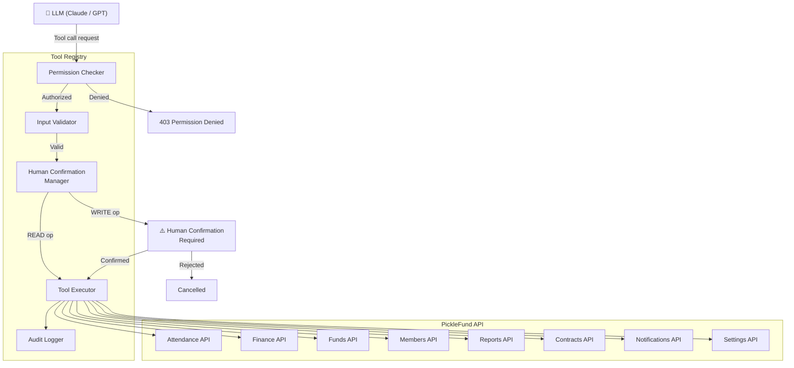
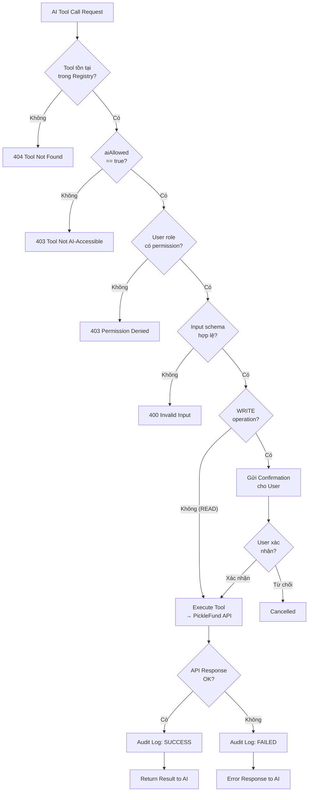

# 04 — TOOL REGISTRY SPECIFICATION
## PickleFund V2.1 — Tool Registry & Permission Layer

---

**Phiên bản:** 1.0.0
**Ngày:** 2026-06-29
**Trạng thái:** APPROVED
**Tác giả:** tunglt6-spec

---

## Lịch sử sửa đổi

| Phiên bản | Ngày | Tác giả | Mô tả |
|---|---|---|---|
| 1.0.0 | 2026-06-29 | tunglt6-spec | Khởi tạo — Phase 0 Architecture |

---

## Mục lục

1. [Tổng quan Tool Registry](#1-tổng-quan-tool-registry)
2. [Nguyên tắc bắt buộc](#2-nguyên-tắc-bắt-buộc)
3. [Tool Definition Schema](#3-tool-definition-schema)
4. [Nhóm attendance.*](#4-nhóm-attendance)
5. [Nhóm finance.*](#5-nhóm-finance)
6. [Nhóm funds.*](#6-nhóm-funds)
7. [Nhóm members.*](#7-nhóm-members)
8. [Nhóm reports.*](#8-nhóm-reports)
9. [Nhóm contracts.*](#9-nhóm-contracts)
10. [Nhóm notifications.*](#10-nhóm-notifications)
11. [Nhóm settings.*](#11-nhóm-settings)
12. [Permission Matrix](#12-permission-matrix)
13. [Audit Log Specification](#13-audit-log-specification)
14. [Tool Execution Flow](#14-tool-execution-flow)
15. [Error Handling](#15-error-handling)
16. [Architecture Decisions](#16-architecture-decisions)
17. [Glossary](#17-glossary)
18. [Cross References](#18-cross-references)

---

## 1. Tổng quan Tool Registry

Tool Registry là **cổng kiểm soát duy nhất** giữa AI Brain và PickleFund API.

### Quy tắc cốt lõi

```
AI  →  Tool Registry  →  PickleFund API  →  Finance Engine RC1
```

AI **không được**:
- Gọi trực tiếp PickleFund API (bypass Tool Registry)
- Gọi Repository pattern
- Gọi Database trực tiếp
- Gọi bất kỳ Service nào mà không qua Tool Registry

### Sơ đồ tổng thể



---

## 2. Nguyên tắc bắt buộc

| # | Nguyên tắc | Chi tiết |
|---|---|---|
| P-01 | **Single Entry Point** | Mọi AI-to-API call phải đi qua Tool Registry |
| P-02 | **Permission First** | Check permission trước khi execute |
| P-03 | **Human Confirmation for Writes** | CREATE/UPDATE/DELETE luôn cần confirm |
| P-04 | **Audit Everything** | Log mọi tool call: success, fail, cancelled |
| P-05 | **Input Validation** | Validate schema trước khi call API |
| P-06 | **Read-Only Finance** | finance.* chỉ READ — không có WRITE tools cho số liệu tài chính |
| P-07 | **Finance Engine là Source of Truth** | Tool Registry không tự tính tài chính |
| P-08 | **No Sensitive Data in Prompt** | Tool kết quả phải mask số tài khoản, CCCD |

---

## 3. Tool Definition Schema

Mỗi tool trong Registry được định nghĩa theo schema sau:

```typescript
interface ToolDefinition {
  // Định danh
  name: string                    // e.g., "finance.getSummary"
  group: ToolGroup                // e.g., "finance"
  version: string                 // e.g., "1.0.0"

  // Mô tả cho LLM
  description: string             // Tiếng Việt — LLM đọc để quyết định dùng tool
  descriptionEn?: string          // English description (optional)

  // Schema input/output
  inputSchema: JSONSchema         // Validate trước khi call
  outputSchema: JSONSchema        // Mô tả output format

  // Permission
  requiredRoles: Role[]           // ['admin', 'treasurer', 'member']
  operation: 'READ' | 'WRITE' | 'DELETE'
  humanConfirmationRequired: boolean

  // Audit
  auditLog: boolean               // Luôn = true
  auditLevel: 'INFO' | 'WARN' | 'CRITICAL'
  sensitiveOutput: boolean        // Có mask output không

  // AI behavior
  aiAllowed: boolean              // Tool này AI được phép dùng không
  aiCallLimit: number             // Max lần gọi per conversation turn
  cacheResponse: boolean          // Cache kết quả (read-only tools)
  cacheTTL?: number               // Seconds

  // Mapping
  apiEndpoint: string             // PickleFund API endpoint
  apiMethod: 'GET' | 'POST' | 'PUT' | 'PATCH' | 'DELETE'
}
```

---

## 4. Nhóm attendance.*

### Tổng quan

| Tool | Operation | Roles | Confirm | AI Allowed |
|---|---|---|---|---|
| `attendance.getBySession` | READ | member, treasurer, admin | Không | Có |
| `attendance.getByMember` | READ | member, treasurer, admin | Không | Có |
| `attendance.getStats` | READ | treasurer, admin | Không | Có |
| `attendance.markPresent` | WRITE | treasurer, admin | **Có** | Có |
| `attendance.markAbsent` | WRITE | treasurer, admin | **Có** | Có |
| `attendance.bulkUpdate` | WRITE | admin | **Có** | Không |

### Chi tiết tools

#### `attendance.getBySession`

```
Name: attendance.getBySession
Description: Lấy danh sách điểm danh cho một buổi tập cụ thể
Input:
  - sessionId: string (required) — ID buổi tập
  - includeAbsent: boolean (optional, default: true)
Output:
  - sessionDate: string
  - totalPresent: number
  - totalAbsent: number
  - attendees: [{memberId, name, status, checkInTime}]
Permission: member, treasurer, admin
Operation: READ
Confirm: Không
AI Allowed: Có
Audit: INFO
Cache: Có (5 phút)
API: GET /sessions/{sessionId}/attendance
```

#### `attendance.getStats`

```
Name: attendance.getStats
Description: Thống kê điểm danh theo kỳ quỹ — tỷ lệ tham dự, buổi vắng, xu hướng
Input:
  - clubId: string (required)
  - periodId: string (optional — mặc định kỳ active)
  - memberId: string (optional — chỉ 1 thành viên)
Output:
  - totalSessions: number
  - averageAttendanceRate: number (%)
  - memberStats: [{memberId, name, present, absent, rate}]
Permission: treasurer, admin
Operation: READ
Confirm: Không
AI Allowed: Có
Audit: INFO
Cache: Có (10 phút)
API: GET /attendance/stats
```

#### `attendance.markPresent`

```
Name: attendance.markPresent
Description: Đánh dấu thành viên có mặt trong buổi tập
Input:
  - sessionId: string (required)
  - memberId: string (required)
  - checkInTime: string (optional — ISO8601)
Output:
  - success: boolean
  - attendanceId: string
  - message: string
Permission: treasurer, admin
Operation: WRITE
Confirm: CÓ — "Xác nhận đánh dấu [Tên thành viên] có mặt buổi [ngày]?"
AI Allowed: Có
Audit: WARN
Cache: Không
API: POST /sessions/{sessionId}/attendance
```

---

## 5. Nhóm finance.*

> **CRITICAL:** Toàn bộ nhóm `finance.*` chỉ có READ operation.
> Finance Engine RC1 là Source of Truth. AI không viết dữ liệu tài chính.

### Tổng quan

| Tool | Operation | Roles | Confirm | AI Allowed |
|---|---|---|---|---|
| `finance.getSummary` | READ | member, treasurer, admin | Không | Có |
| `finance.getClubAssets` | READ | treasurer, admin | Không | Có |
| `finance.getCarryForward` | READ | treasurer, admin | Không | Có |
| `finance.getMemberBalance` | READ | member (own), treasurer, admin | Không | Có |
| `finance.getPeriodOverview` | READ | treasurer, admin | Không | Có |
| `finance.getTransactionHistory` | READ | member (own), treasurer, admin | Không | Có |
| `finance.getHealthScore` | READ | treasurer, admin | Không | Có |

### Chi tiết tools

#### `finance.getSummary`

```
Name: finance.getSummary
Description: Lấy tóm tắt tài chính CLB từ Finance Engine RC1 — bao gồm Quỹ Chính,
             Quỹ Phụ, Số dư chuyển kỳ, Tổng tài sản CLB
Input:
  - clubId: string (required)
  - periodId: string (optional — mặc định kỳ active)
Output:
  - periodId: string
  - periodName: string
  - commonFund: {balance: number, income: number, expense: number}
  - auxiliaryFund: {balance: number, income: number, expense: number}
  - carryForward: {balance: number, fromPeriodId: string}
  - clubAssets: {balance: number, formula: string}
  - lastUpdated: string
Permission: member (limited), treasurer, admin
Operation: READ
Confirm: Không
AI Allowed: Có
Audit: INFO
Cache: Có (2 phút)
API: GET /fund-periods/{periodId}/summary
Note: clubAssets.balance = Quỹ Chính + Carry Forward — không cộng Quỹ Phụ
      AI phải dùng giá trị này, KHÔNG tự tính
```

#### `finance.getClubAssets`

```
Name: finance.getClubAssets
Description: Lấy Tổng tài sản CLB — Quỹ Chính + Số dư chuyển kỳ — từ Finance Engine
Input:
  - clubId: string (required)
Output:
  - clubAssetsBalance: number       -- VND, có thể âm
  - commonFundBalance: number       -- Quỹ Chính
  - carryForwardBalance: number     -- Số dư chuyển kỳ (có thể âm)
  - formula: "Tổng tài sản = Quỹ Chính + Số dư chuyển kỳ"
Permission: treasurer, admin
Operation: READ
Confirm: Không
AI Allowed: Có
Audit: INFO
Cache: Có (2 phút)
API: GET /fund-periods/{periodId}/summary → clubAssets
```

#### `finance.getMemberBalance`

```
Name: finance.getMemberBalance
Description: Lấy số dư / công nợ của một thành viên trong kỳ hiện tại
Input:
  - memberId: string (required)
  - periodId: string (optional)
Output:
  - memberId: string
  - memberName: string
  - totalOwed: number       -- tổng phải đóng
  - totalPaid: number       -- đã đóng
  - balance: number         -- âm = còn nợ, dương = dư
  - sessions: [{date, amount, paid}]
Permission: member (chỉ own), treasurer, admin
Operation: READ
Confirm: Không
AI Allowed: Có
Audit: INFO
Sensitive: Có (mask nếu member xem của người khác)
Cache: Có (5 phút)
API: GET /members/{memberId}/balance
```

#### `finance.getHealthScore`

```
Name: finance.getHealthScore
Description: Lấy health score tài chính CLB — chỉ số đánh giá sức khỏe quỹ
Input:
  - clubId: string (required)
Output:
  - score: number (0-100)
  - grade: 'A' | 'B' | 'C' | 'D' | 'F'
  - factors: [{name, score, weight, insight}]
  - recommendation: string
Permission: treasurer, admin
Operation: READ
Confirm: Không
AI Allowed: Có
Audit: INFO
Cache: Có (10 phút)
API: GET /clubs/{clubId}/health-score
```

---

## 6. Nhóm funds.*

### Tổng quan

| Tool | Operation | Roles | Confirm | AI Allowed |
|---|---|---|---|---|
| `funds.listPeriods` | READ | treasurer, admin | Không | Có |
| `funds.getPeriod` | READ | treasurer, admin | Không | Có |
| `funds.createPeriod` | WRITE | admin | **Có** | Có |
| `funds.closePeriod` | WRITE | admin | **Có** | Không |
| `funds.getTransactions` | READ | treasurer, admin | Không | Có |
| `funds.createTransaction` | WRITE | treasurer, admin | **Có** | Có |
| `funds.updateTransaction` | WRITE | admin | **Có** | Không |
| `funds.deleteTransaction` | DELETE | admin | **Có** | Không |

### Chi tiết tools chính

#### `funds.listPeriods`

```
Name: funds.listPeriods
Description: Danh sách tất cả kỳ quỹ của CLB — active, closed, finalized
Input:
  - clubId: string (required)
  - status: 'active' | 'closed' | 'finalized' | 'all' (optional, default: 'all')
  - limit: number (optional, default: 10)
Output:
  - periods: [{id, name, type, status, startDate, endDate, balance}]
  - total: number
Permission: treasurer, admin
Operation: READ
AI Allowed: Có
Cache: Có (5 phút)
API: GET /fund-periods
```

#### `funds.createTransaction`

```
Name: funds.createTransaction
Description: Tạo giao dịch thu/chi mới — cần xác nhận từ người dùng
Input:
  - clubId: string (required)
  - periodId: string (required)
  - type: 'income' | 'expense' (required)
  - amount: number (required, > 0)
  - description: string (required)
  - fundSource: 'COMMON' | 'MINI' (required)
  - category: string (optional)
  - date: string (optional — ISO8601, default: today)
Output:
  - transactionId: string
  - success: boolean
  - message: string
Permission: treasurer, admin
Operation: WRITE
Confirm: CÓ — "Xác nhận tạo giao dịch [Thu/Chi] [số tiền]đ - [mô tả]?"
AI Allowed: Có
Audit: CRITICAL
API: POST /transactions
```

---

## 7. Nhóm members.*

### Tổng quan

| Tool | Operation | Roles | Confirm | AI Allowed |
|---|---|---|---|---|
| `members.list` | READ | treasurer, admin | Không | Có |
| `members.get` | READ | member (own), treasurer, admin | Không | Có |
| `members.getStats` | READ | treasurer, admin | Không | Có |
| `members.getContributions` | READ | member (own), treasurer, admin | Không | Có |
| `members.create` | WRITE | admin | **Có** | Có |
| `members.update` | WRITE | admin | **Có** | Không |
| `members.deactivate` | WRITE | admin | **Có** | Không |

### Chi tiết tools chính

#### `members.list`

```
Name: members.list
Description: Danh sách thành viên CLB — active, inactive, tất cả
Input:
  - clubId: string (required)
  - status: 'active' | 'inactive' | 'all' (optional, default: 'active')
  - sortBy: 'name' | 'joinDate' | 'balance' (optional)
Output:
  - members: [{id, name, email, phone (masked), status, joinDate, attendanceRate}]
  - total: number
Permission: treasurer, admin
Operation: READ
AI Allowed: Có
Sensitive: Có (phone masked: ****1234)
Cache: Có (10 phút)
API: GET /members
```

#### `members.getStats`

```
Name: members.getStats
Description: Thống kê thành viên — số lượng active, tỷ lệ tham dự, công nợ tổng
Input:
  - clubId: string (required)
  - periodId: string (optional)
Output:
  - totalActive: number
  - totalInactive: number
  - averageAttendanceRate: number
  - totalDebt: number          -- tổng công nợ toàn CLB
  - membersWithDebt: number    -- số thành viên còn nợ
Permission: treasurer, admin
Operation: READ
AI Allowed: Có
Cache: Có (10 phút)
API: GET /members/stats
```

---

## 8. Nhóm reports.*

### Tổng quan

| Tool | Operation | Roles | Confirm | AI Allowed |
|---|---|---|---|---|
| `reports.getPeriodReport` | READ | treasurer, admin | Không | Có |
| `reports.getMemberReceipt` | READ | member (own), treasurer, admin | Không | Có |
| `reports.generatePDF` | WRITE | treasurer, admin | **Có** | Có |
| `reports.getAIInsight` | READ | treasurer, admin | Không | Có |
| `reports.getComparison` | READ | treasurer, admin | Không | Có |

### Chi tiết tools chính

#### `reports.getPeriodReport`

```
Name: reports.getPeriodReport
Description: Báo cáo tài chính đầy đủ cho một kỳ quỹ — thu, chi, tồn quỹ, phân tích
Input:
  - clubId: string (required)
  - periodId: string (required)
Output:
  - period: {id, name, startDate, endDate, status}
  - summary: {totalIncome, totalExpense, balance, carryForward, clubAssets}
  - incomeBreakdown: [{category, amount, percentage}]
  - expenseBreakdown: [{category, amount, percentage}]
  - memberContributions: [{memberId, name, amount, paid, debt}]
  - comparedToPreviousPeriod: {incomeDelta, expenseDelta, balanceDelta}
Permission: treasurer, admin
Operation: READ
AI Allowed: Có
Cache: Có (5 phút)
API: GET /reports/period/{periodId}
```

#### `reports.getAIInsight`

```
Name: reports.getAIInsight
Description: Lấy AI insights về tài chính CLB — không phải tự tính, là insights từ backend
Input:
  - clubId: string (required)
  - periodId: string (optional)
  - insightType: 'trend' | 'anomaly' | 'forecast' | 'recommendation' (optional)
Output:
  - insights: [{type, title, description, severity, actionable}]
  - generatedAt: string
Permission: treasurer, admin
Operation: READ
AI Allowed: Có
Cache: Có (15 phút)
API: GET /reports/ai-insights
Note: Backend tính insight từ data thực — AI Harness chỉ đọc và diễn giải
```

---

## 9. Nhóm contracts.*

### Tổng quan

| Tool | Operation | Roles | Confirm | AI Allowed |
|---|---|---|---|---|
| `contracts.list` | READ | treasurer, admin | Không | Có |
| `contracts.get` | READ | treasurer, admin | Không | Có |
| `contracts.getUpcoming` | READ | treasurer, admin | Không | Có |
| `contracts.create` | WRITE | admin | **Có** | Không |
| `contracts.renew` | WRITE | admin | **Có** | Không |

### Chi tiết tools chính

#### `contracts.getUpcoming`

```
Name: contracts.getUpcoming
Description: Hợp đồng sắp hết hạn trong 30 ngày — cảnh báo cho thủ quỹ
Input:
  - clubId: string (required)
  - daysAhead: number (optional, default: 30)
Output:
  - contracts: [{id, type, description, expiryDate, daysRemaining, amount}]
  - total: number
Permission: treasurer, admin
Operation: READ
AI Allowed: Có
Cache: Có (30 phút)
API: GET /contracts/upcoming
```

---

## 10. Nhóm notifications.*

### Tổng quan

| Tool | Operation | Roles | Confirm | AI Allowed |
|---|---|---|---|---|
| `notifications.getUnread` | READ | member, treasurer, admin | Không | Có |
| `notifications.markRead` | WRITE | member (own), treasurer, admin | Không | Có |
| `notifications.send` | WRITE | admin | **Có** | Không |
| `notifications.sendReminder` | WRITE | treasurer, admin | **Có** | Có |

### Chi tiết tools chính

#### `notifications.sendReminder`

```
Name: notifications.sendReminder
Description: Gửi nhắc nhở đóng tiền cho một hoặc nhiều thành viên
Input:
  - clubId: string (required)
  - memberIds: string[] (required — danh sách member ID)
  - message: string (required — nội dung nhắc nhở)
  - channel: 'in-app' | 'email' (required)
Output:
  - sent: number
  - failed: number
  - results: [{memberId, success, error?}]
Permission: treasurer, admin
Operation: WRITE
Confirm: CÓ — "Xác nhận gửi nhắc nhở đến [N] thành viên?"
AI Allowed: Có
Audit: WARN
API: POST /notifications/reminder
```

---

## 11. Nhóm settings.*

### Tổng quan

| Tool | Operation | Roles | Confirm | AI Allowed |
|---|---|---|---|---|
| `settings.getClub` | READ | admin | Không | Có |
| `settings.updateClub` | WRITE | admin | **Có** | Không |
| `settings.getAIConfig` | READ | admin | Không | Có |
| `settings.updateAIConfig` | WRITE | admin | **Có** | Không |

> **Lưu ý:** AI không tự thay đổi settings. `settings.*` WRITE tools đều `AI Allowed: Không`.

---

## 12. Permission Matrix

### Role Definitions

| Role | Mô tả |
|---|---|
| `member` | Thành viên thông thường — xem dữ liệu của bản thân |
| `treasurer` | Thủ quỹ — quản lý thu chi, điểm danh |
| `admin` | Quản trị viên CLB — toàn quyền |
| `system` | AI system — có thể gọi mọi read tool |

### Permission Matrix đầy đủ

| Tool Group | member | treasurer | admin | AI System |
|---|---|---|---|---|
| `attendance.*` READ | Có (own) | Có | Có | Có |
| `attendance.*` WRITE | Không | Có | Có | Có (confirm) |
| `finance.*` READ | Có (limited) | Có | Có | Có |
| `finance.*` WRITE | Không | Không | Không | **Không** |
| `funds.*` READ | Không | Có | Có | Có |
| `funds.*` WRITE | Không | Có (limited) | Có | Có (confirm) |
| `members.*` READ | Có (own) | Có | Có | Có |
| `members.*` WRITE | Không | Không | Có | Không |
| `reports.*` READ | Có (own receipt) | Có | Có | Có |
| `reports.*` PDF | Không | Có | Có | Có (confirm) |
| `contracts.*` READ | Không | Có | Có | Có |
| `contracts.*` WRITE | Không | Không | Có | Không |
| `notifications.*` READ | Có (own) | Có | Có | Có |
| `notifications.*` WRITE | Không | Có (reminder) | Có | Có (confirm) |
| `settings.*` READ | Không | Không | Có | Có |
| `settings.*` WRITE | Không | Không | Có | **Không** |

---

## 13. Audit Log Specification

### Audit Log Schema

```typescript
interface ToolAuditLog {
  id: string                    // UUID
  timestamp: Date               // UTC
  requestId: string             // Correlation ID (từ AI Harness)

  // Actor
  userId: string
  userRole: Role
  clubId: string

  // Tool
  toolName: string              // e.g., "finance.getSummary"
  toolGroup: string             // e.g., "finance"
  toolVersion: string           // e.g., "1.0.0"
  operation: 'READ' | 'WRITE' | 'DELETE'

  // Input (sanitized)
  inputParams: Record<string, unknown>   // PII masked

  // Execution
  success: boolean
  httpStatus: number
  duration_ms: number
  errorCode?: string
  errorMessage?: string

  // AI Context
  model: string                 // LLM model used
  promptVersion: string         // Prompt version
  conversationId: string        // Conversation ID

  // Human Confirmation (cho WRITE ops)
  confirmationRequired: boolean
  confirmationStatus?: 'pending' | 'confirmed' | 'rejected'
  confirmationTimestamp?: Date
  confirmedByUserId?: string
}
```

### Audit Log Levels

| Level | Khi nào | Retention |
|---|---|---|
| INFO | READ operations | 90 ngày |
| WARN | WRITE operations (confirmed) | 1 năm |
| CRITICAL | DELETE operations, Write Finance data (forbidden) | 2 năm |
| ERROR | Permission denied, validation failed | 1 năm |

---

## 14. Tool Execution Flow



---

## 15. Error Handling

### Error Codes

| Code | HTTP Status | Mô tả | AI Response |
|---|---|---|---|
| `TOOL_NOT_FOUND` | 404 | Tool không tồn tại | "Tôi không có khả năng thực hiện thao tác này" |
| `TOOL_NOT_AI_ACCESSIBLE` | 403 | Tool bị restrict cho AI | "Thao tác này cần thực hiện thủ công" |
| `PERMISSION_DENIED` | 403 | Role không đủ quyền | "Bạn không có quyền thực hiện thao tác này" |
| `INVALID_INPUT` | 400 | Input không đúng schema | "Thông tin đầu vào không hợp lệ: [chi tiết]" |
| `CONFIRMATION_REQUIRED` | 202 | Cần confirm WRITE | Hiển thị confirmation dialog |
| `CONFIRMATION_REJECTED` | 200 | User từ chối confirm | "Đã huỷ thao tác" |
| `API_ERROR` | 5xx | PickleFund API lỗi | "Hệ thống đang gặp sự cố, vui lòng thử lại" |
| `RATE_LIMIT` | 429 | Vượt giới hạn tool calls | "Vui lòng thử lại sau [N] giây" |
| `TIMEOUT` | 504 | Tool call timeout | "Yêu cầu quá thời gian, vui lòng thử lại" |

### Tool Call Rate Limit per Conversation Turn

| Tool Group | Max calls/turn |
|---|---|
| `finance.*` | 5 |
| `members.*` | 3 |
| `attendance.*` | 3 |
| `reports.*` | 2 |
| `funds.*` | 3 |
| `notifications.*` | 1 |
| Total per turn | 10 |

---

## 16. Architecture Decisions

| # | Quyết định | Lý do |
|---|---|---|
| AD-TR-01 | finance.* chỉ READ, không có WRITE tools | Finance Engine RC1 là Source of Truth — AI không được viết tài chính |
| AD-TR-02 | WRITE operations luôn cần human confirmation | Prevent AI accidents — tạo giao dịch sai là hậu quả nghiêm trọng |
| AD-TR-03 | Tool format tương thích OpenAI function calling | Forward compatibility với MCP và đa LLM |
| AD-TR-04 | PII masking trong audit log | GDPR compliance |
| AD-TR-05 | aiAllowed: false cho WRITE admin tools | Admin operations cần manual execution |
| AD-TR-06 | Cache cho READ tools | Giảm API load và latency AI response |
| AD-TR-07 | Per-turn tool call limit | Ngăn AI gọi tool vô hạn trong 1 turn |

---

## 17. Glossary

| Thuật ngữ | Định nghĩa |
|---|---|
| Tool Registry | Danh sách công cụ AI được phép dùng + permission enforcement |
| Tool Definition | Đặc tả đầy đủ 1 tool: schema, permission, audit, AI-allowed |
| Human Confirmation | Xác nhận từ user trước khi execute WRITE operation |
| Operation | READ (chỉ đọc) / WRITE (tạo/sửa) / DELETE (xoá) |
| aiAllowed | Flag — tool này AI có được phép gọi không |
| Audit Log | Ghi chép toàn bộ tool calls với metadata |
| PII Masking | Ẩn thông tin cá nhân (số điện thoại, CCCD) trong log |
| Source of Truth | Finance Engine RC1 — tất cả số liệu tài chính từ đây |

---

## 18. Cross References

| Tài liệu | Liên quan |
|---|---|
| [01_PROJECT_CHARTER.md](01_PROJECT_CHARTER.md) | TG-02: Tool Registry safe, TG-06: Permission-based AI |
| [02_AI_ARCHITECTURE_SPECIFICATION.md](02_AI_ARCHITECTURE_SPECIFICATION.md) | Trust Boundary diagram |
| [03_AI_HARNESS_DESIGN.md](03_AI_HARNESS_DESIGN.md) | Tool format MCP compatibility |
| [05_PROMPT_ENGINE_SPECIFICATION.md](05_PROMPT_ENGINE_SPECIFICATION.md) | Tool injection vào prompt |
| Finance Engine RC1 | `backend/src/fund-periods/` — Source of Truth |
| API Contract | `release/v2.0.0-rc1-enterprise/API_HANDBOOK.md` |

---

*PickleFund V2.1 AI Brain Foundation — Tool Registry Specification v1.0.0*
