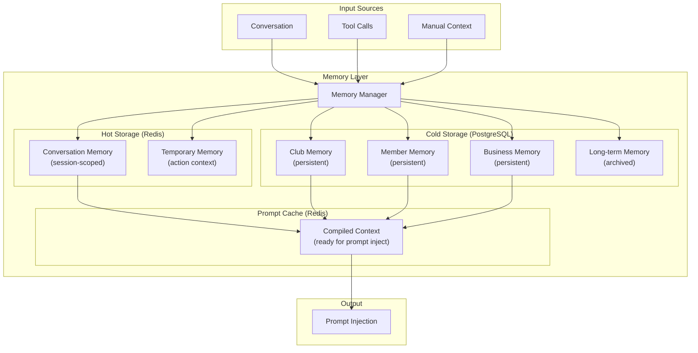
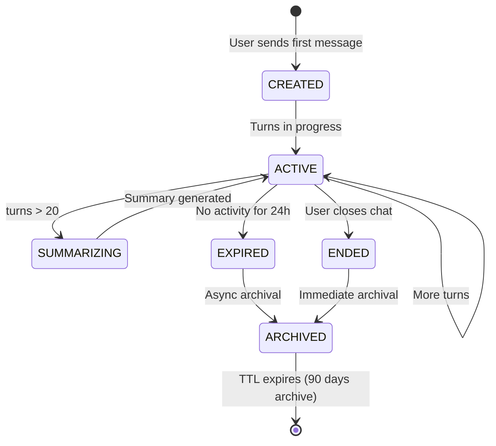
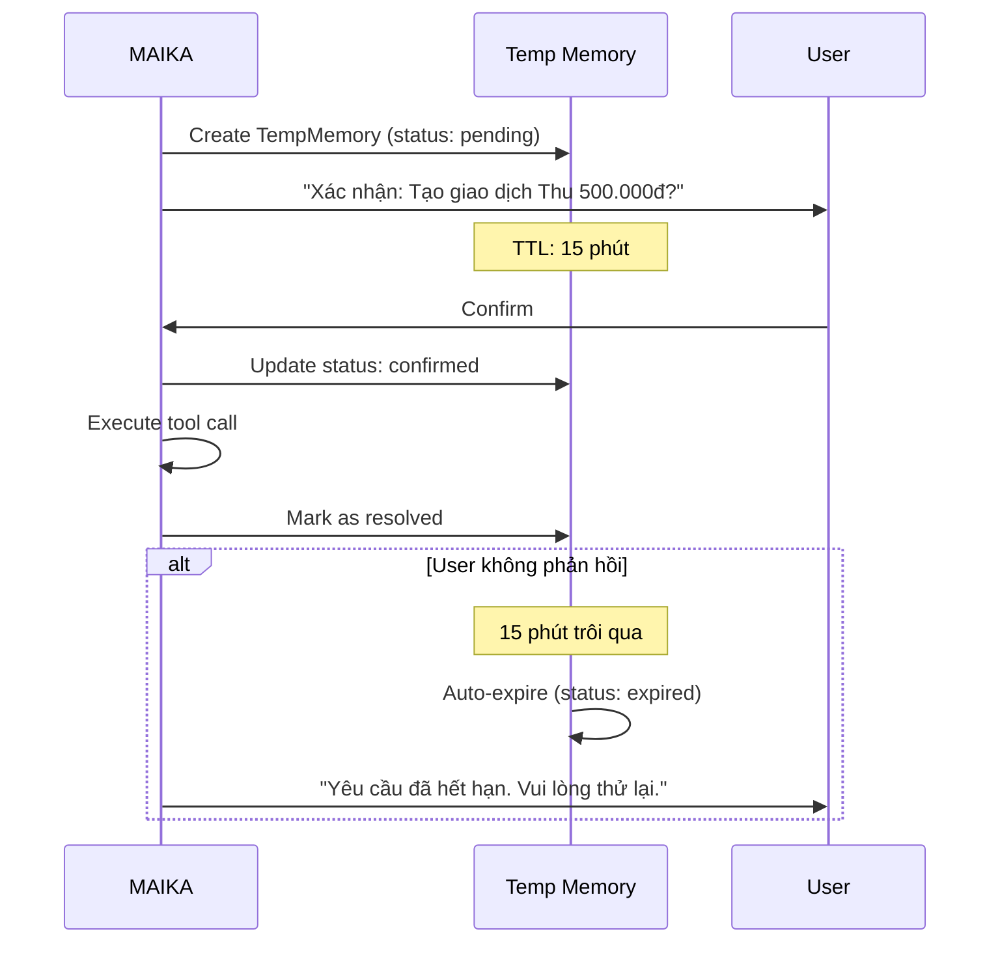
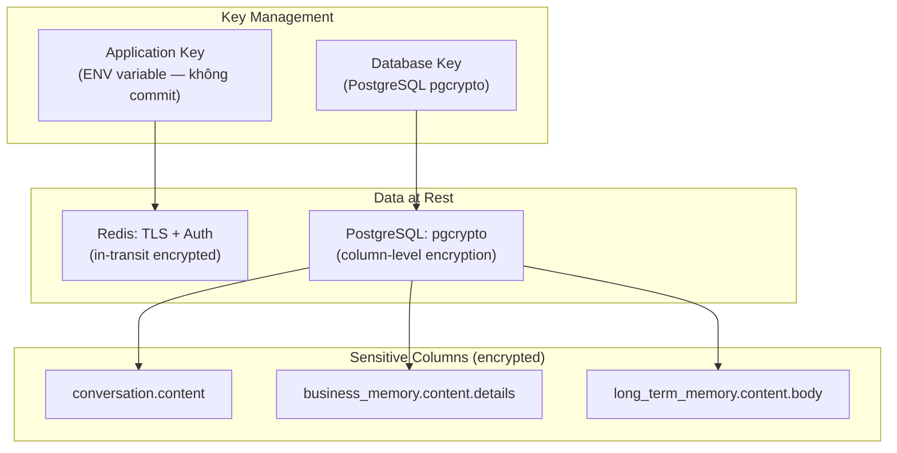
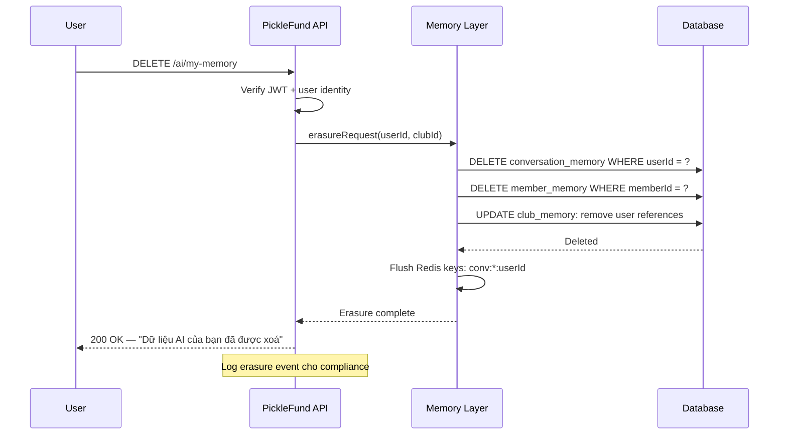
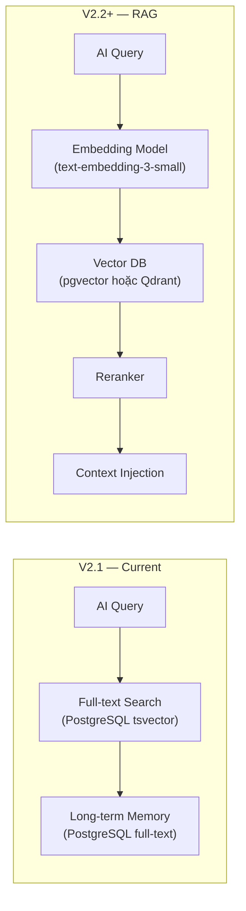
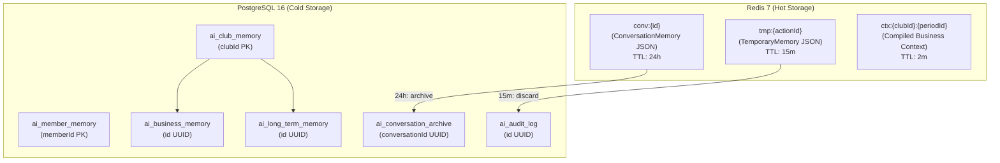

# 06 — MEMORY LAYER SPECIFICATION
## PickleFund V2.1 — Memory Layer Design

---

**Phiên bản:** 1.0.0
**Ngày:** 2026-06-29
**Trạng thái:** APPROVED
**Tác giả:** tunglt6-spec

---

## Lịch sử sửa đổi

| Phiên bản | Ngày | Tác giả | Mô tả |
|---|---|---|---|
| 1.0.0 | 2026-06-29 | tunglt6-spec | Khởi tạo — Phase 0 Architecture |

---

## Mục lục

1. [Tổng quan Memory Layer](#1-tổng-quan-memory-layer)
2. [Memory Types](#2-memory-types)
3. [Conversation Memory](#3-conversation-memory)
4. [Club Memory](#4-club-memory)
5. [Member Memory](#5-member-memory)
6. [Business Memory](#6-business-memory)
7. [Temporary Memory](#7-temporary-memory)
8. [Long-term Memory](#8-long-term-memory)
9. [Memory Retention & Expiration](#9-memory-retention--expiration)
10. [Privacy & Security](#10-privacy--security)
11. [Encryption](#11-encryption)
12. [GDPR-ready Design](#12-gdpr-ready-design)
13. [Future RAG Integration](#13-future-rag-integration)
14. [Storage Architecture](#14-storage-architecture)
15. [Architecture Decisions](#15-architecture-decisions)
16. [Glossary](#16-glossary)
17. [Cross References](#17-cross-references)

---

## 1. Tổng quan Memory Layer

Memory Layer là hệ thống lưu trữ ngữ cảnh cho AI Brain — cho phép MAIKA "nhớ" thông tin qua các cuộc hội thoại và cung cấp trải nghiệm cá nhân hóa.

### Mục tiêu

- **Continuity:** AI nhớ ngữ cảnh hội thoại trong một session
- **Personalization:** AI nhớ thông tin CLB và thành viên qua các session
- **Business Awareness:** AI có ngữ cảnh về tình hình tài chính CLB
- **Privacy-first:** Chỉ lưu những gì cần thiết, không lưu PII không cần thiết
- **GDPR Ready:** Hỗ trợ xoá dữ liệu theo yêu cầu

### Sơ đồ tổng thể Memory Layer



---

## 2. Memory Types

| Type | Scope | Storage | TTL | Mô tả |
|---|---|---|---|---|
| Conversation Memory | 1 session | Redis | 24 giờ | Lịch sử hội thoại hiện tại |
| Club Memory | 1 CLB | PostgreSQL | 90 ngày | Thông tin CLB — cấu trúc, preferences |
| Member Memory | 1 thành viên | PostgreSQL | 90 ngày | Thông tin cá nhân hóa thành viên |
| Business Memory | CLB-wide | PostgreSQL | 90 ngày | Ngữ cảnh nghiệp vụ — xu hướng, patterns |
| Temporary Memory | 1 action | Redis | 15 phút | Context cho pending WRITE operation |
| Long-term Memory | CLB-wide | PostgreSQL | 1 năm | Lịch sử quan trọng, decisions |

---

## 3. Conversation Memory

### 3.1 Mô tả

Conversation Memory lưu trữ toàn bộ lịch sử hội thoại trong một session. Đây là loại memory quan trọng nhất cho trải nghiệm chat liên tục.

### 3.2 Schema

```typescript
interface ConversationMemory {
  conversationId: string        // UUID — unique per session
  userId: string
  clubId: string
  startedAt: Date
  lastActivityAt: Date
  expiresAt: Date               // startedAt + 24h
  status: 'active' | 'expired' | 'ended'

  turns: ConversationTurn[]
  metadata: {
    totalTurns: number
    totalInputTokens: number
    totalOutputTokens: number
    totalToolCalls: number
    modelsUsed: string[]
    promptVersions: string[]
  }

  summary?: string              // Auto-generated khi turns > 20
}

interface ConversationTurn {
  turnId: string
  timestamp: Date
  role: 'user' | 'assistant' | 'tool'
  content: string               // Sanitized, PII masked
  toolCalls?: ToolCallRecord[]
  inputTokens: number
  outputTokens: number
  model: string
  promptVersion: string
  latency_ms: number
}

interface ToolCallRecord {
  tool: string
  input: Record<string, unknown>   // PII masked
  output: Record<string, unknown>  // PII masked
  success: boolean
  duration_ms: number
}
```

### 3.3 Storage Key Pattern

```
Redis key: conv:{conversationId}
TTL: 86400 seconds (24h)
Size limit: 100 turns max, 50KB max
```

### 3.4 Conversation Lifecycle



---

## 4. Club Memory

### 4.1 Mô tả

Club Memory lưu trữ thông tin về CLB — cấu trúc, preferences, và các context MAIKA cần biết về CLB cụ thể.

### 4.2 Schema

```typescript
interface ClubMemory {
  clubId: string
  clubName: string
  createdAt: Date
  updatedAt: Date
  expiresAt: Date               // updatedAt + 90 ngày

  // Cấu trúc CLB
  structure: {
    memberCount: number
    activeCount: number
    activePeriodId: string
    fundingModel: string         // Ví dụ: "weekly contribution"
    sessionFrequency: string     // Ví dụ: "3 buổi/tuần"
    venue: string               // Không lưu địa chỉ đầy đủ
  }

  // Preferences AI
  aiPreferences: {
    preferredResponseLength: 'short' | 'medium' | 'detailed'
    enableProactiveAlerts: boolean
    alertThresholds: {
      lowFundPercent: number     // Cảnh báo khi quỹ < X%
      debtReminderDays: number   // Nhắc khi nợ > X ngày
    }
    language: 'vi' | 'en'
  }

  // Ngữ cảnh nghiệp vụ (không chứa số liệu — số liệu lấy từ Finance Engine)
  businessContext: {
    currentPeriodStatus: string
    lastClosedPeriodDate?: string
    typicalMonthlyContribution: number  // Từ lịch sử — informational only
    notes: string[]              // Ghi chú admin
  }
}
```

### 4.3 Update Policy

Club Memory được cập nhật khi:
- Admin thay đổi settings
- Kỳ quỹ mới bắt đầu / kết thúc
- Số thành viên thay đổi đáng kể (±10%)
- AI nhận thức được pattern mới (qua conversation)

---

## 5. Member Memory

### 5.1 Mô tả

Member Memory lưu thông tin cá nhân hóa cho từng thành viên — giúp MAIKA phục vụ tốt hơn khi thành viên đó chat.

### 5.2 Schema

```typescript
interface MemberMemory {
  memberId: string
  clubId: string
  updatedAt: Date
  expiresAt: Date               // updatedAt + 90 ngày

  // Preferences (không lưu PII)
  preferences: {
    communicationStyle: 'formal' | 'casual'
    preferredLanguage: 'vi' | 'en'
    notificationChannels: ('in-app' | 'email')[]
  }

  // Interaction history (non-PII)
  interactionHistory: {
    lastChatAt?: Date
    totalConversations: number
    commonTopics: string[]      // Ví dụ: ['balance-check', 'attendance']
    satisfactionScore?: number  // 1-5 nếu có feedback
  }

  // Context flags
  flags: {
    hasUnreadAlerts: boolean
    pendingConfirmations: number
    lastReminderSentAt?: Date
  }
}
```

### 5.3 Privacy Rules

| Thông tin | Lưu không | Lý do |
|---|---|---|
| Tên đầy đủ | Không | Đã có trong DB chính |
| Email | Không | PII — không cần trong memory |
| Số điện thoại | Không | PII — không cần trong memory |
| CCCD | Không | PII nhạy cảm |
| Số dư cụ thể | Không | Lấy real-time từ Finance Engine |
| Communication style | Có | Non-PII, cải thiện UX |
| Ngôn ngữ ưa thích | Có | Non-PII, cải thiện UX |

---

## 6. Business Memory

### 6.1 Mô tả

Business Memory lưu trữ ngữ cảnh nghiệp vụ — xu hướng, patterns, và insights về CLB. Không chứa số liệu tài chính cụ thể (số liệu lấy real-time từ Finance Engine).

### 6.2 Schema

```typescript
interface BusinessMemory {
  clubId: string
  periodId?: string             // Nếu liên quan đến kỳ cụ thể
  updatedAt: Date
  expiresAt: Date               // 90 ngày

  type: BusinessMemoryType

  // Nội dung
  content: {
    title: string
    summary: string             // Tóm tắt ngắn cho AI context
    details: Record<string, unknown>  // Chi tiết cụ thể
    confidence: number          // 0-1 — mức độ tin cậy
    source: 'ai-inference' | 'admin-input' | 'system'
  }

  // Expiry
  priority: 'low' | 'medium' | 'high'
  tags: string[]
}

type BusinessMemoryType =
  | 'attendance-pattern'        // Pattern điểm danh (giảm cuối kỳ, etc.)
  | 'contribution-trend'        // Xu hướng đóng tiền
  | 'expense-pattern'           // Pattern chi tiêu
  | 'seasonal-insight'          // Insight theo mùa
  | 'admin-note'                // Ghi chú từ admin
  | 'recurring-reminder'        // Nhắc nhở định kỳ
```

---

## 7. Temporary Memory

### 7.1 Mô tả

Temporary Memory lưu context ngắn hạn cho các action đang chờ xác nhận (pending WRITE operations).

### 7.2 Schema

```typescript
interface TemporaryMemory {
  actionId: string              // UUID — link với pending action
  conversationId: string
  userId: string
  clubId: string
  createdAt: Date
  expiresAt: Date               // createdAt + 15 phút

  // Pending action
  pendingAction: {
    tool: string                // e.g., "funds.createTransaction"
    input: Record<string, unknown>
    humanReadableSummary: string  // "Tạo giao dịch Thu 500.000đ - Tiền sân"
    confirmationToken: string   // Secure random token
  }

  // Status
  status: 'pending' | 'confirmed' | 'rejected' | 'expired'
  resolvedAt?: Date
  resolvedByUserId?: string
}
```

### 7.3 Temporary Memory Flow



---

## 8. Long-term Memory

### 8.1 Mô tả

Long-term Memory lưu trữ những thông tin quan trọng cần giữ lâu dài — decisions, milestones, và historical context.

### 8.2 Schema

```typescript
interface LongTermMemory {
  id: string                    // UUID
  clubId: string
  createdAt: Date
  expiresAt: Date               // 1 năm

  type: 'decision' | 'milestone' | 'policy' | 'historical'

  content: {
    title: string
    body: string                // Markdown
    tags: string[]
    importance: 'normal' | 'high' | 'critical'
  }

  // Metadata
  createdBy: string             // userId hoặc 'system'
  source: string                // Conversation ID hoặc 'admin-input'
  searchable: boolean           // Có thể dùng cho RAG sau này
}
```

### 8.3 Ví dụ Long-term Memory Entries

```
Type: decision
Title: "Thay đổi mức đóng góp kỳ Q3 2026"
Body: "Admin quyết định tăng mức đóng từ 50k lên 70k/buổi do chi phí sân tăng.
       Hiệu lực từ kỳ 2026-Q3."
Tags: [contribution, policy, 2026-Q3]
Importance: high

---

Type: milestone
Title: "Đạt 50 thành viên active"
Body: "CLB đạt mốc 50 thành viên active vào 2026-06-15."
Tags: [growth, milestone]
Importance: normal
```

---

## 9. Memory Retention & Expiration

### 9.1 Retention Policy

```mermaid
gantt
    title Memory Retention Timeline
    dateFormat  X
    axisFormat  %s ngày

    section Conversation Memory
    Active                        :0, 1
    Expired (Redis deleted)       :1, 1

    section Temp Memory
    Active                        :0, 0
    Expired                       :0, 0

    section Club/Member/Business Memory
    Active                        :0, 90
    Eligible for cleanup          :90, 90

    section Long-term Memory
    Active                        :0, 365
    Archive eligible              :365, 365
```



### 9.2 Retention Table

| Memory Type | Active TTL | Archive | Delete After |
|---|---|---|---|
| Conversation Memory | 24 giờ | Không | 24 giờ (Redis auto-delete) |
| Temporary Memory | 15 phút | Không | 15 phút |
| Club Memory | 90 ngày | Không | 90 ngày (auto-update on use) |
| Member Memory | 90 ngày | Không | 90 ngày (auto-update on use) |
| Business Memory | 90 ngày | Không | 90 ngày |
| Long-term Memory | 1 năm | Có (cold storage) | 3 năm (archived) |

### 9.3 Expiration Behavior

```
Memory expiration rules:
1. Redis entries: Auto-expire bằng Redis TTL
2. PostgreSQL entries:
   - Cron job chạy daily lúc 2:00 AM
   - SELECT WHERE expiresAt < NOW()
   - Nếu type = long-term: move to archive table
   - Nếu type khác: DELETE
3. Long-term archive: Giữ 3 năm, sau đó xoá vĩnh viễn
4. User-requested deletion: Xử lý trong 24 giờ (GDPR)
```

---

## 10. Privacy & Security

### 10.1 Privacy Principles

| Principle | Mô tả |
|---|---|
| **Data Minimization** | Chỉ lưu thông tin thực sự cần thiết cho AI |
| **Purpose Limitation** | Memory chỉ dùng để cải thiện AI experience — không dùng cho mục đích khác |
| **Storage Limitation** | Xoá khi hết TTL, không giữ vô thời hạn |
| **Accuracy** | Cập nhật khi thông tin thay đổi |
| **Security** | Encrypt at rest, access control chặt |
| **Transparency** | User có thể xem memory của họ |

### 10.2 PII Policy

| Loại dữ liệu | Được lưu | Ghi chú |
|---|---|---|
| UserId (UUID) | Có | Non-PII identifier |
| ClubId (UUID) | Có | Non-PII identifier |
| Tên đầy đủ | Không | Dùng từ main DB khi cần |
| Email | Không | Main DB |
| Số điện thoại | Không | Main DB, masked khi hiển thị |
| CCCD/Passport | Không | Không liên quan AI |
| Địa chỉ | Không | Không liên quan AI |
| Số dư chính xác | Không | Lấy real-time từ Finance Engine |
| Nội dung hội thoại | Có (masked) | PII trong conversation phải mask |

### 10.3 PII Masking Rules

```
Trước khi lưu ConversationTurn:
1. Số điện thoại: 0912345678 → ****5678
2. CCCD: 012345678901 → ****8901
3. Số tài khoản ngân hàng: 1234567890 → ****7890
4. Email: user@domain.com → u***@domain.com

Regex patterns:
- Phone: /(\d{4})\d{3}(\d{4})/ → $1***$2
- CCCD: /\d{8}(\d{4})/ → ****$1
- Email: /^(\w{1})\w+(@\w+\.\w+)$/ → $1***$2
```

---

## 11. Encryption

### 11.1 Encryption Architecture



### 11.2 Encryption Standards

| Layer | Standard | Key Size |
|---|---|---|
| Transport (Redis TLS) | TLS 1.3 | — |
| Transport (API) | TLS 1.3 / HTTPS | — |
| Database column | AES-256-GCM | 256 bit |
| Key derivation | PBKDF2 | — |

### 11.3 Non-Encrypted Fields

Các field không cần encrypt (non-sensitive):
- `id`, `clubId`, `userId`, `conversationId`
- Timestamps: `createdAt`, `updatedAt`, `expiresAt`
- `status`, `type`, `tags`
- Token counts, latency metrics

---

## 12. GDPR-ready Design

### 12.1 GDPR Rights Implementation

| Right | Implementation |
|---|---|
| **Right to Access** | API endpoint: `GET /ai/my-memory` — user xem toàn bộ memory của mình |
| **Right to Erasure** | API endpoint: `DELETE /ai/my-memory` — xoá trong 24h |
| **Right to Portability** | `GET /ai/my-memory/export` — JSON/CSV export |
| **Right to Rectification** | Admin có thể sửa Member Memory entries |
| **Right to Object** | User có thể opt-out khỏi memory features |

### 12.2 Data Subject Request Flow



### 12.3 Data Retention Compliance

| Quy định | PickleFund Implementation |
|---|---|
| Không lưu quá mức cần thiết | Memory TTL rõ ràng, auto-delete |
| Thông báo người dùng | Privacy notice khi bật AI features |
| Consent management | User phải accept AI memory terms |
| Breach notification | Alert admin trong 72h nếu có data breach |
| Data Processing Agreement | DPA template trong release package |

---

## 13. Future RAG Integration

> **Lưu ý:** Phần này chỉ là thiết kế, **không triển khai trong V2.1**.

### 13.1 RAG Architecture Preview (V2.2+)



### 13.2 Migration Path từ V2.1 sang RAG

| Bước | Action | V2.1 / V2.2+ |
|---|---|---|
| 1 | Lưu Long-term Memory với `searchable: true` flag | V2.1 |
| 2 | Cấu trúc content theo format embedding-friendly | V2.1 |
| 3 | Thêm embedding generation job | V2.2+ |
| 4 | Deploy vector store (pgvector extension) | V2.2+ |
| 5 | Implement similarity search | V2.2+ |
| 6 | A/B test: full-text vs. RAG | V2.2+ |

### 13.3 Semantic Search Placeholder

Long-term Memory đã được thiết kế để tương thích:

```typescript
// V2.1: Full-text search
interface LongTermMemory {
  searchable: boolean         // true = sẽ được index
  searchVector?: unknown      // Placeholder cho future embedding
  tags: string[]              // Manual categorization (V2.1)
}

// V2.2+: Semantic search
interface LongTermMemory {
  searchable: boolean
  searchVector: number[]      // Embedding vector (e.g., 1536 dims)
  tags: string[]
}
```

---

## 14. Storage Architecture

### 14.1 Storage Schema



### 14.2 PostgreSQL Table Definitions (thiết kế)

```sql
-- ai_club_memory
CREATE TABLE ai_club_memory (
    club_id       UUID PRIMARY KEY,
    club_name     TEXT NOT NULL,
    structure     JSONB,
    ai_preferences JSONB,
    business_context JSONB,
    created_at    TIMESTAMPTZ DEFAULT NOW(),
    updated_at    TIMESTAMPTZ DEFAULT NOW(),
    expires_at    TIMESTAMPTZ
);

-- ai_member_memory
CREATE TABLE ai_member_memory (
    member_id     UUID PRIMARY KEY,
    club_id       UUID NOT NULL,
    preferences   JSONB,
    interaction_history JSONB,
    flags         JSONB,
    updated_at    TIMESTAMPTZ DEFAULT NOW(),
    expires_at    TIMESTAMPTZ
);

-- ai_business_memory
CREATE TABLE ai_business_memory (
    id            UUID DEFAULT gen_random_uuid() PRIMARY KEY,
    club_id       UUID NOT NULL,
    period_id     UUID,
    type          TEXT NOT NULL,
    content       JSONB,          -- encrypted sensitive fields
    priority      TEXT DEFAULT 'medium',
    tags          TEXT[],
    created_at    TIMESTAMPTZ DEFAULT NOW(),
    expires_at    TIMESTAMPTZ
);

-- ai_long_term_memory
CREATE TABLE ai_long_term_memory (
    id            UUID DEFAULT gen_random_uuid() PRIMARY KEY,
    club_id       UUID NOT NULL,
    type          TEXT NOT NULL,
    content       JSONB,          -- encrypted
    searchable    BOOLEAN DEFAULT TRUE,
    search_vector TSVECTOR,       -- full-text search (V2.1)
    importance    TEXT DEFAULT 'normal',
    tags          TEXT[],
    created_by    TEXT,
    created_at    TIMESTAMPTZ DEFAULT NOW(),
    expires_at    TIMESTAMPTZ
);

CREATE INDEX idx_ltm_search ON ai_long_term_memory USING GIN(search_vector);
CREATE INDEX idx_ltm_club ON ai_long_term_memory(club_id, expires_at);

-- ai_conversation_archive
CREATE TABLE ai_conversation_archive (
    conversation_id UUID PRIMARY KEY,
    club_id         UUID NOT NULL,
    user_id         UUID NOT NULL,
    turns           JSONB,        -- encrypted
    metadata        JSONB,
    started_at      TIMESTAMPTZ,
    ended_at        TIMESTAMPTZ,
    archived_at     TIMESTAMPTZ DEFAULT NOW(),
    expires_at      TIMESTAMPTZ  -- 90 ngày sau archived
);
```

---

## 15. Architecture Decisions

| # | Quyết định | Lý do |
|---|---|---|
| AD-ML-01 | Redis cho Conversation Memory | Sub-millisecond read, auto-TTL, không cần cleanup job |
| AD-ML-02 | PostgreSQL cho persistent memory | ACID, backup tích hợp, pgcrypto encryption |
| AD-ML-03 | Không lưu số liệu tài chính trong memory | Finance Engine là Source of Truth — tránh stale data |
| AD-ML-04 | PII masking trước khi lưu | Compliance + giảm blast radius nếu memory bị leak |
| AD-ML-05 | GDPR-ready từ thiết kế ban đầu | Không thể retrofit privacy sau khi đã deploy |
| AD-ML-06 | Long-term memory với `searchable` flag | Forward compatibility cho RAG mà không cần migrate schema |
| AD-ML-07 | Không deploy Vector DB trong V2.1 | Tránh over-engineering — full-text search đủ cho V2.1 |
| AD-ML-08 | Column-level encryption cho sensitive content | Defense in depth — dù DB bị dump, content vẫn encrypted |

---

## 16. Glossary

| Thuật ngữ | Định nghĩa |
|---|---|
| Memory Layer | Hệ thống lưu trữ ngữ cảnh cho AI Brain |
| Conversation Memory | Lịch sử hội thoại trong một session |
| Club Memory | Thông tin persistent về CLB cho AI |
| Member Memory | Thông tin cá nhân hóa theo thành viên |
| Business Memory | Ngữ cảnh nghiệp vụ — patterns, insights |
| Temporary Memory | Context ngắn hạn cho pending actions |
| Long-term Memory | Lịch sử quan trọng, giữ 1 năm |
| PII | Personally Identifiable Information — thông tin cá nhân |
| GDPR | General Data Protection Regulation |
| RAG | Retrieval-Augmented Generation — tăng cường AI bằng search |
| pgvector | PostgreSQL extension cho vector similarity search |
| Embedding | Biểu diễn văn bản dưới dạng vector số |
| TTL | Time To Live — thời gian sống của dữ liệu |

---

## 17. Cross References

| Tài liệu | Liên quan |
|---|---|
| [01_PROJECT_CHARTER.md](01_PROJECT_CHARTER.md) | TG-04: Memory Layer phân tầng |
| [02_AI_ARCHITECTURE_SPECIFICATION.md](02_AI_ARCHITECTURE_SPECIFICATION.md) | Memory trong overall architecture |
| [03_AI_HARNESS_DESIGN.md](03_AI_HARNESS_DESIGN.md) | Token logging liên quan memory |
| [04_TOOL_REGISTRY_SPECIFICATION.md](04_TOOL_REGISTRY_SPECIFICATION.md) | Tool call records lưu trong ConversationTurn |
| [05_PROMPT_ENGINE_SPECIFICATION.md](05_PROMPT_ENGINE_SPECIFICATION.md) | Memory injection vào prompt |
| Knowledge Base: GDPR | `knowledge-base/05_OPERATIONS/BACKUP.md` |
| Knowledge Base: Security | `knowledge-base/02_ARCHITECTURE/SECURITY_ARCHITECTURE.md` |

---

*PickleFund V2.1 AI Brain Foundation — Memory Layer Specification v1.0.0*
