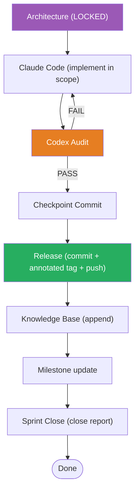

# 03 — Release Gate Matrix
## PickleFund V2.1 — Enterprise Governance Audit Prep

> Mọi release đi tuần tự qua các gate. Không bỏ bước.

---

## Release Gate Flow

## Gate Matrix

| # | Gate | Điều kiện vào | Bằng chứng | Approver |
|---|---|---|---|---|
| 1 | Architecture | Lock Certificate tồn tại | `*_LOCK.md` | Codex + chủ dự án |
| 2 | Claude Code | Trong scope sprint | diff + tests | — |
| 3 | Codex Audit | Build/test PASS | audit result | Codex |
| 4 | Checkpoint | Audit chuẩn bị | `checkpoint(...)` commit | — |
| 5 | Release | Audit PASS | `release(...)` + tag + push | Chủ dự án |
| 6 | Knowledge Base | Release xong | KB append block | — |
| 7 | Milestone | KB cập nhật | milestone note | — |
| 8 | Sprint Close | Tất cả gate trên | `SPRINT*_CLOSE_REPORT.md` | Chủ dự án |

## Release Gate Rules

| Rule ID | Quy tắc |
|---|---|
| RG-01 | Audit FAIL → quay lại Claude Code, không release |
| RG-02 | Tag annotated, trỏ commit đã audit |
| RG-03 | KB append trước khi đóng sprint |
| RG-04 | Không bỏ qua bất kỳ gate nào |

## Cross References
- Handbook §9 · Governance Matrix `02` · DoD Matrix `06`
