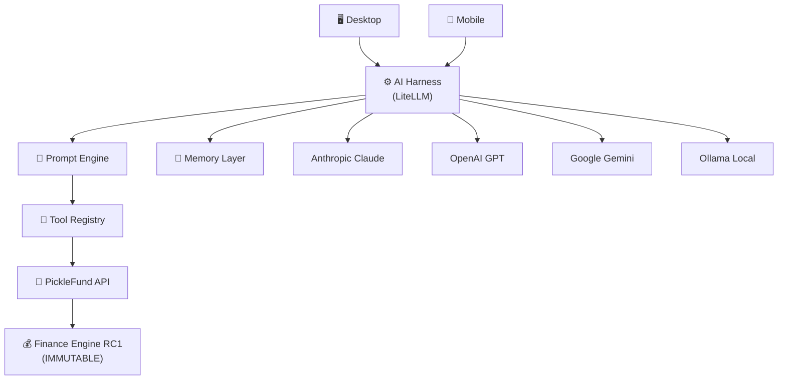

# INDEX — PickleFund V2.1 AI Brain Foundation
## Mục lục tài liệu kiến trúc Phase 0

---

**Phiên bản:** 1.0.0
**Ngày:** 2026-06-29
**Trạng thái:** APPROVED — Ready for Architecture Audit
**Tác giả:** tunglt6-spec

---

## Tổng quan

Thư mục `docs/V2.1_AI_BRAIN/` chứa toàn bộ tài liệu kiến trúc cho **PickleFund V2.1 — AI Brain Foundation**.

Phase 0 hoàn thành trước khi bắt đầu code — theo đúng "Architecture First" principle.

---

## Tài liệu kiến trúc

| # | Tài liệu | Mô tả | Phiên bản |
|---|---|---|---|
| 01 | [📋 Project Charter](01_PROJECT_CHARTER.md) | Vision, Goals, Milestones, Sprint Roadmap, Risks | 1.0.0 |
| 02 | [🏗️ AI Architecture Specification](02_AI_ARCHITECTURE_SPECIFICATION.md) | Overall AI Platform — layers, components, data flow, trust boundary | 1.0.0 |
| 03 | [⚙️ AI Harness Design](03_AI_HARNESS_DESIGN.md) | LiteLLM gateway, routing, failover, cost tracking, streaming | 1.0.0 |
| 04 | [🔧 Tool Registry Specification](04_TOOL_REGISTRY_SPECIFICATION.md) | 8 nhóm API tools, permissions, audit log | 1.0.0 |
| 05 | [📝 Prompt Engine Specification](05_PROMPT_ENGINE_SPECIFICATION.md) | MAIKA persona, prompt builder, versioning, safety | 1.0.0 |
| 06 | [🧠 Memory Layer Specification](06_MEMORY_LAYER_SPECIFICATION.md) | 5 memory types, retention, privacy, GDPR | 1.0.0 |

---

## Diagrams nhanh

### AI Platform Stack



### Finance Engine — Nguyên tắc bất biến

```
Tổng tài sản CLB = Quỹ Chính + Số dư chuyển kỳ
                   (Quỹ Phụ KHÔNG cộng vào)

AI chỉ được ĐỌC — KHÔNG tự tính
Nguồn duy nhất: GET /fund-periods/{id}/summary
```

---

## Nguyên tắc kiến trúc cốt lõi

| # | Nguyên tắc | Tài liệu |
|---|---|---|
| AP-01 | Finance Engine RC1 là Source of Truth — AI không tự tính tài chính | [02](02_AI_ARCHITECTURE_SPECIFICATION.md), [04](04_TOOL_REGISTRY_SPECIFICATION.md) |
| AP-02 | AI chỉ gọi qua Tool Registry — không bypass | [04](04_TOOL_REGISTRY_SPECIFICATION.md) |
| AP-03 | WRITE operations luôn cần Human Confirmation | [04](04_TOOL_REGISTRY_SPECIFICATION.md) |
| AP-04 | Mọi AI action phải có Audit Log | [04](04_TOOL_REGISTRY_SPECIFICATION.md), [03](03_AI_HARNESS_DESIGN.md) |
| AP-05 | Desktop và Mobile phải có AI parity | [01](01_PROJECT_CHARTER.md), [02](02_AI_ARCHITECTURE_SPECIFICATION.md) |
| AP-06 | Privacy-first Memory Design | [06](06_MEMORY_LAYER_SPECIFICATION.md) |
| AP-07 | LiteLLM Failover — AI hoạt động khi primary LLM down | [03](03_AI_HARNESS_DESIGN.md) |
| AP-08 | Prompt Versioning từ Sprint 1 | [05](05_PROMPT_ENGINE_SPECIFICATION.md) |

---

## Cross Reference Matrix

| | 01 Charter | 02 Architecture | 03 Harness | 04 Tools | 05 Prompt | 06 Memory |
|---|:---:|:---:|:---:|:---:|:---:|:---:|
| **01 Charter** | — | ✅ | ✅ | ✅ | ✅ | ✅ |
| **02 Architecture** | ✅ | — | ✅ | ✅ | ✅ | ✅ |
| **03 Harness** | ✅ | ✅ | — | ✅ | ✅ | — |
| **04 Tools** | ✅ | ✅ | ✅ | — | ✅ | — |
| **05 Prompt** | ✅ | ✅ | ✅ | ✅ | — | ✅ |
| **06 Memory** | ✅ | ✅ | ✅ | ✅ | ✅ | — |

---

## Definition of Done — Phase 0

| Tiêu chí | Trạng thái |
|---|---|
| 6 tài liệu đầy đủ | ✅ |
| Không placeholder | ✅ |
| Có Mermaid diagrams | ✅ |
| Có Table of Contents | ✅ |
| Có Version | ✅ |
| Có Revision History | ✅ |
| Có Glossary | ✅ |
| Có Cross Reference | ✅ |
| Tiếng Việt | ✅ |
| Chuẩn Enterprise Documentation | ✅ |
| Không viết code | ✅ |
| Không sửa RC1 | ✅ |

---

## Sprint Roadmap Quick View

| Sprint | Thời gian | Focus |
|---|---|---|
| Phase 0 | 2026-06-29 → 07-01 | Architecture Docs (file này) |
| Sprint 1 | 2026-07-02 → 07-14 | AI Harness + Tool Registry + Prompt Engine v1 |
| Sprint 2 | 2026-07-14 → 07-26 | Memory Layer + MAIKA Chat + Audit Log |
| Sprint 3 | 2026-07-26 → 08-05 | Finance Alerts + Auto Report + Mobile Parity |
| Sprint 4 | 2026-08-05 → 08-15 | QA + Security Audit + V2.1 Release |

---

## Baseline RC1 (Không thay đổi)

Các file/module RC1 **tuyệt đối không sửa** trong suốt V2.1:

```
backend/src/fund-periods/calculators/     ← Finance Engine RC1
backend/src/fund-periods/fund-periods.service.ts
frontend/src/components/finance/          ← Finance Design System RC1
release/v2.0.0-rc1-enterprise/            ← RC1 Release Package
```

---

*PickleFund V2.1 AI Brain Foundation — Architecture Index v1.0.0*
*Sẵn sàng cho Codex Architecture Audit*
