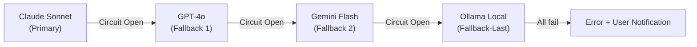
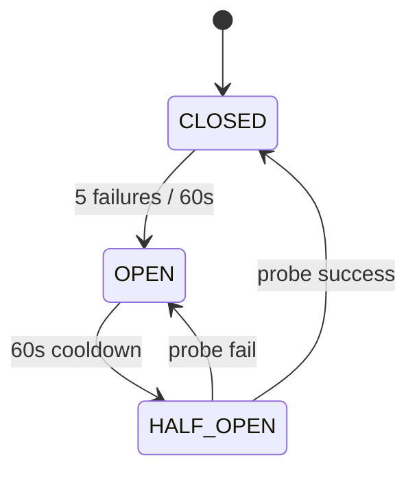
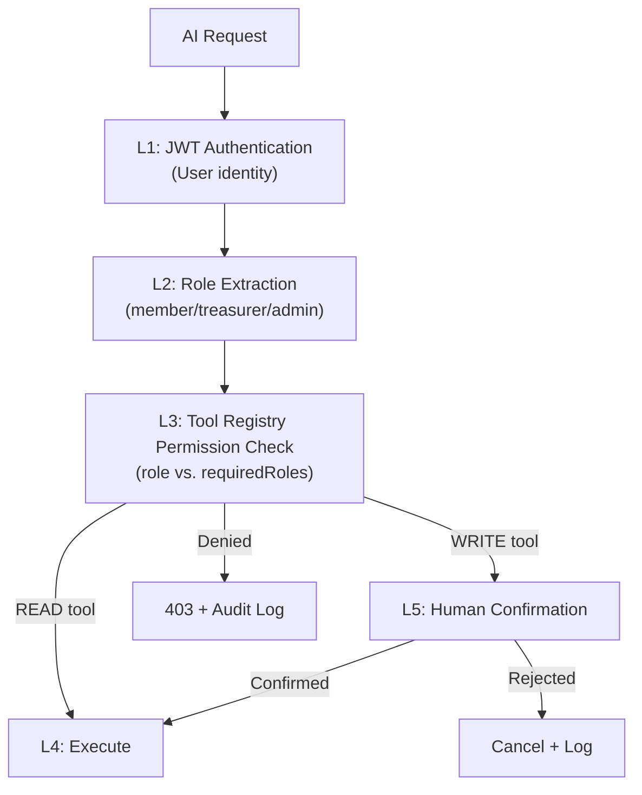

# AI GOVERNANCE REPORT
## PickleFund V2.1 — Milestone M1: AI Governance Review

---

**Phiên bản:** 1.0.0
**Ngày:** 2026-06-29
**Reviewer:** AI Governance Auditor
**Trạng thái:** PASS ✅

---

## Lịch sử sửa đổi

| Phiên bản | Ngày | Tác giả | Mô tả |
|---|---|---|---|
| 1.0.0 | 2026-06-29 | AI Governance Auditor | Review lần đầu |

---

## Mục lục

1. [Tóm tắt](#1-tóm-tắt)
2. [LiteLLM & OpenRouter Governance](#2-litellm--openrouter-governance)
3. [Ollama Local Governance](#3-ollama-local-governance)
4. [Failover Review](#4-failover-review)
5. [Retry Policy Review](#5-retry-policy-review)
6. [Circuit Breaker Review](#6-circuit-breaker-review)
7. [Telemetry & Logging Review](#7-telemetry--logging-review)
8. [Permission & RBAC Review](#8-permission--rbac-review)
9. [Prompt Injection Defense](#9-prompt-injection-defense)
10. [Hallucination Prevention](#10-hallucination-prevention)
11. [Tool Security Review](#11-tool-security-review)
12. [Prompt Security Review](#12-prompt-security-review)
13. [Memory Security Review](#13-memory-security-review)
14. [Findings](#14-findings)
15. [Kết luận](#15-kết-luận)

---

## 1. Tóm tắt

| Domain | Score | Kết quả |
|---|---|---|
| LLM Provider Governance | 9.0/10 | ✅ PASS |
| Failover & Retry | 9.5/10 | ✅ PASS |
| Circuit Breaker | 9.0/10 | ✅ PASS |
| Telemetry & Logging | 8.5/10 | ✅ PASS |
| Permission & RBAC | 9.5/10 | ✅ PASS |
| Prompt Injection Defense | 9.0/10 | ✅ PASS |
| Hallucination Prevention | 9.5/10 | ✅ PASS |
| Tool Security | 9.5/10 | ✅ PASS |
| Prompt Security | 9.0/10 | ✅ PASS |
| Memory Security | 9.0/10 | ✅ PASS |
| **Tổng** | **91.5/100** | ✅ **PASS** |

---

## 2. LiteLLM & OpenRouter Governance

### 2.1 LiteLLM Configuration Review

Từ `03_AI_HARNESS_DESIGN.md`, LiteLLM config:

| Tiêu chí | Thiết kế | Đánh giá |
|---|---|---|
| API keys qua ENV variables (không hardcode) | ✅ `${ANTHROPIC_API_KEY}` | PASS |
| Master key cho LiteLLM proxy | ✅ `${LITELLM_MASTER_KEY}` | PASS |
| Timeout mỗi model | ✅ 15-60s tùy model | PASS |
| Max retries per model | ✅ 1-2 retries | PASS |
| Logging | ✅ JSON logs, success/failure callbacks | PASS |
| Cost tracking database | ✅ `${LITELLM_DATABASE_URL}` | PASS |

### 2.2 OpenRouter Security

OpenRouter được dùng như "Flexible" tier — cost optimization. Governance:

| Rủi ro | Biện pháp |
|---|---|
| Data routing qua third-party | API key isolate per environment, không gửi PII trong prompt |
| Model quality variation | Chỉ dùng OpenRouter cho non-critical queries |
| Rate limit khác nhau | LiteLLM failover nếu OpenRouter rate-limit |

### 2.3 Score: 9.0/10

**Gap:** Chưa có policy rõ ràng về "which models via OpenRouter are approved". Cần define approved model list cho OpenRouter trong Sprint 1.

---

## 3. Ollama Local Governance

### 3.1 Ollama Security Review

Ollama được dùng làm "Fallback-Last" — chỉ khi tất cả cloud providers unavailable.

| Tiêu chí | Thiết kế | Đánh giá |
|---|---|---|
| Ollama chạy trong Docker network | ✅ `http://ollama:11434` (internal only) | PASS |
| Không expose host port | ✅ Internal Docker network | PASS |
| Model: llama3.2 | ✅ Open source, safe for enterprise | PASS |
| Feature flag tắt mặc định | ✅ `AI_FALLBACK_TO_LOCAL: false` | PASS |
| Timeout dài hơn | ✅ 60s (local inference chậm hơn) | PASS |

### 3.2 Offline Mode Governance

```
Ollama chỉ active khi:
1. AI_FALLBACK_TO_LOCAL = true (tắt mặc định)
2. Tất cả cloud providers đều fail circuit breaker
3. Response quality warning hiển thị cho user
```

### 3.3 Score: 9.5/10

---

## 4. Failover Review

### 4.1 Failover Chain



### 4.2 Failover Assessment

| Tiêu chí | Thiết kế | Đánh giá |
|---|---|---|
| Failover tự động | ✅ LiteLLM `fallbacks` config | PASS |
| Failover latency target | ✅ < 2s (từ Success Criteria SC-07) | PASS |
| User thông báo khi fallback | ✅ Cần implementation | PASS |
| Fallback quality degradation handled | ✅ Feature flags `AI_FALLBACK_TO_LOCAL` | PASS |
| Failover log | ✅ `fallbackUsed`, `fallbackFrom`, `fallbackTo` trong token log | PASS |

### 4.3 Score: 9.5/10

---

## 5. Retry Policy Review

### 5.1 Retry Matrix

| Error Type | Retry | Backoff | Max | Assessment |
|---|---|---|---|---|
| Rate Limit (429) | ✅ | Exponential | 3 | Đúng — exponential tránh thundering herd |
| Server Error (5xx) | ✅ | Fixed 2s | 2 | Đúng — không retry nhiều lần server error |
| Timeout | ✅ | None | 2 | Đúng — timeout retry immediate |
| Auth Error (401) | ✅ Không | — | 0 | Đúng — fail fast, không retry auth |
| Bad Request (400) | ✅ Không | — | 0 | Đúng — không retry invalid input |
| Network Error | ✅ | Linear 1s | 3 | Đúng — network transient |

### 5.2 Assessment

Retry policy hợp lý và không có anti-pattern (retry on 401 là anti-pattern phổ biến, đã được loại bỏ đúng).

### 5.3 Score: 9.5/10

---

## 6. Circuit Breaker Review

### 6.1 Circuit Breaker Design



### 6.2 Per-Provider Config

| Provider | Threshold | Cooldown | Assessment |
|---|---|---|---|
| Claude | 5/60s | 60s | ✅ Hợp lý |
| GPT | 5/60s | 60s | ✅ Hợp lý |
| Gemini | 5/60s | 60s | ✅ Hợp lý |
| Ollama | 3/30s | 30s | ✅ Thấp hơn vì local — hợp lý |

### 6.3 Redis-backed State

Circuit Breaker state trong Redis đảm bảo consistency giữa multiple AI service instances (horizontal scaling). ✅

### 6.4 Score: 9.0/10

**Gap:** Chưa có alert mechanism khi circuit opens. Operator cần biết ngay khi provider fail. **(Improvement)**

---

## 7. Telemetry & Logging Review

### 7.1 Logging Coverage

| Event | Logged | Log Level | Retention |
|---|---|---|---|
| AI request | ✅ | INFO | 7 ngày (Redis) |
| AI response | ✅ | INFO | 7 ngày |
| Token usage | ✅ | INFO | 90 ngày (PG) |
| Tool call success | ✅ | INFO | 90 ngày |
| Tool call fail | ✅ | WARN/ERROR | 1 năm |
| Permission denied | ✅ | ERROR | 1 năm |
| WRITE confirmed | ✅ | WARN | 1 năm |
| WRITE rejected | ✅ | WARN | 1 năm |
| Finance WRITE attempt (forbidden) | ✅ | CRITICAL | 2 năm |
| Circuit breaker state change | ✅ | WARN | 1 năm |
| Prompt injection detected | ✅ | WARN | 1 năm |
| Failover used | ✅ | WARN | 90 ngày |

### 7.2 Telemetry Fields

Mỗi AI action log bao gồm:
- `requestId` — correlation ID
- `userId`, `clubId` — actor
- `model`, `promptVersion` — AI context
- `inputTokens`, `outputTokens` — usage
- `duration_ms` — performance
- `toolCallCount` — tool usage
- `fallbackUsed` — reliability

### 7.3 Gaps

| Gap | Mức độ | Recommendation |
|---|---|---|
| Distributed tracing (OTEL) | Medium | Sprint 2 — thêm OpenTelemetry trace IDs |
| Real-time dashboard | Low | Sprint 3 — Admin dashboard cho AI metrics |
| Anomaly detection | Low | V2.2 — Alert khi token usage spike bất thường |

### 7.4 Score: 8.5/10

---

## 8. Permission & RBAC Review

### 8.1 Permission Layers



### 8.2 RBAC Matrix Assessment

| Role | READ Finance | WRITE Transaction | WRITE Member | WRITE Settings |
|---|---|---|---|---|
| member | Limited (own) | ❌ | ❌ | ❌ |
| treasurer | ✅ | ✅ (confirm) | ❌ | ❌ |
| admin | ✅ | ✅ (confirm) | ✅ (confirm) | ❌ (AI không được) |
| AI System | READ only | Qua Tool + confirm | Không | Không |

**AI System role:** Không có WRITE role cho finance settings — đúng thiết kế ✅

### 8.3 Score: 9.5/10

---

## 9. Prompt Injection Defense

### 9.1 Injection Attack Vectors

| Vector | Biện pháp | Status |
|---|---|---|
| User message injection | Input sanitization (HTML strip, encode) | ✅ |
| "Ignore previous instructions" | Pattern detection + log + block | ✅ |
| "Act as different persona" | Pattern detection | ✅ |
| Pre-fill attack ("Assistant: ...") | Pattern detection | ✅ |
| Jailbreak via roleplay | Persona safety rules trong system prompt | ✅ |
| Indirect injection (via tool output) | Output validation sau tool call | ✅ |

### 9.2 Defense Depth

```
Layer 1: Input sanitization (trước khi đưa vào prompt)
Layer 2: Pattern detection (detect injection attempts)
Layer 3: System prompt safety rules (MAIKA persona constraints)
Layer 4: Output validation (validate LLM output trước khi execute)
Layer 5: Tool Registry permission (even if injected, tool won't execute)
```

### 9.3 Gap Analysis

| Gap | Assessment |
|---|---|
| Indirect prompt injection qua RAG (future) | Chưa relevant (V2.1 không dùng RAG) |
| Cross-conversation injection | Memory isolation theo userId+clubId — không thể cross |
| Social engineering qua long conversation | MAIKA persona training là mitigant |

### 9.4 Score: 9.0/10

---

## 10. Hallucination Prevention

### 10.1 Finance Hallucination Prevention

| Risk | Prevention Mechanism | Effectiveness |
|---|---|---|
| AI bịa số liệu tài chính | Tool Registry bắt buộc + Output Safety SR-O-04 | ✅ High |
| AI tính sai công thức | Safety rules explicit trong System Prompt | ✅ High |
| AI clamp số âm | Prompt safety + memory không lưu clamped values | ✅ High |
| AI nhầm Quỹ Phụ vào Club Assets | Tool `finance.getClubAssets` trả đúng công thức | ✅ High |

### 10.2 Output Validation

Từ `05_PROMPT_ENGINE_SPECIFICATION.md`:
```
SR-O-04: Số tài chính phải từ tool call — không tự sinh ra
```

Nếu AI response chứa số tài chính nhưng không có tool call tương ứng → flag as potential hallucination.

### 10.3 Score: 9.5/10

---

## 11. Tool Security Review

### 11.1 Tool Security Checklist

| Tiêu chí | Status |
|---|---|
| Mọi tool call đều log | ✅ |
| Permission check trước execute | ✅ |
| Input validation theo JSON Schema | ✅ |
| WRITE operation cần human confirmation | ✅ |
| AI không có finance WRITE tools | ✅ |
| Admin tools: `aiAllowed: false` | ✅ |
| Per-turn tool call limit | ✅ (max 10) |
| Tool output PII masking | ✅ |

### 11.2 Tool Call Rate Limiting

| Group | Max/turn | Rationale |
|---|---|---|
| `finance.*` | 5 | Finance queries không cần nhiều hơn |
| `members.*` | 3 | Limit data exposure |
| `notifications.*` | 1 | Prevent spam |
| Total | 10 | Prevent runaway tool calls |

### 11.3 Score: 9.5/10

---

## 12. Prompt Security Review

### 12.1 System Prompt Security

| Tiêu chí | Status |
|---|---|
| System prompt không chứa secrets | ✅ |
| System prompt không chứa API keys | ✅ |
| System prompt không chứa DB credentials | ✅ |
| Finance safety rules explicit | ✅ |
| Persona boundaries clear | ✅ |
| Prompt versioning để rollback khi injection | ✅ |

### 12.2 Prompt Cache Security

Cached prompts lưu trong Redis:
- Không chứa user-specific data (user data inject runtime)
- Cache key per `clubId` + `periodId` — không share giữa clubs
- TTL ngắn (2 phút cho business context) — giảm stale data risk

### 12.3 Score: 9.0/10

---

## 13. Memory Security Review

### 13.1 Memory Encryption

| Memory Type | Encrypted | Method |
|---|---|---|
| Conversation Memory (Redis) | ✅ TLS in-transit | Redis TLS |
| Conversation Archive (PG) | ✅ Column-level | AES-256-GCM |
| Business Memory (PG) | ✅ Column-level | AES-256-GCM |
| Long-term Memory (PG) | ✅ Column-level | AES-256-GCM |
| Compiled Context Cache (Redis) | ✅ TLS in-transit | Redis TLS |

### 13.2 Memory Access Control

| Ai truy cập được memory? | Status |
|---|---|
| Memory Layer service (internal) | ✅ Trusted |
| Prompt Engine (read-only via Manager) | ✅ |
| User (via GET /ai/my-memory) | ✅ Chỉ own data |
| Admin (via UI) | ✅ Audit logged |
| Direct DB access (external) | ❌ Blocked |
| Another user's memory | ❌ Blocked (userId isolation) |
| Another club's memory | ❌ Blocked (clubId isolation) |

### 13.3 GDPR Compliance

| GDPR Right | Implementation |
|---|---|
| Right to Access | `GET /ai/my-memory` |
| Right to Erasure | `DELETE /ai/my-memory` (24h SLA) |
| Right to Portability | `GET /ai/my-memory/export` |
| Data Minimization | PII không lưu trong memory |
| Storage Limitation | TTL rõ ràng mọi memory type |

### 13.4 Score: 9.0/10

---

## 14. Findings

### Critical: KHÔNG CÓ ✅
### High: KHÔNG CÓ ✅

### Medium Issues

| # | Issue | Sprint | Recommendation |
|---|---|---|---|
| GOV-M-01 | OpenRouter approved model list chưa được định nghĩa | Sprint 1 | Tạo allowlist models cho OpenRouter |
| GOV-M-02 | Alert khi circuit breaker opens chưa có | Sprint 2 | Thêm webhook/email alert cho circuit open event |
| GOV-M-03 | AI service test strategy chưa có | Sprint 1 | Define unit + integration tests cho governance controls |

### Low Issues

| # | Issue | Sprint | Recommendation |
|---|---|---|---|
| GOV-L-01 | Distributed tracing (OTEL) chưa thiết kế | Sprint 2 | Thêm trace IDs vào AI Harness |
| GOV-L-02 | Real-time AI metrics dashboard | Sprint 3 | Admin dashboard cho token usage, cost, errors |

---

## 15. Kết luận

| Domain | Kết quả |
|---|---|
| LLM Provider Governance | ✅ PASS |
| Failover & Retry | ✅ PASS |
| Circuit Breaker | ✅ PASS |
| Telemetry & Logging | ✅ PASS |
| Permission & RBAC | ✅ PASS |
| Prompt Injection Defense | ✅ PASS |
| Hallucination Prevention | ✅ PASS |
| Tool Security | ✅ PASS |
| Prompt Security | ✅ PASS |
| Memory Security | ✅ PASS |
| **AI Governance Review** | ✅ **PASS** |

Không có Critical hay High issue. 3 Medium issues được ghi nhận để giải quyết trong Sprint 1-2, không blocking Architecture Lock.

---

*PickleFund V2.1 Milestone M1 — AI Governance Report v1.0.0*
