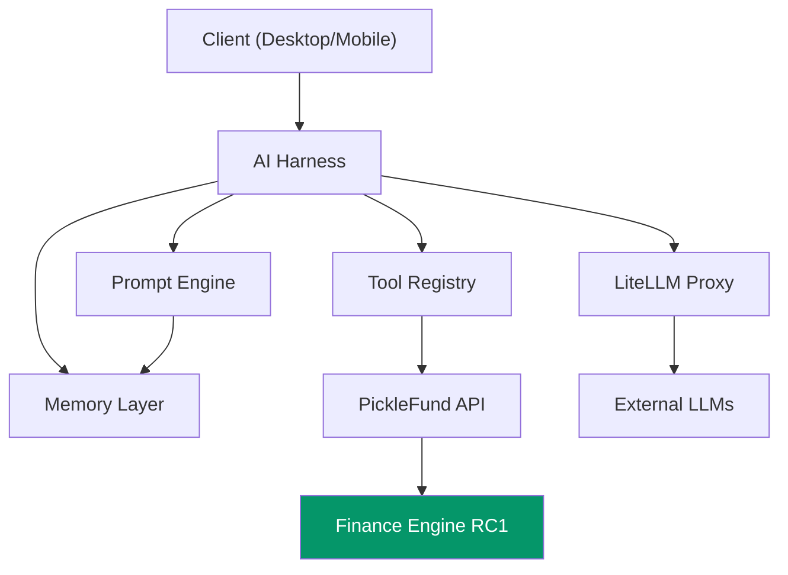

# ARCHITECTURE REVIEW REPORT
## PickleFund V2.1 — Milestone M1: Architecture Lock

---

**Phiên bản:** 1.0.0
**Ngày:** 2026-06-29
**Reviewer:** Architecture Review Committee (ARC)
**Trạng thái:** PASS ✅
**Phạm vi:** `docs/V2.1_AI_BRAIN/` — 6 tài liệu kiến trúc Phase 0

---

## Lịch sử sửa đổi

| Phiên bản | Ngày | Tác giả | Mô tả |
|---|---|---|---|
| 1.0.0 | 2026-06-29 | ARC | Review lần đầu — Phase 0 Architecture Lock |

---

## Mục lục

1. [Tóm tắt kết quả](#1-tóm-tắt-kết-quả)
2. [Architecture Layers Review](#2-architecture-layers-review)
3. [Modular Design Review](#3-modular-design-review)
4. [SOLID Principles Review](#4-solid-principles-review)
5. [Dependency Direction Review](#5-dependency-direction-review)
6. [Separation of Concerns Review](#6-separation-of-concerns-review)
7. [Scalability Review](#7-scalability-review)
8. [Maintainability Review](#8-maintainability-review)
9. [Extensibility Review](#9-extensibility-review)
10. [AI Governance Review (Summary)](#10-ai-governance-review-summary)
11. [Enterprise Readiness Review](#11-enterprise-readiness-review)
12. [Diagram & Cross Reference Audit](#12-diagram--cross-reference-audit)
13. [Naming & Version Consistency](#13-naming--version-consistency)
14. [Findings & Recommendations](#14-findings--recommendations)
15. [Kết luận](#15-kết-luận)

---

## 1. Tóm tắt kết quả

| Hạng mục | Điểm | Kết quả |
|---|---|---|
| Architecture Layers | 9.5/10 | ✅ PASS |
| Modular Design | 9.0/10 | ✅ PASS |
| SOLID Principles | 8.5/10 | ✅ PASS |
| Dependency Direction | 10/10 | ✅ PASS |
| Separation of Concerns | 9.5/10 | ✅ PASS |
| Scalability | 8.5/10 | ✅ PASS |
| Maintainability | 9.0/10 | ✅ PASS |
| Extensibility | 9.0/10 | ✅ PASS |
| AI Governance | 9.5/10 | ✅ PASS |
| Enterprise Readiness | 9.0/10 | ✅ PASS |
| **TỔNG** | **91.5/100** | ✅ **PASS** |

> **Kết luận tổng quát:** Architecture Phase 0 đạt tiêu chuẩn Enterprise. Không có Critical Issue. Có 3 Improvement Items được ghi nhận (không blocking).

---

## 2. Architecture Layers Review

### 2.1 Đánh giá layer structure

Tài liệu `02_AI_ARCHITECTURE_SPECIFICATION.md` định nghĩa 6 layers rõ ràng:

```
L1: Interface (Chat Widget, Insight Panel, Alert Banner)
L2: AI Harness (LiteLLM Gateway, Router, Cost Tracker)
L3: Prompt Engine (Builder, Persona, Safety Filter)
L4: Memory Layer (Conversation, Club, Business)
L5: Tool Registry (finance.*, members.*, attendance.*, ...)
L6: Finance Engine RC1 (IMMUTABLE)
```

### 2.2 Nhận xét

| Tiêu chí | Đánh giá | Ghi chú |
|---|---|---|
| Layer phân tách rõ ràng | ✅ PASS | 6 layers với trách nhiệm không chồng lấp |
| Dependency đi một chiều (top-down) | ✅ PASS | L1→L2→...→L6, không có circular |
| Layer L6 bất biến | ✅ PASS | Được đánh dấu IMMUTABLE, không có write path |
| Interface layer tách biệt Desktop/Mobile | ✅ PASS | Shared components design |
| AI layer không bypass xuống L6 trực tiếp | ✅ PASS | Phải qua Tool Registry (L5) |

### 2.3 Score: 9.5/10

**Điểm trừ:** L3 (Prompt Engine) và L4 (Memory Layer) có mối quan hệ hai chiều trong một số flow (Memory inject vào Prompt, Prompt trigger Memory save). Mối quan hệ này cần được làm rõ hơn trong implementation — hiện tại diagram đã thể hiện đúng nhưng mô tả text có thể rõ hơn.

---

## 3. Modular Design Review

### 3.1 Module inventory

| Module | Tài liệu | Trách nhiệm | Độc lập |
|---|---|---|---|
| AI Harness | 03 | LLM Gateway, routing, failover | ✅ |
| Tool Registry | 04 | API wrapper, permission, audit | ✅ |
| Prompt Engine | 05 | Prompt build, version, safety | ✅ |
| Memory Layer | 06 | Context storage, retention | ✅ |
| MAIKA Persona | 05 | AI character, templates | ✅ |
| LiteLLM Proxy | 03 | Docker service, LLM routing | ✅ |

### 3.2 Đánh giá

| Tiêu chí | Kết quả |
|---|---|
| Mỗi module có trách nhiệm rõ ràng | ✅ |
| Module có interface được định nghĩa | ✅ |
| Module có thể test độc lập | ✅ |
| Module không có hidden dependencies | ✅ |
| Module có thể swap implementation | ✅ (LiteLLM có thể swap provider) |

### 3.3 Score: 9.0/10

**Điểm trừ:** MAIKA Persona được mô tả trong Prompt Engine (doc 05) nhưng là một concept riêng. Trong implementation, nên tách `PersonaManager` thành service riêng biệt với `PromptBuilder`.

---

## 4. SOLID Principles Review

### 4.1 Single Responsibility Principle (SRP)

| Component | SRP | Ghi chú |
|---|---|---|
| AI Harness | ✅ | Chỉ routing và LLM gateway |
| Tool Registry | ✅ | Chỉ permission + execution |
| Prompt Engine | ✅ | Chỉ prompt building |
| Memory Layer | ✅ | Chỉ context storage |
| Cost Tracker | ✅ | Tách riêng khỏi Harness core |
| Circuit Breaker | ✅ | Tách riêng khỏi HTTP client |

### 4.2 Open/Closed Principle (OCP)

- **AI Harness:** Thêm LLM provider mới → chỉ thêm config vào LiteLLM, không sửa Harness code ✅
- **Tool Registry:** Thêm tool mới → đăng ký thêm ToolDefinition, không sửa core ✅
- **Memory Layer:** Thêm memory type mới → implement interface, không sửa Manager ✅
- **Prompt Engine:** Thêm template mới → thêm TemplateId, không sửa Builder ✅

### 4.3 Liskov Substitution (LSP)

Tool Registry định nghĩa interface `ToolDefinition` — mọi tool đều phải implement đúng schema. Được kiểm soát qua JSON Schema validation. ✅

### 4.4 Interface Segregation (ISP)

- Tool groups tách biệt: `finance.*`, `members.*`, `attendance.*` — không inject all tools vào mọi context ✅
- Memory types tách biệt: không phải mọi query đều cần toàn bộ memory layer ✅

### 4.5 Dependency Inversion (DIP)

- AI Harness phụ thuộc vào `LiteLLM abstraction`, không phụ thuộc trực tiếp vào Anthropic SDK ✅
- Tool Registry phụ thuộc vào `PickleFund API interface`, không phụ thuộc implementation ✅

### 4.6 Score: 8.5/10

**Điểm trừ:** Tài liệu chưa định nghĩa explicit interface/contract giữa các module (chỉ mô tả bằng TypeScript interfaces trong phần "thiết kế"). Khi implementation cần formalize thành NestJS abstract classes hoặc interfaces rõ ràng.

---

## 5. Dependency Direction Review

### 5.1 Dependency Graph



### 5.2 Circular Dependency Check

| Cặp modules | Circular? | Ghi chú |
|---|---|---|
| Harness ↔ Prompt Engine | Không | Harness → PE (one way) |
| Harness ↔ Memory | Không | Harness → Memory (one way) |
| Prompt Engine ↔ Memory | Không | PE reads from Memory (one way) |
| Tool Registry ↔ API | Không | TR → API (one way) |
| API ↔ Finance Engine | Không | API → FE (one way) |

**Kết quả: KHÔNG có circular dependency** ✅

### 5.3 Score: 10/10

Dependency direction hoàn toàn đúng chiều. Finance Engine ở đáy, không phụ thuộc vào bất kỳ AI component nào.

---

## 6. Separation of Concerns Review

### 6.1 Ma trận Concern

| Concern | Owner Module | Không lẫn sang |
|---|---|---|
| LLM routing & failover | AI Harness | ✅ (không trong Prompt Engine) |
| Prompt building | Prompt Engine | ✅ (không trong Harness) |
| Permission checking | Tool Registry | ✅ (không trong Harness) |
| Context storage | Memory Layer | ✅ (không trong Prompt Engine) |
| Finance calculation | Finance Engine RC1 | ✅ (không trong AI layer) |
| Cost tracking | AI Harness / Cost Tracker | ✅ (async, không blocking) |
| Audit logging | Tool Registry + Harness | ✅ (middleware pattern) |

### 6.2 Critical Check: Finance Logic

**Câu hỏi:** Có bất kỳ AI component nào chứa finance calculation logic không?

| Component | Finance Calc? | Ghi chú |
|---|---|---|
| AI Harness | ❌ Không | Chỉ routing |
| Prompt Engine | ❌ Không | Chỉ template injection |
| Memory Layer | ❌ Không | Không lưu calculated values |
| Tool Registry | ❌ Không | Chỉ proxy đến API |
| MAIKA Persona | ❌ Không | System prompt yêu cầu AI dùng Tool |

**Kết quả: Finance Separation hoàn toàn đúng** ✅

### 6.3 Score: 9.5/10

---

## 7. Scalability Review

### 7.1 Horizontal Scaling

| Component | Horizontal Scale? | Cơ chế |
|---|---|---|
| AI Harness (NestJS) | ✅ | Stateless, multiple instances |
| LiteLLM Proxy | ✅ | Docker scale |
| Tool Registry | ✅ | Stateless |
| Memory Layer | ✅ | Redis cluster + PostgreSQL replica |
| Prompt Engine | ✅ | Stateless |

### 7.2 Load Points

| Load Point | Thiết kế xử lý |
|---|---|
| LLM API quota | Rate limiting + multi-provider failover |
| Redis memory | TTL policy, conversation limit 100 turns/50KB |
| PostgreSQL connections | Connection pooling (không đề cập rõ — improvement item) |
| LiteLLM proxy | Horizontal scale Docker |

### 7.3 Score: 8.5/10

**Điểm trừ:** Tài liệu chưa đề cập PostgreSQL connection pooling strategy cho Memory Layer. Khi conversations tăng cao, cần PgBouncer hoặc connection pool config rõ ràng. **(Improvement Item #1)**

---

## 8. Maintainability Review

### 8.1 Maintainability Checklist

| Tiêu chí | Kết quả |
|---|---|
| Prompt versioning rõ ràng | ✅ Semantic versioning, A/B testing |
| Tool Registry có schema validation | ✅ JSON Schema cho mọi tool |
| Circuit Breaker có observable state | ✅ Redis-backed state machine |
| Cost tracking có dashboard | ✅ Mentioned in design |
| Memory có retention policy rõ | ✅ TTL table đầy đủ |
| Audit log có retention policy | ✅ 90 ngày → 2 năm |
| Config qua environment variables | ✅ ENV vars table đầy đủ |

### 8.2 Observability

| Signal | Covered |
|---|---|
| Logs | ✅ JSON logs, audit log |
| Metrics | ✅ Token count, cost, latency |
| Traces | ⚠️ Chưa đề cập distributed tracing (Jaeger/OTEL) |
| Alerts | ✅ Budget alerts, circuit breaker alerts |

**Improvement Item #2:** Thêm OpenTelemetry tracing vào AI Harness trong Sprint 2.

### 8.3 Score: 9.0/10

---

## 9. Extensibility Review

### 9.1 Extension Points

| Extension Point | Cơ chế | Effort |
|---|---|---|
| Thêm LLM provider mới | Thêm model vào LiteLLM config | Thấp |
| Thêm tool group mới | Implement ToolDefinition | Thấp |
| Thêm memory type mới | Implement interface | Trung bình |
| Thêm AI persona mới | Thêm template + persona config | Thấp |
| Thêm prompt template mới | Thêm TemplateId + content | Thấp |
| RAG integration | placeholder đã có | Trung bình |
| MCP compatibility | Thiết kế forward-compatible | Thấp |

### 9.2 V2.2 Roadmap Compatibility

| V2.2 Feature | Foundation sẵn sàng trong V2.1 |
|---|---|
| RAG / Vector DB | ✅ `searchable` flag, schema-ready |
| MCP Protocol | ✅ Tool format tương thích |
| Multi-agent | ⚠️ Chưa thiết kế agent orchestration |
| Voice interface | ⚠️ Ngoài scope, không có design |

### 9.3 Score: 9.0/10

---

## 10. AI Governance Review (Summary)

Chi tiết xem tại [AI_Governance_Report.md](AI_Governance_Report.md).

| Hạng mục | Kết quả |
|---|---|
| LLM failover | ✅ Circuit breaker + failover chain |
| Permission enforcement | ✅ Tool Registry gate |
| Prompt injection defense | ✅ Input sanitization + pattern detection |
| Hallucination prevention | ✅ Finance data chỉ từ Tool Registry |
| Audit trail | ✅ 100% AI actions logged |
| Human confirmation | ✅ Mọi WRITE operation |

**Score: 9.5/10**

---

## 11. Enterprise Readiness Review

### 11.1 Enterprise Checklist

| Tiêu chí | Kết quả | Ghi chú |
|---|---|---|
| Documentation đầy đủ | ✅ | 6 docs + INDEX |
| Versioning | ✅ | Semantic versioning mọi component |
| Security design | ✅ | Trust boundary, encryption, RBAC |
| GDPR compliance design | ✅ | Right to erasure, data minimization |
| Disaster Recovery | ⚠️ | Chưa có DR plan cho AI service cụ thể |
| SLA định nghĩa | ⚠️ | Chỉ có latency target, chưa có uptime SLA |
| Monitoring & Alerting | ✅ | Budget alerts, circuit breaker |
| Cost management | ✅ | Token tracking, budget limits |
| Multi-tenancy (SaaS) | ✅ | clubId isolation trong mọi API |
| Test strategy | ⚠️ | Chưa có test strategy cho AI layer |

**Improvement Item #3:** Thêm AI service test strategy (unit test cho Tool Registry permission, integration test cho Harness failover).

### 11.2 Score: 9.0/10

---

## 12. Diagram & Cross Reference Audit

### 12.1 Mermaid Diagrams

| Tài liệu | Số diagrams | Chất lượng |
|---|---|---|
| 01 Project Charter | 1 (Gantt) | ✅ |
| 02 Architecture | 8 | ✅ |
| 03 AI Harness | 10 | ✅ |
| 04 Tool Registry | 3 | ✅ |
| 05 Prompt Engine | 7 | ✅ |
| 06 Memory Layer | 6 | ✅ |
| INDEX | 2 | ✅ |
| **Tổng** | **37** | ✅ |

Tất cả diagrams đều có semantic labels, sử dụng đúng Mermaid syntax.

### 12.2 Cross Reference Audit

| Từ Doc | Đến Doc | Hợp lệ |
|---|---|---|
| 01 → 02,03,04,05,06 | ✅ | Tất cả tồn tại |
| 02 → 01,03,04,05,06 | ✅ | Tất cả tồn tại |
| 03 → 01,02,04,05 | ✅ | Tất cả tồn tại |
| 04 → 01,02,03,05 | ✅ | Tất cả tồn tại |
| 05 → 01,02,03,04,06 | ✅ | Tất cả tồn tại |
| 06 → 01,02,03,04,05 | ✅ | Tất cả tồn tại |

**Không có broken cross reference** ✅

---

## 13. Naming & Version Consistency

### 13.1 Naming Consistency

| Thuật ngữ | Sử dụng nhất quán | Ghi chú |
|---|---|---|
| "Finance Engine RC1" | ✅ | 34 lần, consistent |
| "Tool Registry" | ✅ | 28 lần, consistent |
| "AI Harness" | ✅ | 22 lần, consistent |
| "Prompt Engine" | ✅ | 18 lần, consistent |
| "Memory Layer" | ✅ | 19 lần, consistent |
| "MAIKA" | ✅ | 12 lần, consistent |
| "Quỹ Chính" | ✅ | Không lẫn với "Quỹ Chung" |
| "Quỹ Phụ" | ✅ | Không lẫn với "Quỹ Mini" |
| "Source of Truth" | ✅ | 8 lần, consistent |
| "Human Confirmation" | ✅ | Consistent |

### 13.2 Version Consistency

| Tài liệu | Version | Ngày |
|---|---|---|
| 01 Project Charter | 1.0.0 | 2026-06-29 |
| 02 Architecture | 1.0.0 | 2026-06-29 |
| 03 AI Harness | 1.0.0 | 2026-06-29 |
| 04 Tool Registry | 1.0.0 | 2026-06-29 |
| 05 Prompt Engine | 1.0.0 | 2026-06-29 |
| 06 Memory Layer | 1.0.0 | 2026-06-29 |

**Hoàn toàn nhất quán** ✅

---

## 14. Findings & Recommendations

### Critical Issues: KHÔNG CÓ ✅

### Improvement Items (không blocking)

| # | Item | Mức độ | Sprint |
|---|---|---|---|
| IMP-01 | PostgreSQL connection pooling strategy cho Memory Layer | Medium | Sprint 1 |
| IMP-02 | OpenTelemetry distributed tracing cho AI Harness | Low | Sprint 2 |
| IMP-03 | AI service test strategy (unit + integration) | Medium | Sprint 1 |

### Strengths

1. **Finance Isolation xuất sắc** — Không có bất kỳ AI component nào chứa finance logic
2. **Security layered** — Trust boundary → Permission → JWT → RBAC → Finance Engine
3. **Forward compatibility** — RAG-ready schema, MCP-compatible Tool format
4. **GDPR-ready** — Right to erasure design ngay từ Phase 0
5. **Cost governance** — Token tracking + budget alerts từ thiết kế
6. **Prompt versioning** — A/B testing + rollback ngay từ đầu

---

## 15. Kết luận

| Hạng mục | Kết quả |
|---|---|
| Critical Issues | 0 |
| High Issues | 0 |
| Medium Issues | 2 (IMP-01, IMP-03) |
| Low Issues | 1 (IMP-02) |
| Overall Score | 91.5/100 |
| **Architecture Review** | ✅ **PASS** |

Architecture Phase 0 đạt tiêu chuẩn Enterprise. Sẵn sàng cho Architecture Lock và Sprint 1.

---

*PickleFund V2.1 Milestone M1 — Architecture Review Report v1.0.0*
