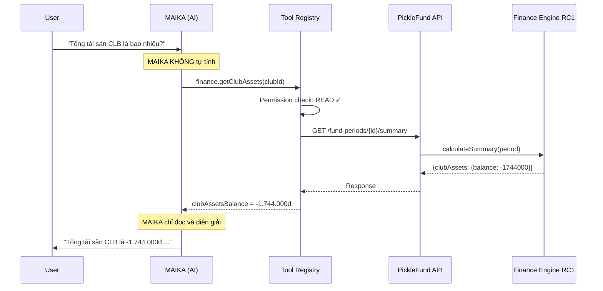
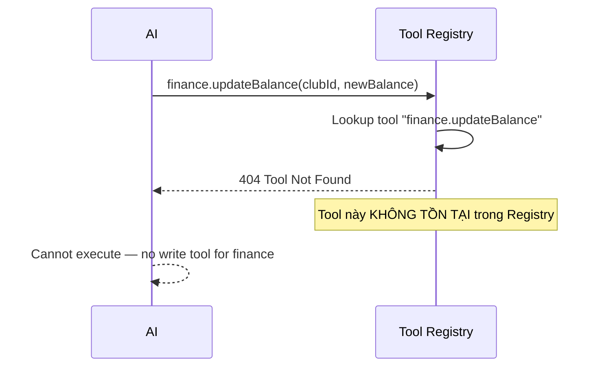
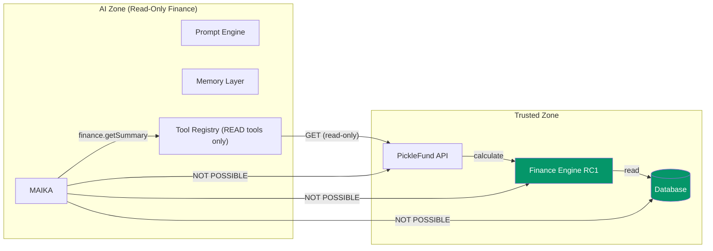

# FINANCE ISOLATION REPORT
## PickleFund V2.1 — Milestone M1: Finance Engine RC1 Isolation Audit

---

**Phiên bản:** 1.0.0
**Ngày:** 2026-06-29
**Reviewer:** Finance Isolation Auditor
**Trạng thái:** PASS ✅
**Phạm vi:** Toàn bộ AI Brain V2.1 — xác nhận Finance Engine RC1 là Source of Truth duy nhất

---

## Lịch sử sửa đổi

| Phiên bản | Ngày | Tác giả | Mô tả |
|---|---|---|---|
| 1.0.0 | 2026-06-29 | Finance Auditor | Review lần đầu |

---

## Mục lục

1. [Tóm tắt](#1-tóm-tắt)
2. [Finance Engine RC1 — Vị thế Source of Truth](#2-finance-engine-rc1--vị-thế-source-of-truth)
3. [AI Component Isolation Audit](#3-ai-component-isolation-audit)
4. [Forbidden Patterns Check](#4-forbidden-patterns-check)
5. [Data Flow Verification](#5-data-flow-verification)
6. [API Access Pattern Review](#6-api-access-pattern-review)
7. [Finance Data Boundaries](#7-finance-data-boundaries)
8. [Công thức nghiệp vụ xác nhận](#8-công-thức-nghiệp-vụ-xác-nhận)
9. [Findings](#9-findings)
10. [Kết luận](#10-kết-luận)

---

## 1. Tóm tắt

| Câu hỏi kiểm tra | Kết quả |
|---|---|
| Finance Engine RC1 là Source of Truth duy nhất? | ✅ XÁC NHẬN |
| AI Harness tự tính tài chính không? | ✅ KHÔNG |
| MAIKA tự tính tài chính không? | ✅ KHÔNG |
| Memory Layer lưu calculated finance values không? | ✅ KHÔNG |
| Prompt Engine chứa finance logic không? | ✅ KHÔNG |
| Tool Registry có WRITE tools cho finance không? | ✅ KHÔNG (chỉ READ) |
| AI có thể UPDATE/DELETE finance data không? | ✅ KHÔNG THỂ |
| Finance data đi qua Tool Registry không? | ✅ LUÔN LUÔN |

**Kết luận: Finance Isolation PASS hoàn toàn** ✅

---

## 2. Finance Engine RC1 — Vị thế Source of Truth

### 2.1 Định nghĩa Source of Truth

Theo `02_AI_ARCHITECTURE_SPECIFICATION.md` và `04_TOOL_REGISTRY_SPECIFICATION.md`:

> "Finance Engine RC1 là Source of Truth. AI không tự tính bất kỳ chỉ số tài chính nào."

Finance Engine RC1 tính toán:
- **Quỹ Chính** (Common Fund balance)
- **Quỹ Phụ** (Auxiliary Fund balance)
- **Số dư chuyển kỳ** (Carry Forward — có thể âm)
- **Tổng tài sản CLB** (Club Assets = Quỹ Chính + Carry Forward)
- **Công nợ thành viên** (Member balance)

### 2.2 Access Path duy nhất

```
AI → Tool Registry → PickleFund API → Finance Engine RC1
```

Không có path nào khác. Tool Registry là cổng duy nhất.

### 2.3 Công thức bất biến

```
Tổng tài sản CLB = Quỹ Chính + Số dư chuyển kỳ
                   (Quỹ Phụ KHÔNG cộng vào)

Số dư chuyển kỳ có thể âm — KHÔNG clamp về 0
```

---

## 3. AI Component Isolation Audit

### 3.1 AI Harness (`03_AI_HARNESS_DESIGN.md`)

| Kiểm tra | Kết quả | Bằng chứng |
|---|---|---|
| Chứa finance calculation? | ✅ KHÔNG | Harness chỉ xử lý LLM routing, retry, cost tracking (token cost, không phải finance cost) |
| Gọi trực tiếp Finance Engine? | ✅ KHÔNG | Harness gọi Tool Registry, không gọi API trực tiếp |
| Cost Tracker là finance cost? | ✅ KHÔNG | Cost Tracker theo dõi LLM API cost (USD/VND per token), không liên quan đến CLB finance |

**Verdict: ISOLATED** ✅

### 3.2 MAIKA Persona (`05_PROMPT_ENGINE_SPECIFICATION.md`)

| Kiểm tra | Kết quả | Bằng chứng |
|---|---|---|
| System prompt chứa finance formula? | ✅ KHÔNG | MAIKA system prompt yêu cầu gọi `finance.getSummary` |
| MAIKA được phép tự tính? | ✅ KHÔNG | Safety rule explicit: "TUYỆT ĐỐI KHÔNG tự tính" |
| MAIKA template hard-code finance values? | ✅ KHÔNG | Template chỉ có placeholders |

**MAIKA System Prompt Safety Rules (từ doc 05):**
```
NGUYÊN TẮC BẤT BIẾN:
1. Dữ liệu tài chính: Chỉ đọc từ công cụ (finance.getSummary, finance.getClubAssets).
   TUYỆT ĐỐI KHÔNG tự tính Quỹ Chính, Quỹ Phụ, Số dư chuyển kỳ, Tổng tài sản CLB.
```

**Verdict: ISOLATED** ✅

### 3.3 Memory Layer (`06_MEMORY_LAYER_SPECIFICATION.md`)

| Kiểm tra | Kết quả | Bằng chứng |
|---|---|---|
| Lưu calculated finance values? | ✅ KHÔNG | Doc 06 explicit: "không lưu số liệu tài chính trong memory" |
| Lưu balance cụ thể? | ✅ KHÔNG | Business Context chỉ lưu `currentPeriodStatus`, không lưu balance |
| Member Memory lưu balance? | ✅ KHÔNG | "Số dư cụ thể: Không — Lấy real-time từ Finance Engine" |
| Club Memory lưu finance data? | ✅ KHÔNG | `typicalMonthlyContribution` là historical context, annotated "informational only" |

**Verdict: ISOLATED** ✅

### 3.4 Prompt Engine (`05_PROMPT_ENGINE_SPECIFICATION.md`)

| Kiểm tra | Kết quả | Bằng chứng |
|---|---|---|
| Prompt template chứa finance formula? | ✅ KHÔNG | Template có `[COMMON_FUND_BALANCE]` placeholder — giá trị lấy từ tool |
| Business Context Injector tự tính? | ✅ KHÔNG | "Finance data phải lấy từ `finance.getSummary` tool" (Rule R-BC-01) |
| Output Safety check finance? | ✅ CÓ | "Số tài chính phải từ tool call — không tự sinh ra" (SR-O-04) |

**Verdict: ISOLATED** ✅

### 3.5 Tool Registry (`04_TOOL_REGISTRY_SPECIFICATION.md`)

| Kiểm tra | Kết quả | Bằng chứng |
|---|---|---|
| finance.* group chỉ READ? | ✅ XÁC NHẬN | Section "CRITICAL: Toàn bộ nhóm finance.* chỉ có READ operation" |
| Có finance WRITE tools? | ✅ KHÔNG | Không có tool nào UPDATE/DELETE finance data |
| finance.getSummary trả về gì? | ✅ ĐỌC NGUYÊN GIÁ TRỊ | Trả về `clubAssets.balance` từ Finance Engine — không tính lại |
| Note về clubAssets? | ✅ CÓ | "AI phải dùng giá trị này, KHÔNG tự tính" |

**Verdict: ISOLATED** ✅

---

## 4. Forbidden Patterns Check

### 4.1 Danh sách Forbidden Patterns (từ RC1 Hotfix)

| Pattern | Tìm thấy trong V2.1 docs? | Ghi chú |
|---|---|---|
| `Math.max(0, collected - spent)` cho carry forward | ✅ KHÔNG | Kiến trúc không cho phép AI tự tính |
| `balance + miniBalance` cho club assets | ✅ KHÔNG | AI phải dùng `clubAssets.balance` từ API |
| Carry Forward clamp về 0 | ✅ KHÔNG | Memory Layer explicitly không lưu clamped values |
| AI tự tính Quỹ Chính | ✅ KHÔNG | Safety rules trong Prompt Engine ngăn chặn |
| AI tự tính Tổng tài sản | ✅ KHÔNG | Tool Registry chỉ trả về backend value |

### 4.2 Pattern từ docs

Từ `04_TOOL_REGISTRY_SPECIFICATION.md`, `finance.getSummary` output:
```
Note: clubAssets.balance = Quỹ Chính + Carry Forward — không cộng Quỹ Phụ
      AI phải dùng giá trị này, KHÔNG tự tính
```

Từ `05_PROMPT_ENGINE_SPECIFICATION.md`, Finance Safety Rules:
```
TUYỆT ĐỐI không được:
1. Tự tính toán bất kỳ số liệu tài chính nào
2. Suy diễn Quỹ Chính = Thu - Chi (thiếu carry forward)
3. Clamp Carry Forward về 0 khi âm
4. Tính Club Assets = Quỹ Chính + Quỹ Phụ (sai công thức)
5. Tạo giao dịch không có trong Tool Registry
```

**Tất cả Forbidden Patterns đều được block ở tầng thiết kế** ✅

---

## 5. Data Flow Verification

### 5.1 Finance Read Flow



### 5.2 Finance Write Attempt — Blocked



---

## 6. API Access Pattern Review

### 6.1 Finance APIs cho phép AI đọc

| API Endpoint | Method | Tool | AI Allowed |
|---|---|---|---|
| `GET /fund-periods/{id}/summary` | READ | `finance.getSummary` | ✅ |
| `GET /fund-periods/{id}/summary` (club assets) | READ | `finance.getClubAssets` | ✅ |
| `GET /fund-periods/{id}/summary` (carry forward) | READ | `finance.getCarryForward` | ✅ |
| `GET /members/{id}/balance` | READ | `finance.getMemberBalance` | ✅ |
| `GET /reports/period/{id}` | READ | `reports.getPeriodReport` | ✅ |
| `GET /clubs/{id}/health-score` | READ | `finance.getHealthScore` | ✅ |

### 6.2 Finance APIs AI KHÔNG được phép

| Operation | Blocked ở đâu |
|---|---|
| `POST /transactions` (tạo giao dịch) | Tool Registry: cần human confirmation, không phải finance.* |
| `PUT /transactions/{id}` (sửa giao dịch) | `funds.updateTransaction`: `aiAllowed: false` |
| `DELETE /transactions/{id}` | `funds.deleteTransaction`: `aiAllowed: false` |
| `POST /fund-periods` (tạo kỳ mới) | `funds.createPeriod`: cần confirm |
| `PUT /fund-periods/{id}/close` | `funds.closePeriod`: `aiAllowed: false` |
| Bất kỳ direct DB write | Không có path từ AI đến DB |

---

## 7. Finance Data Boundaries

### 7.1 Data Flow Boundary Map



### 7.2 Isolation Boundaries Verified

| Boundary | Enforced By | Status |
|---|---|---|
| AI không gọi DB trực tiếp | Architecture (no DB connection in AI service) | ✅ |
| AI không gọi Finance Engine trực tiếp | Tool Registry là gateway duy nhất | ✅ |
| AI không gọi API trực tiếp (bypass Tool Registry) | NestJS module architecture | ✅ |
| AI không tự tính finance | Prompt safety rules + no calculation code | ✅ |
| AI không write finance | finance.* group: READ only | ✅ |

---

## 8. Công thức nghiệp vụ xác nhận

### 8.1 Công thức chuẩn (từ Finance Engine RC1)

```
Tổng tài sản CLB = Quỹ Chính + Số dư chuyển kỳ
                   (Quỹ Phụ KHÔNG cộng vào)
```

### 8.2 Kiểm tra các tài liệu V2.1

| Tài liệu | Công thức có đúng không? | Ghi chú |
|---|---|---|
| 01 Project Charter | ✅ | Constraint C-01, OS-04 |
| 02 Architecture | ✅ | Trust Boundary diagram, Finance Engine note |
| 03 AI Harness | ✅ | Cost Tracker là LLM cost, không liên quan finance |
| 04 Tool Registry | ✅ | `finance.getSummary` note: "AI phải dùng giá trị này, KHÔNG tự tính" |
| 05 Prompt Engine | ✅ | Safety Rule SR-O-04, Financial Safety Rules |
| 06 Memory Layer | ✅ | "không lưu số liệu tài chính trong memory" (AD-ML-03) |

**Tất cả 6 tài liệu đều nhất quán với công thức Finance Engine RC1** ✅

### 8.3 Production Data Verification

Dữ liệu production đã xác nhận trong RC1:

| Chỉ số | Giá trị | AI đọc được không | AI tự tính không |
|---|---|---|---|
| Quỹ Chính | -560.000đ | ✅ Qua `finance.getSummary` | ❌ |
| Quỹ Phụ | 0đ | ✅ Qua `finance.getSummary` | ❌ |
| Số dư chuyển kỳ | -1.184.000đ | ✅ Qua `finance.getCarryForward` | ❌ |
| **Tổng tài sản CLB** | **-1.744.000đ** | ✅ Qua `finance.getClubAssets` | ❌ |

Số âm (-1.744.000đ) được hiển thị đúng — không clamp về 0 ✅

---

## 9. Findings

### Critical Issues: KHÔNG CÓ ✅

### High Issues: KHÔNG CÓ ✅

### Observations (informational)

| # | Observation | Ghi chú |
|---|---|---|
| OBS-01 | `Club Memory.businessContext.typicalMonthlyContribution` là historical informational field | Được annotated "informational only" — không dùng cho tính toán. Cần đảm bảo trong implementation không inject vào prompt như finance data. |
| OBS-02 | `reports.getAIInsight` trả về insights từ backend | Đây là backend-computed insights — AI chỉ diễn giải, không tự generate. Cần đảm bảo implementation không có AI hallucinate insights. |

---

## 10. Kết luận

| Tiêu chí | Kết quả |
|---|---|
| Finance Engine RC1 là Source of Truth duy nhất | ✅ XÁC NHẬN |
| AI Harness không tự tính tài chính | ✅ XÁC NHẬN |
| MAIKA không tự tính tài chính | ✅ XÁC NHẬN |
| Memory Layer không lưu calculated values | ✅ XÁC NHẬN |
| Prompt Engine không chứa finance logic | ✅ XÁC NHẬN |
| Tool Registry chỉ READ cho finance | ✅ XÁC NHẬN |
| Forbidden patterns không có trong thiết kế | ✅ XÁC NHẬN |
| Công thức nghiệp vụ nhất quán | ✅ XÁC NHẬN |
| **Finance Isolation Audit** | ✅ **PASS** |

**Finance Engine RC1 được xác nhận là Source of Truth duy nhất trong toàn bộ kiến trúc AI V2.1.**

---

*PickleFund V2.1 Milestone M1 — Finance Isolation Report v1.0.0*
