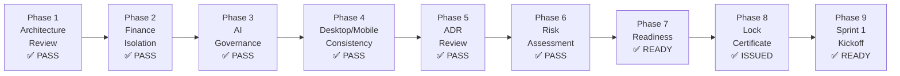

# INDEX — PickleFund V2.1 Milestone M1
## Architecture Lock — Mục lục tài liệu review

---

**Phiên bản:** 1.0.0
**Ngày:** 2026-06-29
**Trạng thái:** COMPLETE — Architecture Locked ✅
**Certificate:** PKLF-V21-M1-ALC-20260629

---

## Tóm tắt M1

Milestone M1 — Architecture Lock đã hoàn thành toàn bộ 9 phases review.
**Tất cả các review đều PASS. Không có Critical Issue.**

---

## Tài liệu M1

| # | Tài liệu | Mô tả | Kết quả |
|---|---|---|---|
| P1 | [📋 Architecture Review Report](Architecture_Review_Report.md) | Enterprise architecture review — layers, SOLID, scalability | ✅ PASS 91.5/100 |
| P2 | [💰 Finance Isolation Report](Finance_Isolation_Report.md) | Xác nhận Finance Engine RC1 là Source of Truth duy nhất | ✅ PASS |
| P3 | [🛡️ AI Governance Report](AI_Governance_Report.md) | LiteLLM, failover, permission, security, hallucination prevention | ✅ PASS 91.5/100 |
| P4 | [📱 Desktop/Mobile Consistency Report](Desktop_Mobile_Consistency_Report.md) | AI feature parity Desktop vs. Mobile | ✅ PASS — No Gaps |
| P5 | [📐 Architecture Decision Log](Architecture_Decision_Log.md) | 38 ADRs — consistency, traceability, conflicts check | ✅ PASS |
| P6 | [⚠️ Risk Assessment](Risk_Assessment.md) | 16 risks — Critical: 0, High: 2→mitigated | ✅ PASS |
| P7 | [🚀 Implementation Readiness](Implementation_Readiness.md) | Sprint 1 readiness — all components documented | ✅ READY |
| P8 | [🔒 Architecture Lock Certificate](Architecture_Lock_Certificate.md) | Official lock certificate | ✅ ISSUED |
| P9 | [🏃 Sprint 1 Kickoff](Sprint1_Kickoff.md) | Sprint goal, epics, backlog, acceptance criteria | ✅ READY |

---

## Kết quả Tổng hợp

---

## Milestone M1 Pass Criteria — Verification

| Tiêu chí | Kết quả |
|---|---|
| Review hoàn tất 100% | ✅ 9/9 phases done |
| Không còn Critical Risk | ✅ 0 critical risks |
| Finance Engine là Source of Truth duy nhất | ✅ XÁC NHẬN (Finance Isolation Report) |
| Desktop và Mobile đồng nhất về kiến trúc AI | ✅ XÁC NHẬN (Consistency Report) |
| Architecture Lock Certificate được phát hành | ✅ PKLF-V21-M1-ALC-20260629 |
| Sprint 1 được xác nhận sẵn sàng triển khai | ✅ Start 2026-07-02 |
| **Milestone M1** | ✅ **PASS** |

---

## Số liệu M1

| Metric | Giá trị |
|---|---|
| Tổng tài liệu M1 | 10 (9 reports + INDEX) |
| Tổng phases review | 9 |
| Tổng ADRs reviewed | 38 |
| Critical Issues | 0 |
| High Issues | 0 |
| Medium Issues (non-blocking) | 5 |
| Risk Assessment | 16 risks, 0 critical |
| Finance Isolation | Full PASS |
| Desktop/Mobile Gap | 0 |
| Architecture Score | 91.5/100 |
| Governance Score | 91.5/100 |

---

## Liên kết sang Phase 0 Documents

| Tài liệu Phase 0 | Link |
|---|---|
| Project Charter | [../01_PROJECT_CHARTER.md](../01_PROJECT_CHARTER.md) |
| AI Architecture | [../02_AI_ARCHITECTURE_SPECIFICATION.md](../02_AI_ARCHITECTURE_SPECIFICATION.md) |
| AI Harness Design | [../03_AI_HARNESS_DESIGN.md](../03_AI_HARNESS_DESIGN.md) |
| Tool Registry | [../04_TOOL_REGISTRY_SPECIFICATION.md](../04_TOOL_REGISTRY_SPECIFICATION.md) |
| Prompt Engine | [../05_PROMPT_ENGINE_SPECIFICATION.md](../05_PROMPT_ENGINE_SPECIFICATION.md) |
| Memory Layer | [../06_MEMORY_LAYER_SPECIFICATION.md](../06_MEMORY_LAYER_SPECIFICATION.md) |
| Phase 0 Index | [../INDEX.md](../INDEX.md) |

---

## Bước tiếp theo

| Action | Date | Status |
|---|---|---|
| Provision Anthropic API key | 2026-07-01 | ⏳ |
| LiteLLM Docker image setup | 2026-07-01 | ⏳ |
| Sprint 1 START | 2026-07-02 | ⏳ |
| Sprint 1 END / Demo | 2026-07-14 | ⏳ |
| Sprint 2 Kickoff | 2026-07-14 | ⏳ |

---

*PickleFund V2.1 Milestone M1 — Index v1.0.0*
*Architecture Lock: PKLF-V21-M1-ALC-20260629*
