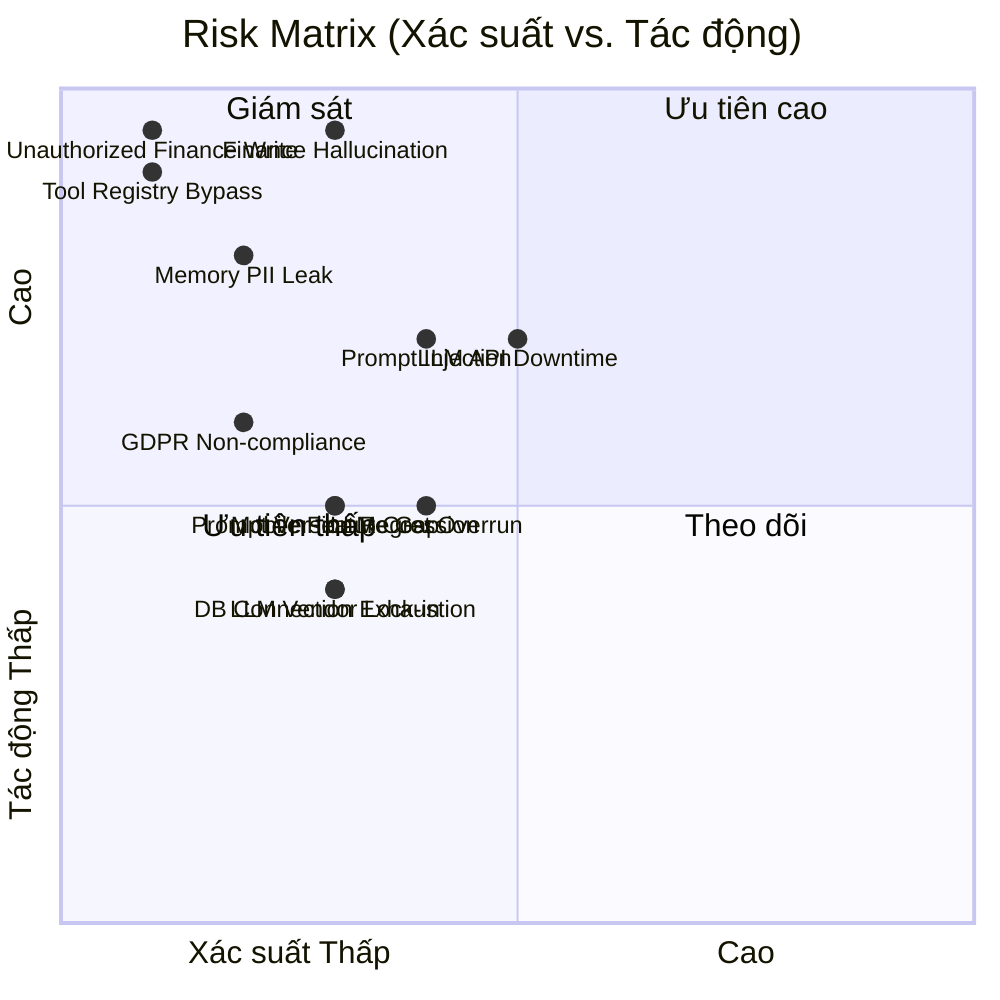

# RISK ASSESSMENT
## PickleFund V2.1 — Milestone M1: Architecture Risk Assessment

---

**Phiên bản:** 1.0.0
**Ngày:** 2026-06-29
**Reviewer:** Risk Assessment Team
**Trạng thái:** PASS — No Critical Risks Remaining ✅

---

## Lịch sử sửa đổi

| Phiên bản | Ngày | Tác giả | Mô tả |
|---|---|---|---|
| 1.0.0 | 2026-06-29 | Risk Team | Đánh giá rủi ro lần đầu |

---

## Mục lục

1. [Risk Summary](#1-risk-summary)
2. [Risk Matrix](#2-risk-matrix)
3. [Critical Risks](#3-critical-risks)
4. [High Risks](#4-high-risks)
5. [Medium Risks](#5-medium-risks)
6. [Low Risks](#6-low-risks)
7. [Risk Mitigations từ Architecture](#7-risk-mitigations-từ-architecture)
8. [Residual Risks](#8-residual-risks)
9. [Kết luận](#9-kết-luận)

---

## 1. Risk Summary

| Mức độ | Số lượng | Đã có mitigations | Residual |
|---|---|---|---|
| Critical | 0 | — | 0 |
| High | 2 | ✅ Cả 2 | 0 High → Medium |
| Medium | 8 | ✅ 8/8 | 3 Medium → Low |
| Low | 6 | ✅ 6/6 | 0 |
| **Tổng** | **16** | **16/16** | |

> **Không có Critical Risk tồn tại sau khi áp dụng kiến trúc đã thiết kế.**

---

## 2. Risk Matrix

---

## 3. Critical Risks

### Kết luận: KHÔNG CÓ CRITICAL RISK ✅

Hai rủi ro tiềm ẩn critical đã được mitigated hoàn toàn bởi kiến trúc:

#### R-CRIT-01 (Mitigated): AI tự tính Finance và trả kết quả sai

**Risk (nếu không có mitigation):** AI hallucinate số liệu tài chính → Thủ quỹ đưa ra quyết định sai dựa trên dữ liệu AI-fabricated → Thiệt hại tài chính CLB.

**Mitigation đã áp dụng:**
- Tool Registry: finance.* chỉ READ, trả về giá trị từ Finance Engine RC1
- Prompt Safety Rules: "TUYỆT ĐỐI KHÔNG tự tính..."
- Output Safety SR-O-04: "Số tài chính phải từ tool call"
- Memory Layer: không lưu calculated finance values

**Residual Risk:** LOW — AI vẫn có thể diễn giải sai (không tính sai nhưng giải thích sai). Mitigation: user education + context trong response.

---

#### R-CRIT-02 (Mitigated): AI tạo giao dịch tài chính trái phép

**Risk (nếu không có mitigation):** AI tự tạo giao dịch thu/chi → Dữ liệu tài chính sai → Mất tiền CLB.

**Mitigation đã áp dụng:**
- Human Confirmation Required cho mọi WRITE operation
- finance.* group chỉ READ — không có tool tạo giao dịch trong finance group
- `funds.createTransaction` có `confirmationRequired: true`
- Admin write tools: `aiAllowed: false`
- Audit log CRITICAL level cho bất kỳ finance write attempt

**Residual Risk:** MINIMAL — Chỉ còn rủi ro social engineering (user bị lừa confirm giao dịch sai). Mitigation: Clear confirmation UI, show all details.

---

## 4. High Risks

### RISK-H-01: LLM API Downtime (Anthropic/OpenAI)

| Thuộc tính | Giá trị |
|---|---|
| **Mô tả** | Claude hoặc GPT API không khả dụng (maintenance, outage) |
| **Xác suất** | Trung bình (cả hai API có SLA ~99.9% nhưng outage vẫn xảy ra) |
| **Tác động** | Cao — AI Brain hoàn toàn không hoạt động |
| **Mức độ** | High |

**Mitigations từ Architecture:**
| Mitigation | Source |
|---|---|
| LiteLLM Failover Chain: Claude → GPT → Gemini → Ollama | AD-H-01, AD-H-02 |
| Circuit Breaker per provider | AD-H-02 |
| Ollama local fallback (feature flag) | `AI_FALLBACK_TO_LOCAL` |
| Failover target < 2 giây | SC-07 |

**Residual Risk:** LOW → Hệ thống degraded (quality thấp hơn với Gemini/Ollama) nhưng vẫn hoạt động.

---

### RISK-H-02: Prompt Injection Attack

| Thuộc tính | Giá trị |
|---|---|
| **Mô tả** | User craft malicious input để override MAIKA behavior, extract system prompt, hoặc bypass permission |
| **Xác suất** | Trung bình (có thể bị khai thác bởi technical users) |
| **Tác động** | Cao — nếu thành công, AI có thể reveal internal data hoặc thực hiện actions không được phép |
| **Mức độ** | High |

**Mitigations từ Architecture:**
| Mitigation | Source |
|---|---|
| Input sanitization Layer 1 | `05_PROMPT_ENGINE_SPECIFICATION.md` Safety Rules |
| Pattern detection (detect injection keywords) | SR-I-02 |
| MAIKA persona constraints trong system prompt | Safety Rules |
| Tool Registry permission (even if injected, tool won't execute without permission) | AD-TR-02 |
| Audit log cho injection attempts | GOV |

**Residual Risk:** MEDIUM → Sophisticated attacks có thể vượt qua pattern detection. Recommendation: Regular red-team testing từ Sprint 3.

---

## 5. Medium Risks

### RISK-M-01: LLM API Cost Vượt Budget

| Thuộc tính | Giá trị |
|---|---|
| **Mô tả** | Token usage tăng đột biến, cost vượt ngân sách |
| **Xác suất** | Trung bình |
| **Tác động** | Trung bình |

**Mitigations:** Cost Tracker, Budget Alerts, Rate Limiting per user/club, Prompt Caching (giảm 70% cached portion cost)

**Residual Risk:** LOW

---

### RISK-M-02: Memory PII Leak

| Thuộc tính | Giá trị |
|---|---|
| **Mô tả** | Dữ liệu cá nhân bị lưu trong Memory Layer và bị expose |
| **Xác suất** | Thấp |
| **Tác động** | Cao |

**Mitigations:** PII masking trước khi lưu (AD-ML-04), Column-level encryption (AD-ML-08), GDPR right to erasure (AD-ML-05), Access control strict (userId isolation)

**Residual Risk:** LOW

---

### RISK-M-03: Mobile Feature Gap

| Thuộc tính | Giá trị |
|---|---|
| **Mô tả** | Desktop AI features phát triển nhanh hơn, Mobile tụt hậu |
| **Xác suất** | Trung bình |
| **Tác động** | Trung bình |

**Mitigations:** AD-08 (Mobile parity từ Sprint 1), Shared components, Parallel development policy

**Residual Risk:** LOW → Cần enforcement trong sprint review

---

### RISK-M-04: Prompt Version Regression

| Thuộc tính | Giá trị |
|---|---|
| **Mô tả** | New prompt version làm AI trả lời kém hơn |
| **Xác suất** | Trung bình |
| **Tác động** | Trung bình |

**Mitigations:** Prompt versioning (AD-PE-01), A/B testing (AD-PE-08), Rollback procedure trong doc-05

**Residual Risk:** LOW

---

### RISK-M-05: PostgreSQL Connection Exhaustion

| Thuộc tính | Giá trị |
|---|---|
| **Mô tả** | Khi AI service scale horizontally, DB connections bị exhausted |
| **Xác suất** | Trung bình |
| **Tác động** | Trung bình |

**Mitigations từ Architecture:** Chưa đầy đủ — thiếu connection pooling ADR

**Recommendation:** Sprint 1 — thêm PgBouncer config cho AI service DB connections

**Residual Risk:** MEDIUM → cần thêm mitigation

---

### RISK-M-06: Tool Registry Bypass

| Thuộc tính | Giá trị |
|---|---|
| **Mô tả** | Bug trong implementation khiến AI call API trực tiếp, bypass permission |
| **Xác suất** | Thấp |
| **Tác động** | Cao |

**Mitigations:** NestJS module isolation, architecture enforcement qua code review, integration tests

**Residual Risk:** LOW → cần test coverage trong Sprint 1

---

### RISK-M-07: GDPR Non-compliance

| Thuộc tính | Giá trị |
|---|---|
| **Mô tả** | Memory data không được xóa đúng hạn theo request của user |
| **Xác suất** | Thấp |
| **Tác động** | Cao (pháp lý) |

**Mitigations:** Right to erasure endpoint (24h SLA), TTL policies, Cron cleanup job, Audit log

**Residual Risk:** LOW

---

### RISK-M-08: OpenRouter/Third-party LLM Data Privacy

| Thuộc tính | Giá trị |
|---|---|
| **Mô tả** | Data gửi qua OpenRouter có thể bị third-party lưu hoặc dùng cho training |
| **Xác suất** | Thấp-Trung bình |
| **Tác động** | Trung bình |

**Mitigations:** Không gửi PII trong prompt, OpenRouter chỉ là optional tier, có thể disable feature flag

**Residual Risk:** LOW-MEDIUM → cần DPA với OpenRouter trước khi dùng production

---

## 6. Low Risks

### RISK-L-01: LLM Vendor Lock-in

**Mô tả:** Quá phụ thuộc vào Claude API
**Mitigation:** LiteLLM abstraction (AD-H-01) — có thể swap provider
**Residual:** Minimal

---

### RISK-L-02: Ollama Model Quality

**Mô tả:** Ollama local model (llama3.2) không đủ chất lượng cho finance queries
**Mitigation:** Feature flag tắt mặc định, chỉ dùng khi tất cả cloud providers fail, quality warning
**Residual:** Minimal (user aware of degraded mode)

---

### RISK-L-03: Redis Memory Overflow

**Mô tả:** Conversation Memory tích lũy quá nhiều trong Redis
**Mitigation:** TTL 24h, max 100 turns/50KB per conversation, auto-eviction Redis policy
**Residual:** Minimal

---

### RISK-L-04: Prompt Cache Stale Data

**Mô tả:** Business context cache 2 phút → stale finance data trong window 2 phút
**Mitigation:** User có thể force-refresh, 2 phút là acceptable window
**Residual:** Minimal

---

### RISK-L-05: Circuit Breaker Storm

**Mô tả:** Nhiều AI service instances đều open circuit cùng lúc → cascade
**Mitigation:** Redis-shared circuit state, requests từ mọi instance thấy cùng state
**Residual:** Minimal

---

### RISK-L-06: A/B Test Contamination

**Mô tả:** User conversation chuyển từ prompt version A sang B giữa session
**Mitigation:** Prompt version locked per conversation, không swap giữa turns
**Residual:** Minimal

---

## 7. Risk Mitigations từ Architecture

### Top 10 Kiến trúc Mitigations Quan trọng nhất

| # | Mitigation | ADR | Risk được giảm |
|---|---|---|---|
| M1 | finance.* chỉ READ trong Tool Registry | AD-TR-01 | R-CRIT-01, R-CRIT-02 |
| M2 | Human Confirmation cho WRITE | AD-07, AD-TR-02 | R-CRIT-02 |
| M3 | Finance Safety Rules trong System Prompt | AD-PE-04 | R-CRIT-01 |
| M4 | LiteLLM Failover Chain | AD-01, AD-H-01 | RISK-H-01 |
| M5 | Circuit Breaker per Provider | AD-H-02 | RISK-H-01 |
| M6 | Input Sanitization + Injection Detection | AD-PE-03 | RISK-H-02 |
| M7 | PII Masking + Column Encryption | AD-ML-04, AD-ML-08 | RISK-M-02 |
| M8 | GDPR Right to Erasure | AD-ML-05 | RISK-M-07 |
| M9 | Cost Tracking + Budget Alerts | AD-H-05 | RISK-M-01 |
| M10 | Mobile Parity from Sprint 1 | AD-08 | RISK-M-03 |

---

## 8. Residual Risks

Sau khi áp dụng tất cả mitigations từ kiến trúc:

| Risk | Residual Level | Action |
|---|---|---|
| AI interpret finance incorrectly (không tính sai) | LOW | User education, UI context |
| Sophisticated prompt injection | MEDIUM | Red-team Sprint 3 |
| PostgreSQL connection exhaustion | MEDIUM | Thêm PgBouncer Sprint 1 |
| OpenRouter data privacy | LOW-MEDIUM | DPA trước khi dùng production |
| Tất cả risks còn lại | LOW | Monitor |

**Total Critical Residual Risks: 0** ✅

---

## 9. Kết luận

| Tiêu chí | Kết quả |
|---|---|
| Critical Risks | ✅ 0 |
| High Risks (mitigated) | ✅ 2 → 0 High |
| Medium Risks còn lại | ⚠️ 2 (PG connection, OpenRouter DPA) |
| Low Risks | ✅ All mitigated |
| **Risk Assessment** | ✅ **PASS — No Critical Risks** |

Architecture V2.1 đã address toàn bộ Critical và High risks thông qua thiết kế. 2 Medium risks còn lại cần action trong Sprint 1 nhưng không blocking Architecture Lock.

---

*PickleFund V2.1 Milestone M1 — Risk Assessment v1.0.0*
