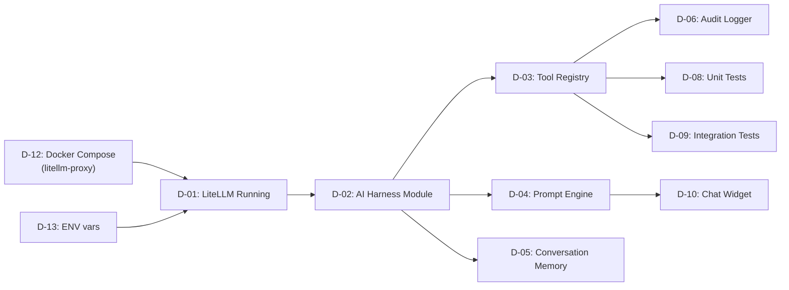
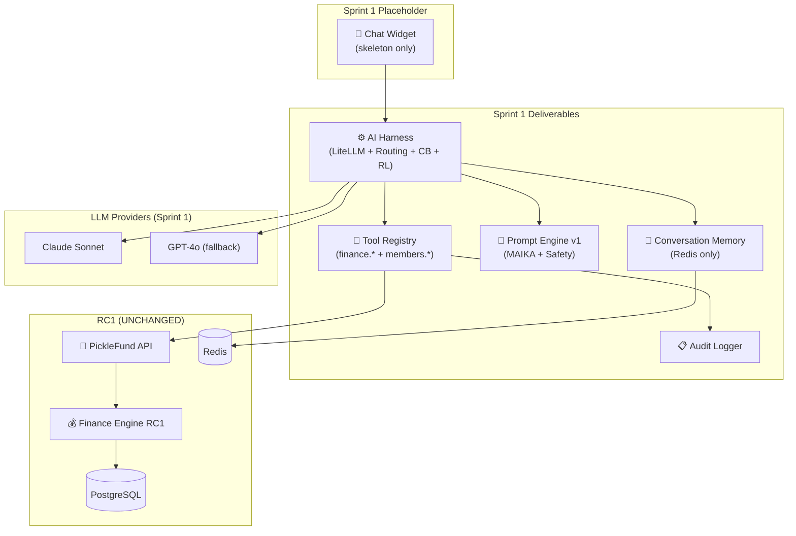

# SPRINT 1 KICKOFF
## PickleFund V2.1 — AI Brain Foundation: Sprint 1 Foundation

---

**Phiên bản:** 1.0.0
**Ngày:** 2026-06-29
**Sprint Start:** 2026-07-02
**Sprint End:** 2026-07-14
**Trạng thái:** READY TO START ✅
**Architecture Lock:** PKLF-V21-M1-ALC-20260629

---

## Lịch sử sửa đổi

| Phiên bản | Ngày | Tác giả | Mô tả |
|---|---|---|---|
| 1.0.0 | 2026-06-29 | tunglt6-spec | Kickoff document sau Architecture Lock |

---

## Mục lục

1. [Sprint Goal](#1-sprint-goal)
2. [Epic](#2-epic)
3. [Deliverables](#3-deliverables)
4. [Dependencies](#4-dependencies)
5. [Acceptance Criteria](#5-acceptance-criteria)
6. [Definition of Done](#6-definition-of-done)
7. [Sprint Backlog](#7-sprint-backlog)
8. [Technical Architecture (Sprint 1)](#8-technical-architecture-sprint-1)
9. [Constraints & Guard Rails](#9-constraints--guard-rails)
10. [Risks Sprint 1](#10-risks-sprint-1)

---

## 1. Sprint Goal

> **"Xây dựng nền tảng AI Brain cho PickleFund — AI Harness hoạt động với LiteLLM, Tool Registry phục vụ finance.* và members.* READ queries, Prompt Engine v1 với MAIKA persona, và Conversation Memory cơ bản. Thủ quỹ có thể hỏi MAIKA về số dư quỹ và nhận câu trả lời đúng từ Finance Engine RC1."**

---

## 2. Epic

**EPIC-V21-S1: AI Brain Foundation**

| Thuộc tính | Giá trị |
|---|---|
| Epic ID | EPIC-V21-S1 |
| Sprint | 1 (2026-07-02 → 07-14) |
| Owner | Backend Team |
| Status | NOT STARTED |

### User Stories trong Epic

| US ID | Story | Priority |
|---|---|---|
| US-01 | Là thủ quỹ, tôi muốn hỏi MAIKA "Quỹ Chính hiện tại là bao nhiêu?" và nhận câu trả lời đúng | P0 |
| US-02 | Là thủ quỹ, tôi muốn hỏi MAIKA "Tổng tài sản CLB là bao nhiêu?" và nhận câu trả lời đúng | P0 |
| US-03 | Là thủ quỹ, tôi muốn hỏi MAIKA "Có bao nhiêu thành viên active?" và nhận câu trả lời | P0 |
| US-04 | Là hệ thống, tôi muốn AI Harness tự động chuyển sang GPT khi Claude không khả dụng | P0 |
| US-05 | Là admin, tôi muốn xem log token usage của MAIKA | P1 |
| US-06 | Là developer, tôi muốn mọi AI tool call đều được audit logged | P0 |

---

## 3. Deliverables

### Backend Deliverables

| # | Deliverable | Owner | Effort |
|---|---|---|---|
| D-01 | LiteLLM Docker service chạy thành công | Backend/DevOps | 1 day |
| D-02 | AI Harness NestJS module | Backend | 3 days |
| D-03 | Tool Registry core + finance.* group | Backend | 3 days |
| D-04 | Prompt Engine v1 + MAIKA persona | Backend | 2 days |
| D-05 | Conversation Memory (Redis) | Backend | 1 day |
| D-06 | Audit Logger | Backend | 1 day |
| D-07 | Database migrations (AI tables) | Backend | 0.5 day |
| D-08 | Unit tests (Tool Registry + Permission) | Backend | 2 days |
| D-09 | Integration test: finance query end-to-end | Backend | 1 day |

### Frontend Deliverables

| # | Deliverable | Owner | Effort |
|---|---|---|---|
| D-10 | AI chat widget placeholder (Desktop) | Frontend | 1 day |
| D-11 | useAIChat hook skeleton | Frontend | 1 day |

### DevOps Deliverables

| # | Deliverable | Owner | Effort |
|---|---|---|---|
| D-12 | Docker Compose update với litellm-proxy | DevOps | 0.5 day |
| D-13 | ENV vars update + .env.example | DevOps | 0.5 day |

---

## 4. Dependencies

### Pre-requisites (phải có trước Sprint 1 start)

| Dependency | Status | Owner | Deadline |
|---|---|---|---|
| Architecture Lock Certificate | ✅ ISSUED | ARC | 2026-06-29 |
| Anthropic API key | ⏳ PENDING | DevOps | 2026-07-01 |
| LiteLLM Docker image pull | ⏳ PENDING | DevOps | 2026-07-01 |
| `.env` updated với AI vars | ⏳ PENDING | DevOps | 2026-07-01 |
| pgcrypto enabled dev DB | ⏳ PENDING | DevOps | 2026-07-01 |
| Finance Engine RC1 API accessible | ✅ DONE | RC1 | — |
| Redis 7 available | ✅ DONE | RC1 | — |
| PostgreSQL 16 available | ✅ DONE | RC1 | — |

### Internal Dependencies (trong Sprint 1)



---

## 5. Acceptance Criteria

### AC-01: AI Harness hoạt động

```
Given: LiteLLM Docker service running
When: AI Harness gửi request đến LiteLLM
Then:
  - Nhận response từ Claude Sonnet
  - Response time < 5s (TTFT)
  - Token usage được log

Given: Claude API trả về 503
When: AI Harness nhận lỗi
Then:
  - Circuit breaker count tăng
  - Request được route sang GPT-4o
  - Fallback được log (fallbackUsed: true)
```

### AC-02: Tool Registry — finance.* READ

```
Given: Treasurer role JWT token
When: AI gọi finance.getSummary(clubId)
Then:
  - Tool Registry check permission: PASS
  - Tool gọi GET /fund-periods/{id}/summary
  - Trả về {commonFund, auxFund, carryForward, clubAssets}
  - clubAssets.balance = Quỹ Chính + Carry Forward (đúng công thức)
  - Audit log được tạo

Given: Member role JWT token
When: AI gọi finance.getClubAssets(clubId)
Then:
  - Tool Registry check permission: DENIED (member không có quyền xem club assets)
  - 403 response
  - Audit log với DENIED status
```

### AC-03: Tool Registry — No Finance WRITE

```
Given: Bất kỳ request nào
When: AI cố gọi bất kỳ tool nào để WRITE finance data
Then:
  - Tool Registry: 404 Tool Not Found (tool không tồn tại)
  - HOẶC: 403 aiAllowed: false
  - Không có gì được ghi vào Finance Engine
```

### AC-04: Prompt Engine + MAIKA

```
Given: User hỏi "Quỹ Chính hiện tại là bao nhiêu?"
When: Prompt Engine build prompt
Then:
  - MAIKA persona v1 được inject
  - Finance summary từ finance.getSummary được inject
  - Safety rules được inject
  - finance.getSummary tool được include trong tools list

Given: LLM response chứa số tài chính
When: Output validation check
Then:
  - Số đó phải có tool call tương ứng (SR-O-04)
  - Nếu không: flag as potential hallucination, log warning
```

### AC-05: Conversation Memory

```
Given: User đã gửi 5 tin nhắn trong 1 session
When: User gửi tin thứ 6
Then:
  - Conversation history 5 turns trước được load từ Redis
  - Inject vào prompt (đúng format)
  - Response có context của conversation

Given: Session bắt đầu lúc T=0
When: T = 24h + 1 minute
Then:
  - Redis key đã expire
  - Conversation bắt đầu fresh
```

### AC-06: Audit Log

```
Given: Bất kỳ AI tool call nào
When: Tool được execute (success hoặc fail)
Then:
  - Audit log entry được tạo trong PostgreSQL
  - Chứa: requestId, userId, clubId, toolName, operation, success, duration_ms, timestamp
  - Chứa: model, promptVersion, conversationId
```

### AC-07: Unit Tests Pass

```
When: npm test (AI module)
Then:
  - Tool Registry permission tests: PASS
  - finance.* READ-only tests: PASS
  - Human confirmation required tests: PASS
  - Circuit breaker state tests: PASS
  - Rate limiter tests: PASS
  - Coverage ≥ 80%
```

---

## 6. Definition of Done

Sprint 1 được coi là DONE khi tất cả các mục sau đều đạt:

### Technical DoD

| # | Tiêu chí | Kiểm tra |
|---|---|---|
| DOD-01 | D-01 đến D-09 hoàn thành | Demo |
| DOD-02 | AC-01 đến AC-07 tất cả PASS | Test results |
| DOD-03 | Unit tests ≥ 80% coverage | npm test coverage |
| DOD-04 | Integration test: finance query end-to-end PASS | Test result |
| DOD-05 | Finance Isolation: AI không tự tính finance | Code review |
| DOD-06 | Audit log: mọi tool call được log | Log verification |
| DOD-07 | RC1 Backend tests vẫn ≥ 175/175 PASS | CI |
| DOD-08 | RC1 Finance Engine không bị sửa đổi | `git diff HEAD~N -- backend/src/fund-periods/calculators/` |
| DOD-09 | Zero critical security issues | Code review |
| DOD-10 | Lint PASS, Build PASS | CI |

### Architecture DoD

| # | Tiêu chí |
|---|---|
| DOD-A-01 | Mọi AI call đi qua Tool Registry |
| DOD-A-02 | finance.* không có WRITE tool trong Registry |
| DOD-A-03 | MAIKA persona không chứa finance calculation |
| DOD-A-04 | Conversation Memory không lưu finance values |

### Documentation DoD

| # | Tiêu chí |
|---|---|
| DOD-D-01 | ENV vars mới được update vào `.env.example` |
| DOD-D-02 | ADR-V21-09 (Connection Pooling) được tạo |
| DOD-D-03 | ADR-V21-12 (AI Testing Strategy) được tạo |
| DOD-D-04 | Sprint 1 retrospective notes |

---

## 7. Sprint Backlog

### Week 1 (2026-07-02 → 07-07)

| Ngày | Task | Owner | Estimate |
|---|---|---|---|
| 07-02 | Docker Compose: thêm litellm-proxy service | DevOps | 4h |
| 07-02 | ENV setup + .env.example update | DevOps | 2h |
| 07-02 | LiteLLM config file (litellm_config.yaml) | Backend | 4h |
| 07-03 | NestJS AI Harness module skeleton | Backend | 6h |
| 07-03 | LiteLLMClient HTTP wrapper | Backend | 4h |
| 07-04 | RoutingEngine + RoutingRules | Backend | 6h |
| 07-04 | CircuitBreaker (Redis state machine) | Backend | 4h |
| 07-05 | RateLimiter (sliding window) | Backend | 4h |
| 07-05 | Database migrations (AI tables) | Backend | 2h |
| 07-07 | CostTracker + TokenLogger (async) | Backend | 6h |

### Week 2 (2026-07-07 → 07-14)

| Ngày | Task | Owner | Estimate |
|---|---|---|---|
| 07-07 | Tool Registry core (lookup, execute, validate) | Backend | 8h |
| 07-08 | Permission checker middleware | Backend | 4h |
| 07-08 | finance.getSummary + finance.getClubAssets | Backend | 4h |
| 07-09 | finance.getMemberBalance + members.list | Backend | 4h |
| 07-09 | Audit Logger (PG write) | Backend | 4h |
| 07-10 | Prompt Engine skeleton + MAIKA v1 template | Backend | 6h |
| 07-10 | BusinessContextInjector | Backend | 4h |
| 07-11 | Safety Filter (input sanitization) | Backend | 4h |
| 07-11 | Conversation Memory (Redis) | Backend | 4h |
| 07-11 | SSE Streaming handler | Backend | 4h |
| 07-12 | Frontend: AI chat widget placeholder | Frontend | 6h |
| 07-12 | Frontend: useAIChat hook skeleton | Frontend | 4h |
| 07-13 | Unit tests: Tool Registry + Permission | Backend | 8h |
| 07-14 | Integration test: finance query E2E | Backend | 6h |
| 07-14 | Demo + Sprint Review | All | 2h |

---

## 8. Technical Architecture (Sprint 1)

### Sprint 1 Architecture Diagram



### What is NOT built in Sprint 1

| Component | Sprint |
|---|---|
| Full MAIKA chat UI (Desktop + Mobile) | Sprint 2 |
| Club/Member/Business Memory | Sprint 2 |
| Proactive Alerts | Sprint 3 |
| Auto Report Generation | Sprint 3 |
| attendance.* tools | Sprint 2 |
| notifications.* tools | Sprint 3 |
| Gemini / OpenRouter | Sprint 2 |
| A/B Prompt Testing | Sprint 2 |

---

## 9. Constraints & Guard Rails

### KHÔNG được làm trong Sprint 1

| # | Constraint |
|---|---|
| GR-01 | Không sửa Finance Engine RC1 |
| GR-02 | Không thêm finance WRITE tools vào Tool Registry |
| GR-03 | Không thay đổi Database Schema RC1 |
| GR-04 | Không thay đổi API Contract RC1 |
| GR-05 | Không commit `.env` thật |
| GR-06 | Không push code chưa có unit test |
| GR-07 | Không implement feature ngoài sprint scope |
| GR-08 | Không sửa existing Desktop/Mobile UI |

### Code Review Gate

Mọi PR phải pass:
1. `finance.* tools chỉ READ` — grep check
2. `Không có Math.max(0, collected-spent)` trong AI code — grep
3. `Không có balance + miniBalance` — grep
4. Unit tests coverage ≥ 80%
5. Lint PASS
6. RC1 tests ≥ 175/175

---

## 10. Risks Sprint 1

| Risk | Xác suất | Tác động | Mitigation |
|---|---|---|---|
| LiteLLM setup issues | Thấp | Trung bình | Có tài liệu đầy đủ, Docker image stable |
| Anthropic API key chưa có | Thấp | Cao | Setup trước Sprint start (07-01) |
| Finance query trả về sai | Thấp | Cao | Tool mapping rõ ràng trong doc-04, integration test |
| Circuit Breaker state race condition | Thấp | Trung bình | Redis atomic operations |
| Sprint scope creep | Trung bình | Trung bình | Strict sprint backlog, guard rails |

---

## Sprint 1 Summary

| Attribute | Value |
|---|---|
| Sprint | 1 — Foundation |
| Duration | 2 weeks (2026-07-02 → 07-14) |
| Goal | AI Harness + Tool Registry + Prompt Engine v1 + Basic Memory |
| P0 Deliverables | D-01, D-02, D-03, D-04, D-05, D-06 |
| Success metric | Thủ quỹ hỏi MAIKA về số quỹ → nhận câu trả lời đúng từ Finance Engine |
| Finance constraint | Zero finance write operations |
| Architecture constraint | All AI calls via Tool Registry |
| Test requirement | ≥ 80% coverage, Finance isolation contract tests PASS |

**Sprint 1 START: 2026-07-02 — GO! 🚀**

---

*PickleFund V2.1 Milestone M1 — Sprint 1 Kickoff v1.0.0*
