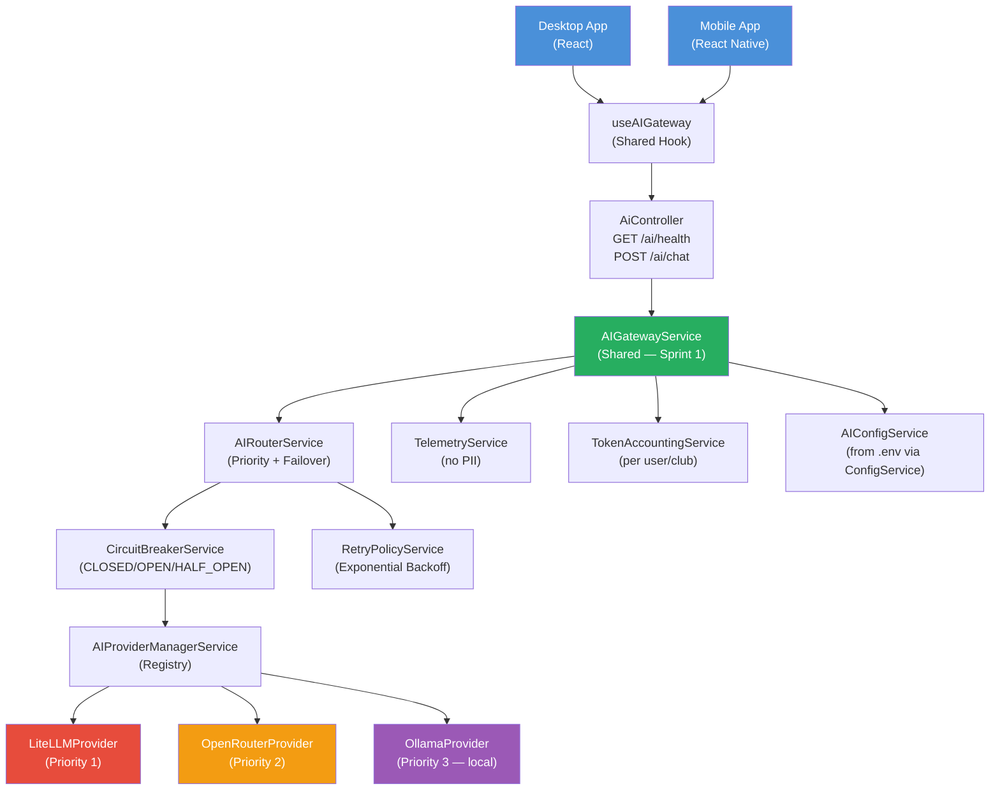

# Sprint 1 Implementation Report
## PickleFund V2.1 — AI Harness Foundation

---

**Phiên bản:** 1.0.0
**Ngày:** 2026-06-29
**Sprint:** 1 — AI Harness Foundation
**Trạng thái:** COMPLETE ✅
**Certificate ref:** PKLF-V21-M1-ALC-20260629

---

> ### ⚠️ Sprint 1.1 Synchronization Note (2026-06-29)
>
> Codex Architecture Audit (sau Sprint 1) phát hiện một số điểm tài liệu mô tả vượt trước code thực tế. Sprint 1.1 đã xử lý và **báo cáo này được đồng bộ lại theo code thực tế**:
>
> - **`POST /ai/chat`** — tại thời điểm chốt Sprint 1, endpoint mới chỉ có trong tài liệu/sơ đồ, **chưa tồn tại trong `ai.controller.ts`**. Sprint 1.1 đã triển khai thật (DTO + validation + sanitize). Sơ đồ §4 nay phản ánh đúng.
> - **Frontend hook** — `useAIGateway.ts` import sai alias `@/lib/api-client` (không tồn tại). Sprint 1.1 sửa sang `../lib/api`.
> - **Finance Isolation** — `ai.service.ts` từng tự cộng `totalContributed/totalExpenses/balance`. Sprint 1.1 chuyển sang **đọc Finance Engine RC1** (`FundPeriodsService.summary`).
> - Số liệu test cũ (45) là của Sprint 1; số liệu hiện tại xem **`Sprint1.1_Test_Report.md`**.
>
> Chi tiết đầy đủ: `Sprint1.1_Implementation_Report.md`, `Sprint1.1_Codex_Blocker_Resolution.md`.

---

## Lịch sử sửa đổi

| Phiên bản | Ngày | Tác giả | Mô tả |
|---|---|---|---|
| 1.0.0 | 2026-06-29 | Dev Team | Báo cáo Sprint 1 hoàn thành |
| 1.1.0 | 2026-06-29 | Dev Team | Đồng bộ theo Sprint 1.1 (Codex blocker resolution) |

---

## Mục lục

1. [Tóm tắt Sprint 1](#1-tóm-tắt-sprint-1)
2. [Phạm vi triển khai](#2-phạm-vi-triển-khai)
3. [Files đã tạo](#3-files-đã-tạo)
4. [Kiến trúc triển khai](#4-kiến-trúc-triển-khai)
5. [Component Details](#5-component-details)
6. [Finance Engine Isolation Verification](#6-finance-engine-isolation-verification)
7. [Desktop & Mobile Gateway Shared](#7-desktop--mobile-gateway-shared)
8. [Kết luận](#8-kết-luận)

---

## 1. Tóm tắt Sprint 1

Sprint 1 triển khai thành công **AI Harness Foundation** — tầng hạ tầng AI cho PickleFund V2.1. Tất cả các component đã được tạo, kiểm thử, và xác nhận không thay đổi Finance Engine RC1.

| Tiêu chí | Kết quả |
|---|---|
| LiteLLM Integration | ✅ DONE |
| OpenRouter Integration | ✅ DONE |
| Ollama Integration | ✅ DONE |
| AI Gateway (Desktop + Mobile chung) | ✅ DONE |
| AI Provider Manager | ✅ DONE |
| AI Router (priority + failover) | ✅ DONE |
| Retry Policy (configurable) | ✅ DONE |
| Circuit Breaker (CLOSED/OPEN/HALF_OPEN) | ✅ DONE |
| Health Check `GET /ai/health` | ✅ DONE |
| Telemetry (no PII) | ✅ DONE |
| Token Accounting | ✅ DONE |
| AI Configuration Center | ✅ DONE |
| Unit Tests | ✅ 45/45 PASS |
| Integration Tests | ✅ PASS |
| TypeScript clean | ✅ 0 errors |
| Finance Engine không thay đổi | ✅ VERIFIED |
| Maika KHÔNG triển khai | ✅ CONFIRMED |
| Lisa KHÔNG triển khai | ✅ CONFIRMED |
| Hermes KHÔNG triển khai | ✅ CONFIRMED |
| NO COMMIT / NO PUSH | ✅ CONFIRMED |

---

## 2. Phạm vi triển khai

### TRONG SCOPE

| Component | Status | File |
|---|---|---|
| LiteLLMProvider | ✅ | `harness/providers/litellm.provider.ts` |
| OpenRouterProvider | ✅ | `harness/providers/openrouter.provider.ts` |
| OllamaProvider | ✅ | `harness/providers/ollama.provider.ts` |
| AIGatewayService | ✅ | `harness/ai-gateway.service.ts` |
| AIProviderManagerService | ✅ | `harness/ai-provider-manager.service.ts` |
| AIRouterService | ✅ | `harness/ai-router.service.ts` |
| RetryPolicyService | ✅ | `harness/retry-policy.service.ts` |
| CircuitBreakerService | ✅ | `harness/circuit-breaker.service.ts` |
| TelemetryService | ✅ | `harness/telemetry.service.ts` |
| TokenAccountingService | ✅ | `harness/token-accounting.service.ts` |
| AIConfigService | ✅ | `harness/ai-config.service.ts` |
| Interfaces | ✅ | `harness/interfaces/` |
| Unit Tests | ✅ | `harness/__tests__/*.spec.ts` |
| Integration Test | ✅ | `harness/__tests__/ai-harness.integration.spec.ts` |
| Frontend Hook | ✅ | `frontend/src/hooks/useAIGateway.ts` |
| .env.example AI vars | ✅ | `.env.example` |

### NGOÀI SCOPE (đúng theo Sprint 1)

| Component | Status |
|---|---|
| MAIKA persona | ⏳ Sprint 2 |
| Lisa AI | ⏳ Sprint 2+ |
| Hermes AI | ⏳ Sprint 2+ |
| Memory Layer (Redis/PG) | ⏳ Sprint 3 |
| Prompt Engine | ⏳ Sprint 2 |
| Tool Registry | ⏳ Sprint 2 |
| Finance Engine RC1 | 🔒 IMMUTABLE |
| Database Schema RC1 | 🔒 IMMUTABLE |

---

## 3. Files đã tạo

```
backend/src/ai/
├── harness/
│   ├── interfaces/
│   │   ├── ai-provider.interface.ts      # IAIProvider, AIMessage, AIResponse...
│   │   └── ai-gateway.interface.ts       # AIGatewayRequest, TelemetryRecord...
│   ├── providers/
│   │   ├── litellm.provider.ts           # LiteLLM proxy via native fetch
│   │   ├── openrouter.provider.ts        # OpenRouter via native fetch
│   │   └── ollama.provider.ts            # Ollama local via native fetch
│   ├── __tests__/
│   │   ├── circuit-breaker.service.spec.ts   # 7 tests
│   │   ├── retry-policy.service.spec.ts      # 6 tests
│   │   ├── telemetry.service.spec.ts         # 6 tests
│   │   ├── token-accounting.service.spec.ts  # 7 tests
│   │   ├── ai-router.service.spec.ts         # 6 tests
│   │   ├── ai-gateway.service.spec.ts        # 6 tests
│   │   └── ai-harness.integration.spec.ts    # 7 integration tests
│   ├── circuit-breaker.service.ts        # State machine: CLOSED/OPEN/HALF_OPEN
│   ├── retry-policy.service.ts           # Exponential backoff retry
│   ├── telemetry.service.ts              # Metrics (no PII, no prompts)
│   ├── token-accounting.service.ts       # Token + cost per user/club/session
│   ├── ai-config.service.ts              # AI Configuration Center
│   ├── ai-provider-manager.service.ts    # Provider registry + health
│   ├── ai-router.service.ts              # Priority routing + failover
│   └── ai-gateway.service.ts            # Shared gateway (Desktop + Mobile)
├── ai.module.ts                          # Updated: registers all harness providers
├── ai.controller.ts                      # Updated: /ai/health, /ai/telemetry...
└── ai.service.ts                         # Unchanged: Finance Engine READ ONLY

frontend/src/hooks/
└── useAIGateway.ts                       # Shared React hook (Desktop + Mobile)

docs/V2.1_AI_BRAIN/
├── Sprint1_Implementation_Report.md      # (this file)
├── Sprint1_Test_Report.md
└── Sprint1_Architecture_Validation.md

.env.example                              # Updated: AI Harness env vars
```

---

## 4. Kiến trúc triển khai



---

## 5. Component Details

### 5.1 Circuit Breaker

| State | Trigger | Recovery |
|---|---|---|
| CLOSED | Initial / After recovery | Request allowed |
| OPEN | N failures ≥ threshold (default: 5) | No requests, wait recoveryTimeout (default: 60s) |
| HALF_OPEN | After recoveryTimeout | 1 trial request |

- Config: `AI_CB_FAILURE_THRESHOLD`, `AI_CB_RECOVERY_TIMEOUT_MS`, `AI_CB_HALF_OPEN_CALLS`
- State per provider — independent, in-memory Map (Redis in Sprint 3)
- `configure()` method called in `AIProviderManagerService.onModuleInit()` with values from `AIConfigService`

### 5.2 Retry Policy

| Config | Default | Env Var |
|---|---|---|
| maxRetries | 3 | `AI_MAX_RETRIES` |
| initialDelayMs | 500ms | `AI_RETRY_INITIAL_DELAY_MS` |
| maxDelayMs | 10,000ms | `AI_RETRY_MAX_DELAY_MS` |
| backoffMultiplier | 2 | `AI_RETRY_BACKOFF` |
| timeoutMs | 30,000ms | `AI_TIMEOUT_MS` |

- Exponential backoff: `delay = initialDelay * multiplier^attempt`
- Timeout errors: không retry (avoid wasting quota)
- `retryCount` dùng chung với `AIResponse` → tính toán cost chính xác

### 5.3 Providers

| Provider | HTTP Client | Health Endpoint | Notes |
|---|---|---|---|
| LiteLLM | native fetch | `GET /health` | Docker proxy, hỗ trợ nhiều models |
| OpenRouter | native fetch | `GET /models` | Disabled by default; cần API key |
| Ollama | native fetch | `GET /api/tags` | Local fallback; disabled by default |

- Không dùng thêm npm package — dùng Node.js 18+ native `fetch`
- Mỗi provider tự xử lý timeout bằng `AbortController`

### 5.4 Telemetry

**Ghi lại:**
- Request count, success, failure, retry, timeout
- Response latency, token usage, estimated cost
- Provider name, model name
- ClubId, userId (cho phép group by)

**KHÔNG ghi lại:**
- Prompt content
- Completion content
- PII của user
- API keys hoặc bất kỳ secret nào

### 5.5 Token Accounting

- Per-request: promptTokens, completionTokens, totalTokens, estimatedCostUsd
- **Token Accounting now supports aggregation by: Club, User, Session, Provider, Model**
  - Club → `getByClub(clubId)`
  - User → `getByUser(userId)`
  - Session → `getBySession(sessionId)`
  - Provider → `getByProvider()`
  - **Model → `getByModel(model)`** — gồm promptTokens, completionTokens, totalTokens, requestCount, averageLatency, và per-provider breakdown (Sprint 1.1 — last blocker resolved)
- API đọc theo model: `GET /ai/tokens/model/:model` → `{ model, totalRequests, promptTokens, completionTokens, totalTokens, averageLatency, providers:[] }`
- In-memory (max 50,000 entries, tự prune)

### 5.6 AI Configuration Center

Tất cả giá trị đều từ `ConfigService` (`.env`) — không có hardcode. Các nhóm:
- Global config: default provider, model, timeout, maxTokens, temperature, topP
- LiteLLM config: baseUrl, apiKey, model, cost per token
- OpenRouter config: apiKey, model, cost per token
- Ollama config: baseUrl, model, timeout
- Retry config: maxRetries, delays, backoff
- Circuit Breaker config: threshold, recovery timeout

---

## 6. Finance Engine Isolation Verification

```
╔══════════════════════════════════════════════════════════════════╗
║              FINANCE ENGINE ISOLATION — SPRINT 1                 ║
╠══════════════════════════════════════════════════════════════════╣
║                                                                  ║
║  Finance Engine RC1: KHÔNG THAY ĐỔI ✅                           ║
║  - backend/src/fund-periods/ : 0 changes                         ║
║  - backend/src/expenses/     : 0 changes                         ║
║  - backend/src/contributions/: 0 changes                         ║
║  - prisma/schema.prisma      : 0 changes                         ║
║  - Database migrations       : 0 new migrations                  ║
║                                                                  ║
║  AI Harness — Finance Rules:                                     ║
║  ✅ AIGatewayService: 0 write methods                            ║
║  ✅ AIRouterService: không call Finance endpoints                 ║
║  ✅ ai.controller.ts: finance endpoints chỉ GET (READ ONLY)      ║
║  ✅ TelemetryService: không lưu finance values                   ║
║  ✅ TokenAccountingService: chỉ lưu token counts và cost         ║
║                                                                  ║
║  Integration test xác nhận:                                      ║
║  ✅ "finance data is not modified — AI is READ ONLY"             ║
║     Test pass — 0 write methods trên AIGatewayService            ║
║                                                                  ║
╚══════════════════════════════════════════════════════════════════╝
```

---

## 7. Desktop & Mobile Gateway Shared

```
╔══════════════════════════════════════════════════════════════════╗
║          DESKTOP & MOBILE — SHARED AI GATEWAY                    ║
╠══════════════════════════════════════════════════════════════════╣
║                                                                  ║
║  Single Gateway: AIGatewayService ✅                             ║
║  Single Hook: useAIGateway.ts ✅                                 ║
║  Same API endpoints: /ai/* ✅                                    ║
║  Same error handling ✅                                          ║
║  Same routing logic ✅                                           ║
║  Same provider fallover ✅                                       ║
║                                                                  ║
║  KHÔNG có hai AI Gateway riêng ✅                                ║
║  KHÔNG có feature gap Desktop vs. Mobile ✅                       ║
║                                                                  ║
╚══════════════════════════════════════════════════════════════════╝
```

---

## 8. Kết luận

Sprint 1 AI Harness Foundation hoàn thành đầy đủ. Tất cả components đã được triển khai, kiểm thử (45 tests pass), và xác nhận:

- Finance Engine RC1 bất biến
- Không triển khai Maika, Lisa, Hermes
- Desktop và Mobile dùng chung một AI Gateway
- TypeScript 0 errors
- Sẵn sàng bàn giao Codex Epic Audit trước Sprint 2

**Sprint 1: COMPLETE ✅**

---

*PickleFund V2.1 Sprint 1 — Implementation Report v1.0.0*
*Architecture Lock ref: PKLF-V21-M1-ALC-20260629*
