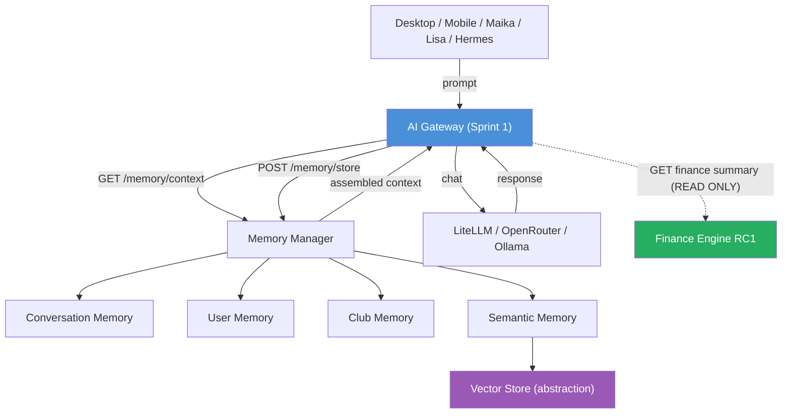
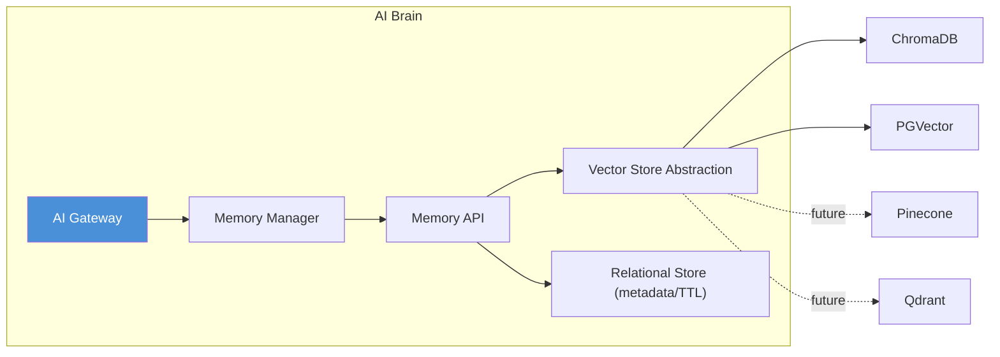

# 01 — Memory Architecture
## PickleFund V2.1 — Sprint 2 (Memory Layer) · DESIGN ONLY

> Tài liệu thiết kế. KHÔNG chứa code triển khai. Finance Engine RC1 vẫn là nguồn sự thật tài chính duy nhất; Memory Layer KHÔNG lưu/biến đổi số liệu tài chính.

---

## 1. Mục tiêu

Thiết kế tầng **Memory** cho AI Brain, cung cấp ngữ cảnh dài hạn & ngắn hạn cho AI Gateway (Sprint 1) mà không phá vỡ cách ly tài chính. Memory là **read/write của ngữ cảnh hội thoại & tri thức**, không phải của dữ liệu tài chính.

## 2. Năm loại Memory

| Loại | Phạm vi | Lưu gì | TTL mặc định | Nguồn |
|---|---|---|---|---|
| **AI Memory** | Toàn hệ | Hành vi/kết quả tool, fact đã xác thực | dài / vĩnh viễn | AI Gateway |
| **Conversation Memory** | Session | Lượt hội thoại (turns), tóm tắt | trung bình | Chat |
| **User Memory** | User | Sở thích, vai trò, ngữ cảnh cá nhân | dài | User profile |
| **Club Memory** | Club | Bối cảnh CLB (không phải số liệu tài chính) | dài | Club context |
| **Semantic Memory** | Toàn hệ | Embeddings + tài liệu/tri thức để semantic search | dài | Vector Store |

> **Ranh giới tài chính:** Club Memory CHỈ lưu bối cảnh định tính (vd "CLB ưu tiên sân ngoài trời"). Mọi con số tài chính lấy realtime từ Finance Engine RC1 qua AI Gateway — KHÔNG cache trong memory.

## 3. Memory Flow

## 4. Vị trí trong kiến trúc

## 5. Nguyên tắc thiết kế

| ID | Quyết định |
|---|---|
| AD-S2-01 | Memory Layer tách rời AI Gateway qua **Memory API** (HTTP nội bộ / service interface) |
| AD-S2-02 | Vector Store **provider-agnostic** (xem `02_VECTOR_STORE_SPECIFICATION.md`) |
| AD-S2-03 | KHÔNG lưu số liệu tài chính trong memory — đọc realtime RC1 |
| AD-S2-04 | Memory dùng chung cho Desktop/Mobile/Maika/Lisa/Hermes (một API) |
| AD-S2-05 | Tách metadata/TTL (relational) khỏi embeddings (vector store) |

## 6. Cross References

- Vector Store → `02_VECTOR_STORE_SPECIFICATION.md`
- API → `03_MEMORY_API_SPECIFICATION.md`
- Search → `04_SEMANTIC_SEARCH_DESIGN.md`
- Context → `05_CONTEXT_WINDOW_DESIGN.md`
- Lifecycle → `06_MEMORY_MANAGER_DESIGN.md`
