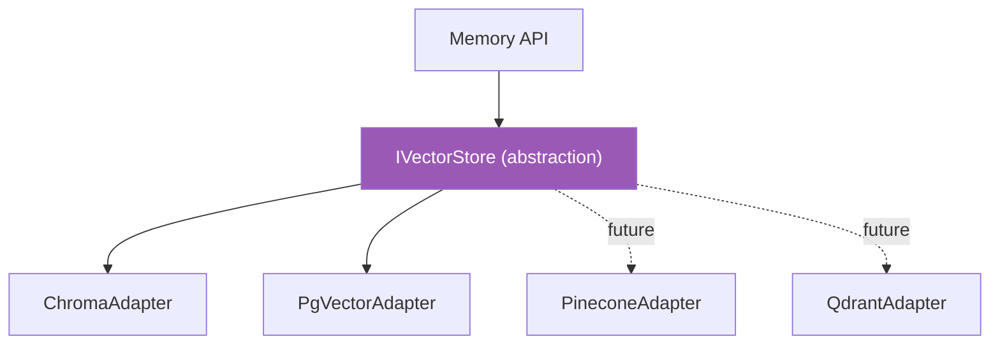

# 02 — Vector Store Specification
## PickleFund V2.1 — Sprint 2 (Memory Layer) · DESIGN ONLY

> Thiết kế **abstraction** không phụ thuộc provider. KHÔNG code triển khai.

---

## 1. Mục tiêu

Định nghĩa một abstraction cho vector storage để Memory Layer không khoá cứng vào một provider. Có thể swap backend mà không đổi Memory API.

## 2. Provider Matrix

| Provider | Trạng thái Sprint 2 | Ghi chú |
|---|---|---|
| **ChromaDB** | Primary (dev/self-host) | Nhẹ, dễ chạy local/Docker |
| **PGVector** | Primary (prod) | Tận dụng PostgreSQL sẵn có (cùng DB infra) |
| **Pinecone** | Future | Managed, scale lớn |
| **Qdrant** | Future | Self-host hiệu năng cao |

## 3. Abstraction Interface (mô tả, không phải code triển khai)

| Thao tác | Mô tả | Input | Output |
|---|---|---|---|
| `upsert` | Thêm/cập nhật vector + metadata | namespace, id, vector, metadata | ack |
| `query` | Tìm k láng giềng gần nhất | namespace, vector, topK, filter | matches[] (id, score, metadata) |
| `delete` | Xoá theo id / filter | namespace, id\|filter | ack |
| `createNamespace` | Tạo không gian (collection) | namespace, dim, metric | ack |
| `health` | Kiểm tra kết nối | — | status |

### Cấu hình provider (driven by `.env`, không hardcode)

| Biến | Ý nghĩa |
|---|---|
| `VECTOR_STORE_PROVIDER` | `chroma` \| `pgvector` \| `pinecone` \| `qdrant` |
| `VECTOR_STORE_URL` | endpoint/DSN |
| `VECTOR_STORE_API_KEY` | secret (nếu managed) |
| `VECTOR_DIMENSION` | số chiều embedding |
| `VECTOR_DISTANCE_METRIC` | `cosine` \| `l2` \| `dot` |

## 4. Provider-agnostic mapping

## 5. Architecture Decisions

| ID | Quyết định | Lý do |
|---|---|---|
| AD-S2-06 | Một interface `IVectorStore`, nhiều adapter | Swap provider không đổi API |
| AD-S2-07 | Namespace per (tenant/club) + per memory-type | Cách ly dữ liệu đa tenant |
| AD-S2-08 | Metadata filter ở tầng query | Lọc theo clubId/userId/type/TTL |
| AD-S2-09 | Default PGVector ở prod | Tái dùng hạ tầng Postgres, ít moving parts |

## 6. Cross References
- Kiến trúc → `01_MEMORY_ARCHITECTURE.md`
- Search dùng query → `04_SEMANTIC_SEARCH_DESIGN.md`
- Lifecycle (delete/TTL) → `06_MEMORY_MANAGER_DESIGN.md`
