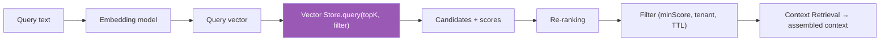

# 04 — Semantic Search Design
## PickleFund V2.1 — Sprint 2 (Memory Layer) · DESIGN ONLY

> Thiết kế. KHÔNG code triển khai.

---

## 1. Mục tiêu

Truy hồi memory liên quan ngữ nghĩa cho một truy vấn, phục vụ `POST /memory/search` và `GET /memory/context`.

## 2. Pipeline

## 3. Embedding

| Mục | Thiết kế |
|---|---|
| Provider | Cấu hình qua `.env` (`EMBEDDING_PROVIDER`, `EMBEDDING_MODEL`); ưu tiên đi qua LiteLLM để thống nhất |
| Dimension | `VECTOR_DIMENSION` khớp Vector Store |
| Chuẩn hoá | L2-normalize để dùng cosine |
| Caching | Cache embedding theo hash(content) để giảm chi phí (in-memory Sprint 2) |

## 4. Similarity & Ranking

| Bước | Thiết kế |
|---|---|
| Similarity | cosine (mặc định) — cấu hình `VECTOR_DISTANCE_METRIC` |
| topK | tham số request, mặc định 8 |
| minScore | ngưỡng cắt, mặc định 0.7 |
| Re-ranking | kết hợp score + độ mới (recency) + priority (xem `06`) |
| Diversity | tránh trùng lặp gần (optional, dedup theo nội dung) |

## 5. Context Retrieval

- Lấy matches → đưa sang Context Window Assembly (`05`) với `budgetTokens`.
- Gắn `sources[]` để truy vết (không lộ nội dung nhạy cảm/PII trong log).

## 6. Architecture Decisions

| ID | Quyết định | Lý do |
|---|---|---|
| AD-S2-14 | Embedding qua LiteLLM khi có thể | Thống nhất provider + telemetry/token accounting |
| AD-S2-15 | Re-rank = similarity + recency + priority | Ngữ cảnh liên quan & cập nhật |
| AD-S2-16 | minScore + topK cấu hình theo request | Kiểm soát nhiễu |

## 7. Cross References
- Vector query → `02_VECTOR_STORE_SPECIFICATION.md`
- Context assembly → `05_CONTEXT_WINDOW_DESIGN.md`
- Priority/recency → `06_MEMORY_MANAGER_DESIGN.md`
