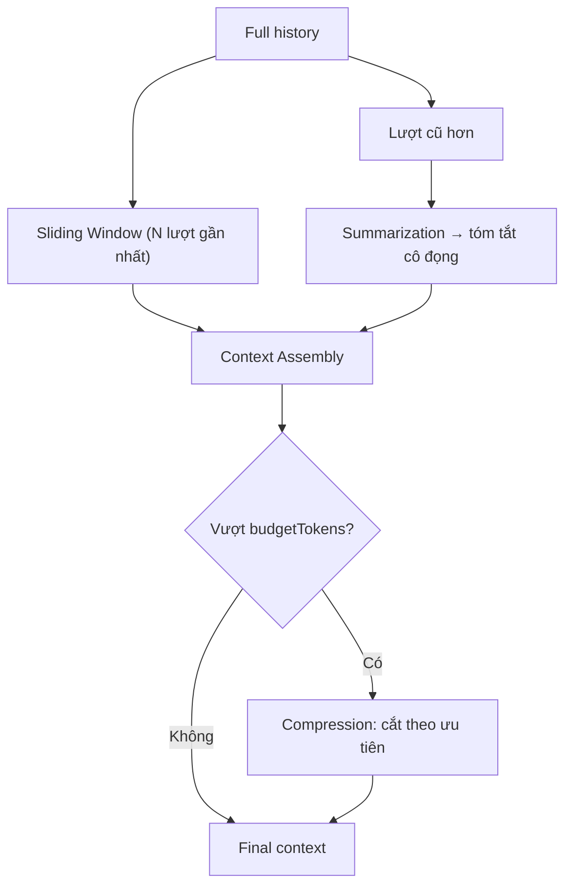

# 05 — Context Window Design
## PickleFund V2.1 — Sprint 2 (Memory Layer) · DESIGN ONLY

> Thiết kế. KHÔNG code triển khai.

---

## 1. Mục tiêu

Lắp ráp ngữ cảnh tối ưu trong giới hạn token của model (đọc từ AI Config Sprint 1: `*_CONTEXT_WINDOW`).

## 2. Thành phần ngữ cảnh

| Thành phần | Mô tả | Ưu tiên |
|---|---|---|
| System prompt | Hướng dẫn AI (persona Sprint 2+) | cao nhất |
| User Memory | Sở thích/vai trò | cao |
| Club Memory | Bối cảnh CLB (định tính) | trung bình |
| Conversation History | Lượt gần đây | cao (gần) → thấp (xa) |
| Semantic Memory | Kết quả search (`04`) | theo score |
| Finance Summary (RC1) | Lấy realtime khi cần số liệu | nạp on-demand, KHÔNG cache |

## 3. Conversation History — chiến lược

## 4. Kỹ thuật

| Kỹ thuật | Thiết kế |
|---|---|
| Sliding Window | Giữ N lượt gần nhất nguyên văn (cấu hình `MEMORY_HISTORY_WINDOW`) |
| Summarization | Tóm tắt lượt cũ thành 1 khối (qua LLM, lưu lại làm Conversation Memory) |
| Compression | Khi vượt budget: cắt theo thứ tự ưu tiên (system > user > recent > semantic > club) |
| Context Assembly | Ghép theo ưu tiên đến khi đạt `budgetTokens`; trả `tokensUsed`, `sources` |
| Token đếm | Ước lượng theo model; dùng cùng đơn vị với Token Accounting Sprint 1 |

## 5. Architecture Decisions

| ID | Quyết định | Lý do |
|---|---|---|
| AD-S2-17 | Sliding window + summarization kết hợp | Giữ độ chính xác gần, nén phần xa |
| AD-S2-18 | Cắt theo ưu tiên khi vượt budget | Bảo toàn ngữ cảnh quan trọng nhất |
| AD-S2-19 | Finance Summary nạp on-demand, không cache | Cách ly tài chính, luôn realtime RC1 |

## 6. Cross References
- Search → `04_SEMANTIC_SEARCH_DESIGN.md`
- API `GET /memory/context` → `03_MEMORY_API_SPECIFICATION.md`
- Context window size từ AI Config Sprint 1 (`*_CONTEXT_WINDOW`)
