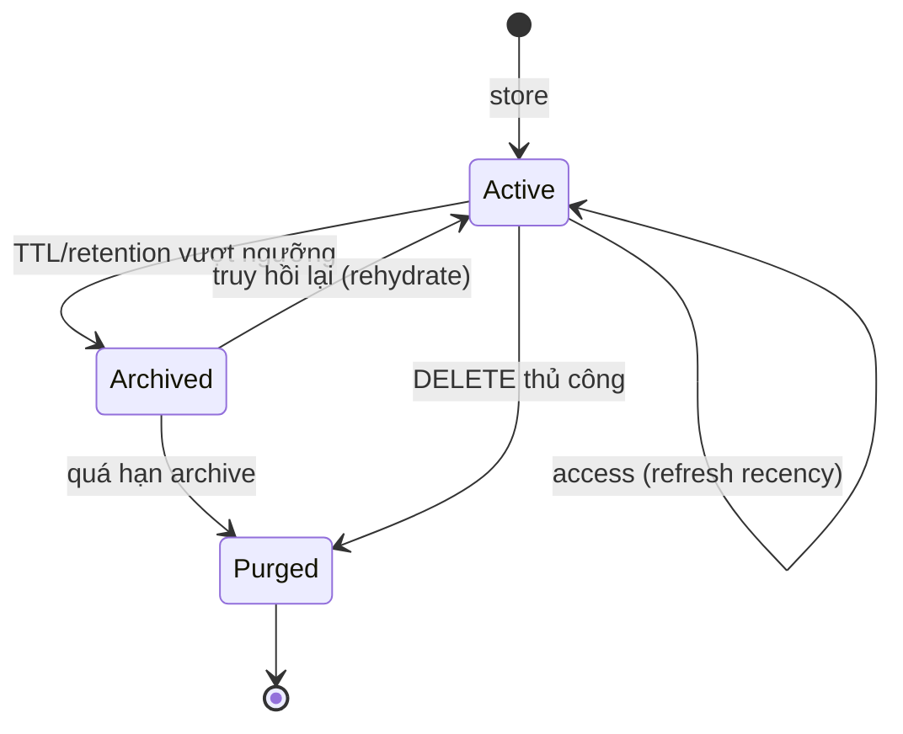

# 06 — Memory Manager Design
## PickleFund V2.1 — Sprint 2 (Memory Layer) · DESIGN ONLY

> Thiết kế. KHÔNG code triển khai.

---

## 1. Vai trò

Memory Manager điều phối vòng đời memory: TTL, retention, cleanup, priority, archive — và là điểm Memory API gọi vào.

## 2. Memory Lifecycle

## 3. Chính sách

| Chính sách | Thiết kế |
|---|---|
| **TTL** | Theo loại memory (`01`): conversation ngắn, user/club/semantic dài; cấu hình `MEMORY_TTL_*` |
| **Retention** | Giữ tối thiểu N item/scope kể cả hết TTL (tránh mất ngữ cảnh quan trọng) |
| **Cleanup** | Job định kỳ (thiết kế dùng scheduler hiện có) quét hết hạn → archive/purge |
| **Priority** | Trọng số (pinned > fact > preference > turn); ảnh hưởng re-ranking (`04`) & thứ tự cắt (`05`) |
| **Archive** | Chuyển sang lưu trữ lạnh (giữ metadata, có thể bỏ embedding) trước khi purge |

## 4. Tương tác

| Gọi từ | Thao tác |
|---|---|
| `POST /memory/store` | tạo Active + tính TTL + ghi Vector Store |
| `DELETE /memory` | Active/Archived → Purged (tôn trọng tenant/quyền) |
| Cleanup job | Active → Archived → Purged theo TTL/retention |
| Search/Context | đọc priority + recency để re-rank/cắt |

## 5. Architecture Decisions

| ID | Quyết định | Lý do |
|---|---|---|
| AD-S2-20 | TTL theo loại memory | Hội thoại ngắn hạn, tri thức dài hạn |
| AD-S2-21 | Retention tối thiểu vượt trên TTL | Không mất ngữ cảnh quan trọng |
| AD-S2-22 | Archive trước Purge | Có thể rehydrate; tiết kiệm vector store |
| AD-S2-23 | Cleanup dùng scheduler hiện có | Không thêm hạ tầng mới ở Sprint 2 |

## 6. Cross References
- Loại memory & TTL mặc định → `01_MEMORY_ARCHITECTURE.md`
- Priority/recency dùng trong → `04`, `05`
- Vector delete → `02_VECTOR_STORE_SPECIFICATION.md`
