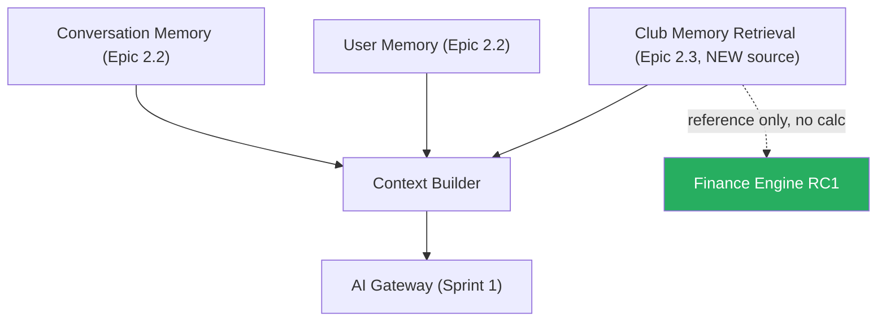

# 06 — Context Builder Integration
## PickleFund V2.1 — Sprint 2 Epic 2.3 Architecture Gate

**Version:** 1.0.0 · **Status:** DRAFT / PENDING CODEX · **Ngày:** 2026-06-29

## Revision History
| Ver | Ngày | Mô tả |
|---|---|---|
| 1.0.0 | 2026-06-29 | Initial context builder integration (design only) |

---

## 1. Nguyên tắc tích hợp
- **KHÔNG viết lại** `ConversationContextBuilder` (Epic 2.2) — chỉ **thêm một source mới**: Club Memory Retrieval Source.
- KHÔNG phá Conversation Memory / User Memory.
- KHÔNG thay đổi AI Gateway · KHÔNG thay đổi Prompt Engine.
- Semantic Search **KHÔNG** gọi Finance Engine trực tiếp.

## 2. Sơ đồ tích hợp

## 3. Cách thêm source (additive)
- Context Builder nhận thêm output từ Club Memory Retrieval (đã trim, scope clubId).
- Thứ tự ưu tiên/trim do Context Window Manager (Epic 2.2) quyết định — không đổi cơ chế.
- Behavior Memory vẫn chưa đưa vào context (như Epic 2.2) — Club Memory là source bổ sung độc lập.

## Clear Boundaries
Tích hợp = additive source. Không sửa builder core/AI Gateway/Prompt Engine/Finance Engine.

## DoD
Club Memory retrieval xuất hiện như source mới; Conversation/User Memory + Gateway không đổi hành vi; có test tương thích. Xem `EPIC2.3_ACCEPTANCE_CRITERIA.md`.

## Risks
- R: viết lại builder gây regression → Mitigation: additive-only + test tương thích Epic 2.2.
- R: Semantic Search gọi Finance trực tiếp → Mitigation: cấm; reference RC1 chỉ ở tầng đọc summary nếu cần.

## Security Notes
Source mới giữ scope clubId; không trộn dữ liệu user/club khác vào context.

## Cross References
`RETRIEVAL_PIPELINE_DESIGN.md` · `SECURITY_AND_TENANT_ISOLATION.md` · Epic 2.2 context-builder
