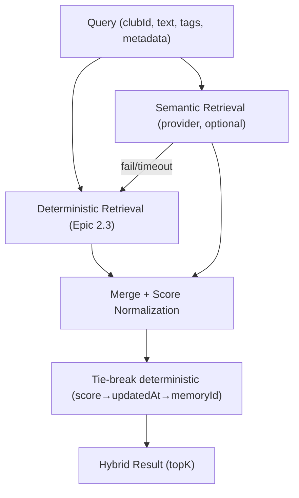

# 04 — Hybrid Retrieval Design
## PickleFund V2.1 — Sprint 2 Epic 2.4 Architecture Gate

**Version:** 1.0.0 · **Status:** DRAFT / PENDING CODEX · **Ngày:** 2026-06-29

## Revision History
| Ver | Ngày | Mô tả |
|---|---|---|
| 1.0.0 | 2026-06-29 | Initial hybrid retrieval design |

## Purpose
Thiết kế hợp nhất Deterministic + Semantic retrieval = Hybrid.

## Scope
RetrievalEngine khi có provider thật (Epic 2.4).

## Design

## Yêu cầu
- Deterministic result **vẫn hoạt động nếu semantic fail** (fallback).
- **Merge strategy rõ ràng**: hợp nhất theo memoryId, cộng/chuẩn hoá score.
- **Score normalization**: đưa semantic score + deterministic score về cùng thang [0,1].
- **Tie-break deterministic** (score → updatedAt → memoryId).
- **KHÔNG LLM ranking**.

## Risks
- R: semantic lệch kết quả → deterministic là nền; semantic chỉ bổ sung.
- R: non-deterministic ordering → tie-break cố định.

## Cross References
`03_SEMANTIC_PROVIDER_CONTRACT.md` · Epic 2.3 `RETRIEVAL_PIPELINE_DESIGN.md`.
