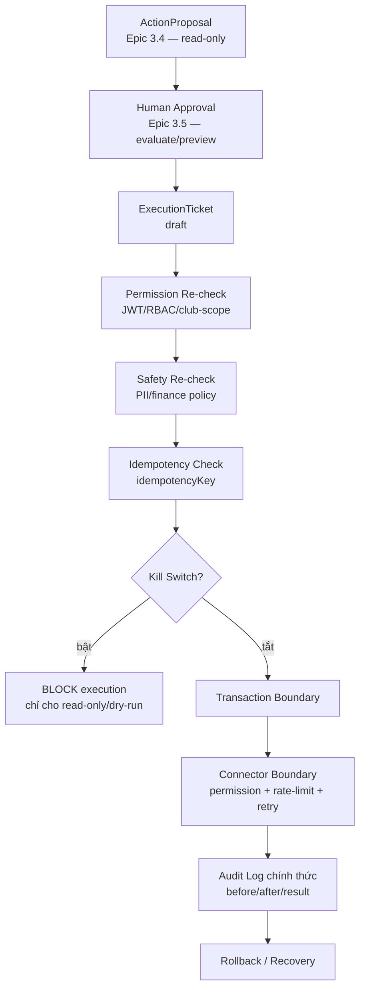

# ADR-01 — Execution Engine Architecture

> **Sprint 4 — Architecture Decision Record.** Tài liệu thiết kế kiến trúc Execution Engine **TRƯỚC** khi viết bất kỳ code Sprint 4 nào. Đây **chỉ là thiết kế** — chưa mở execution thật.

**Phiên bản:** 1.0 (draft) · **Ngày:** 2026-06-30 · **Nhánh:** `main`

---

## 2. Trạng thái

**Proposed / Pending Codex Audit.**

- Execution Readiness = **NOT READY**.
- Sprint 4 (Execution Engine) = **BLOCKED** cho tới khi ADR-01 được Codex Audit **PASS** và có quyết định mở Epic 4.1.
- ADR này **không** thay đổi trạng thái thực thi; **không** triển khai execution.

## 3. Bối cảnh

- **Sprint 2** (AI Memory Architecture) và **Sprint 3** (Maika AI Governance Layer) đã CLOSED / Architecture Frozen; toàn bộ Epic 3.1–3.5 đã Codex PASS, Commit, Tag, Push.
- Maika hiện có pipeline **READ-ONLY**: Understand → Organization Intelligence → Workflow Planning → Action Proposal → **Human Approval Engine** (Epic 3.5). Mọi đề xuất `executionAllowed=false`, `requiresHumanApproval=true`.
- Sprint 4 cần **thiết kế** Execution Engine để trong tương lai có thể thực thi action đã được duyệt — nhưng việc thực thi **chưa được phép**.
- Execution là bước rủi ro cao nhất: cần kiến trúc **an toàn, kiểm toán được (auditable), rollback được (recoverable)**, idempotent, có kill switch, tách biệt Finance Engine.

## 4. Mục tiêu kiến trúc

Execution Engine (tương lai) phải hỗ trợ:

- **Execution Ticket** — đơn vị thực thi có vòng đời rõ ràng.
- **Permission re-check** tại thời điểm execution (không tin quyền cũ).
- **Approval verification** — xác minh approval còn hiệu lực & khớp proposal.
- **Idempotency** — cùng key không tạo execution trùng.
- **Audit log chính thức** — bất biến, đầy đủ before/after.
- **Rollback strategy** — phân loại reversible / irreversible / compensating / manual.
- **Retry policy** — có giới hạn, backoff, an toàn với non-idempotent.
- **Kill switch** — global / club / action-type / connector.
- **Observability** — metrics đầy đủ.
- **Transaction boundary** — xác định ranh giới giao dịch từng action.
- **Connector boundary** — Email/Telegram/Notification/API Write là connector có kiểm soát.

## 5. Non-goals (ADR-01 KHÔNG triển khai)

ADR-01 **KHÔNG** làm bất kỳ điều nào sau đây:

- execute action · API write · DB write
- gửi email · telegram · notification
- workflow automation · scheduler · job queue · background worker
- external connector thật
- production execution

> ADR-01 = **thiết kế kiến trúc + model dạng tài liệu**. Không service, không endpoint, không migration, không DB table.

## 6. Kiến trúc đề xuất



> ⚠️ **Sprint 4 chưa được mở execution thật.** Sơ đồ trên là **kiến trúc thiết kế**; các node (ExecutionTicket, Connector, Audit Log…) chỉ tồn tại dưới dạng **model tài liệu** trong ADR này.

## 7. Execution Ticket Model (thiết kế, chưa tạo DB table)

```
ExecutionTicket {
  ticketId
  actionProposalId
  clubId
  requestedBy
  approvedBy
  approvalSnapshot        // bản chụp bất biến của approval
  actionType
  riskLevel               // low | medium | high | critical
  status
  idempotencyKey
  dryRunReference         // tham chiếu DryRunResult (Epic 3.4)
  executionMode           // dry-run | (future) live — mặc định dry-run
  createdAt
  expiresAt
}
```

**Trạng thái (state machine) đề xuất:** `draft` → `approved_pending_execution` → (`blocked` | `executing`) → (`succeeded` | `failed`) → (`rolled_back` | `cancelled`).

> Trong ADR-01 **chỉ thiết kế model** — KHÔNG tạo DB table, KHÔNG persist, KHÔNG migration.

## 8. Permission Model

- **Re-check quyền tại thời điểm execution** — không dùng permission cũ một cách mù quáng (quyền có thể đã thay đổi giữa lúc duyệt và lúc thực thi).
- `role` và `clubId` lấy từ **auth context (JWT)**; **không** body override.
- **Cross-club bị block** tuyệt đối (tenant isolation).
- Least privilege: chỉ vai trò đủ quyền cho action-type + risk-level tương ứng.

## 9. Approval Verification

Trước khi chuyển ticket sang `executing`, phải xác minh:

- Approval **còn hiệu lực** (chưa hết hạn).
- `approvedBy` hợp lệ (đúng vai trò approver).
- `approvedAt` hợp lệ.
- **Approval snapshot khớp** action proposal (không bị sửa sau khi duyệt).
- **Không cho approve-and-execute trong cùng một request** ở giai đoạn đầu (tách bước duyệt và bước thực thi).

## 10. Idempotency

- Mọi execution phải có **`idempotencyKey`**.
- Cùng key **không** được tạo execution trùng.
- **Retry an toàn** — lặp lại với cùng key trả kết quả cũ, không tạo action mới.
- Connector timeout **không** được tạo double action (dùng key + trạng thái ticket để dedupe).

## 11. Audit Log chính thức (thiết kế, chưa persist)

```
ExecutionAuditLog {
  ticketId
  actionId
  clubId
  actor
  approvalSnapshot
  permissionDecision
  safetyDecision
  beforeStateRef          // tham chiếu, không chứa raw nhạy cảm
  afterStateRef
  executionResult
  error
  timestamp
}
```

> ADR-01 **chỉ thiết kế** audit log — chưa persist vào DB. Audit log phải **bất biến (append-only)**.

## 12. Rollback Strategy

Phân loại action theo khả năng hoàn tác:

- **Reversible action** — có thể tự hoàn tác an toàn.
- **Irreversible action** — không thể hoàn tác (vd gửi email/telegram đã gửi).
- **Compensating action** — bù trừ bằng action ngược (saga).
- **Manual recovery** — cần con người xử lý.

> ⚠️ **Financial action mặc định KHÔNG auto-rollback bằng AI.** Mọi hoàn tác tài chính phải do con người + Finance Engine quyết định.

## 13. Kill Switch

Bốn cấp:

- **Global kill switch** — chặn toàn hệ thống.
- **Club-level** — chặn theo từng CLB.
- **Action-type** — chặn theo loại action.
- **Connector-level** — chặn theo từng connector.

Khi kill switch **bật**: **block execution**; **vẫn cho phép read-only / dry-run**.

## 14. Retry Policy

- Retry **có giới hạn** (max attempts).
- **Exponential backoff**.
- **Không retry** action không idempotent.
- **Không retry finance write** nếu chưa có rule riêng (ADR/Epic riêng).

## 15. Transaction Boundary

- Mỗi action phải xác định **transaction boundary** rõ ràng.
- **Không trộn** nhiều loại action trong một transaction nếu không có saga.
- Nếu chạm connector ngoài hệ thống → cần **outbox / saga** (thiết kế ở Epic sau).

## 16. Connector Boundary

Email / Telegram / Notification / API Write đều là **connector**. Mỗi connector cần:

- **permission**
- **rate limit**
- **retry rule**
- **failure handling**
- **audit**
- **kill switch**

> ADR-01 chỉ định nghĩa ranh giới connector; **không** hiện thực connector nào.

## 17. Finance Isolation

- **Finance Engine vẫn là Source of Truth.**
- Execution Engine **không** tự tính toán tài chính.
- Finance write (nếu có trong tương lai) là loại **high / critical risk**.
- **Finance execution cần ADR riêng hoặc Epic riêng.**
- AI **không** được tự tạo phiếu thu/chi nếu chưa có approval + audit đầy đủ.

## 18. PII / Vector Safety

- **Không** đưa raw PII / finance vào ExecutionTicket / AuditLog / connector payload.
- Phải dùng **sanitizer/policy** (`VectorContentPolicyService` hoặc tương đương) **trước** khi tạo ticket.
- **Logs không chứa raw sensitive data** (chỉ ref/hash).

## 19. Observability

Metrics đề xuất:

`tickets_created` · `tickets_blocked` · `execution_attempts` · `execution_success` · `execution_failed` · `rollback_required` · `kill_switch_blocks` · `approval_expired` · `idempotency_duplicates`.

## 20. Security Controls

- **JWT** authentication.
- **RBAC** (role-based access control).
- **Club scope** (tenant isolation).
- **No body override** (role/clubId từ auth context).
- **Immutable approval snapshot**.
- **Audit trail** đầy đủ, append-only.
- **Least privilege**.

## 21. Sprint 4 Roadmap đề xuất (chưa triển khai)

| Epic | Nội dung |
|---|---|
| **Epic 4.1** | Execution Ticket Framework |
| **Epic 4.2** | Idempotency & Audit Log |
| **Epic 4.3** | Permission / Safety Re-check |
| **Epic 4.4** | Connector Boundary |
| **Epic 4.5** | Controlled Execution Pilot |
| **Epic 4.6** | Rollback & Observability |
| **Sprint 4 Final Governance Audit** | Gate cuối |

> Đây **chỉ là đề xuất thứ tự** — chưa Epic nào được mở. Epic 4.1 chỉ mở sau khi ADR-01 PASS + có quyết định.

## 22. Quyết định

- ADR-01 **đề xuất kiến trúc**, **chưa approve execution**.
- **Execution Readiness vẫn NOT READY.**
- **Sprint 4 implementation vẫn BLOCKED** cho tới khi Codex Audit ADR-01 **PASS** và có quyết định mở Epic 4.1.
- Tuân thủ quy trình: Claude Code thiết kế → **Codex Audit** → PASS → mới mở Epic tiếp theo. Không tự duyệt.

---

> 🧾 ADR-01 là tài liệu thiết kế. Mọi hiện thực hóa (service/endpoint/migration/connector) **chỉ** được thực hiện ở các Epic Sprint 4 sau khi ADR-01 PASS và Epic tương ứng được mở.
