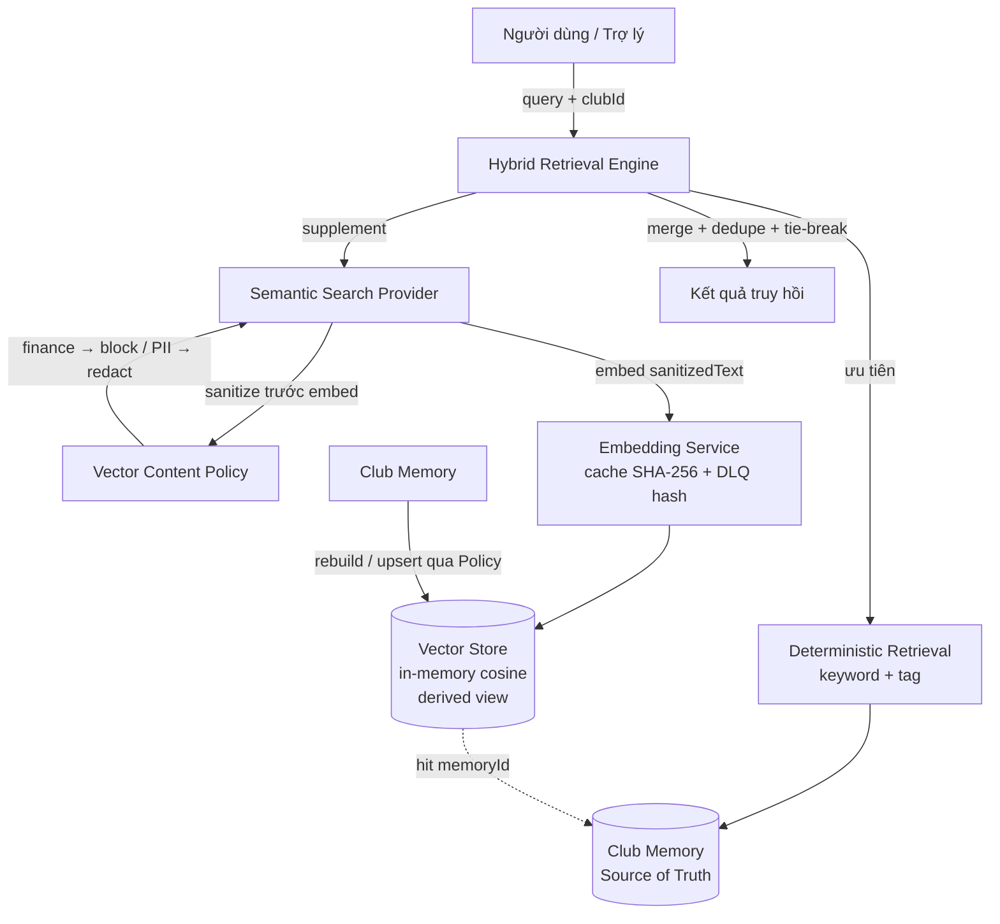

# 01 — Kiến trúc AI Memory (Technical Baseline v2.0)

> Phản ánh code thực tế trong `backend/src/ai/` sau Sprint 2 / Epic 2.4 PASS.

---

## 1. Kiến trúc tổng thể

Lớp AI Memory được xây theo nguyên tắc Zero-Refactor, mỗi tầng là một module NestJS độc lập, ráp với nhau qua interface/DI token.

| Tầng | Thư mục | Vai trò |
|---|---|---|
| **AI Harness** | `backend/src/ai/harness/` | Gateway/Router/Provider Manager, Retry, Circuit Breaker, Telemetry, Token Accounting, Config. |
| **Memory Core** | `backend/src/ai/memory/` | CRUD bộ nhớ, Memory Object immutable, repository abstraction. |
| **Conversation Memory** | `backend/src/ai/conversation/` | Cửa sổ hội thoại + context builder. |
| **User Memory** | `backend/src/ai/user-memory/` | Bộ nhớ theo người dùng. |
| **Club Memory** | `backend/src/ai/club-memory/` | Bộ nhớ theo CLB — **Source of Truth** cho retrieval. |
| **Retrieval** | `backend/src/ai/retrieval/` | Deterministic retrieval (keyword + tag), index manager, interface semantic. |
| **Vector Layer** | `backend/src/ai/vector/` | Vector Store, Embedding, Semantic Search, Hybrid Retrieval, Content Policy, Observability. |

> Persistence của Memory Core hiện là **in-memory volatile default** (repository abstraction sẵn sàng, nhưng adapter DB là **deferred** — để Sprint/Epic sau).

## 2. AI Harness

`backend/src/ai/harness/` — hạ tầng gọi mô hình, gồm: `ai-gateway.service`, `ai-router.service`, `ai-provider-manager.service`, `retry-policy.service`, `circuit-breaker.service`, `telemetry.service`, `token-accounting.service`, `ai-config.service`.

- Cấu hình lấy từ `.env`/`ConfigService`, **không hardcode**.
- Retry phân loại lỗi + jitter; circuit breaker cô lập provider lỗi.

## 3. Memory Core

`backend/src/ai/memory/` — `MemoryManager`: save / load / delete / update / list / search.

- **Memory Object immutable** (deep clone/freeze).
- Memory Type enum: SYSTEM / USER / CLUB / SESSION / TEMP / LONG_TERM.
- Repository **abstraction** (`IMemoryRepository` + token `MEMORY_REPOSITORY`); default in-memory volatile.
- Memory Core **không biết** Vector DB (tách lớp).

## 4. Conversation Memory

`backend/src/ai/conversation/` — `conversation.context-window`, `conversation.context-builder`, service + repository + DTO.

- Quản lý cửa sổ hội thoại theo session, dựng ngữ cảnh cho prompt.

## 5. User Memory

`backend/src/ai/user-memory/` — bộ nhớ gắn người dùng (service/repository/DTO/types), scope theo user.

## 6. Club Memory

`backend/src/ai/club-memory/` — bộ nhớ gắn CLB, là **Source of Truth (SoT)** cho retrieval và cho việc rebuild vector index.

- Vector index là **derived view** dựng lại được từ Club Memory; Club Memory **không** phụ thuộc ngược vào vector.

## 7. Retrieval (Deterministic)

`backend/src/ai/retrieval/` — `RetrievalEngine` + `IndexManager`:

- Truy hồi **xác định (deterministic)**: keyword match + lọc theo tag.
- `NoopSemanticSearchProvider` là cài đặt mặc định của interface semantic (không phụ thuộc vector).
- Là **ưu tiên** trong Hybrid Retrieval (xem [02-hybrid-retrieval-flow.md](02-hybrid-retrieval-flow.md)).

## 8. Semantic Search

`backend/src/ai/vector/semantic-search.provider.ts` — cài đặt `ISemanticSearchProvider` của Epic 2.3:

- Embedding query → similarity search → topK + threshold + timeout.
- **Query đi qua Vector Content Policy TRƯỚC khi embed**: finance → block (trả `[]`), PII → redact.
- Mọi lỗi (embed/budget/timeout) → trả `[]` để Hybrid fallback về deterministic.
- Read-only, scope `clubId`.

## 9. Vector Store

`backend/src/ai/vector/in-memory-vector-store.provider.ts` (qua token `VECTOR_STORE_PROVIDER`):

- In-memory, similarity **cosine**.
- **Derived view**, không phải SoT. Backend production (PGVector/Qdrant/…) là **deferred**.

## 10. Embedding

`backend/src/ai/vector/embedding.service.ts` + `local-hash-embedding.provider.ts`:

- Provider mặc định: **local hash** (deterministic, L2-normalized) — không gọi API ngoài.
- Cache theo **SHA-256** của text; batch theo `EMBEDDING_MAX_BATCH`; cost guardrail (`EMBEDDING_DAILY_BUDGET` → `BudgetExceededError`); retry → **Dead Letter Queue (DLQ) chỉ lưu hash**, không lưu raw text.

## 11. Vector Content Policy

`backend/src/ai/vector/vector-content-policy.service.ts` — `sanitizeForEmbedding()`:

- Finance term / money pattern → `allowed=false`, `sanitizedText=''` (block).
- PII (email/điện thoại/CCCD/số tài khoản) → redact bằng regex deterministic (`[redacted-email|phone|id]`).
- `policyVersion = 'policy-v1'` (đưa vào embeddingVersion để invalidate khi policy đổi).

## 12. Observability

`backend/src/ai/vector/vector-observability.service.ts` — counters: cacheHit/cacheMiss, semanticAttempts/semanticSuccess, fallbackCount, embeddingFailures, vectorQuery latency, `policySkipped`, `piiRedacted`, `financeBlocked`.

## 13. Sơ đồ luồng

