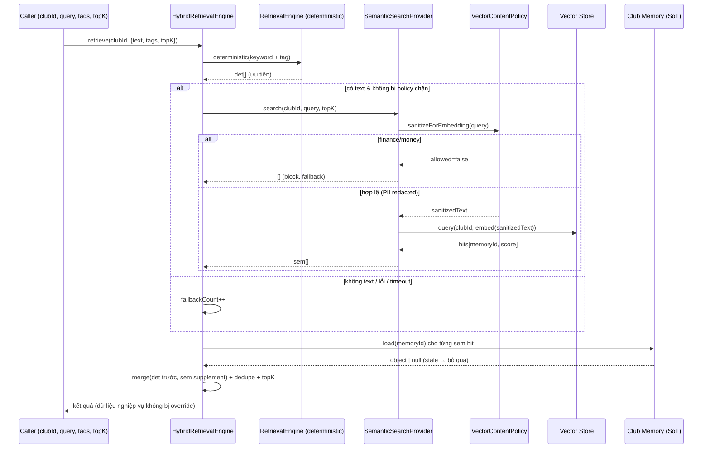

# 02 — Luồng Hybrid Retrieval (Technical Baseline v2.0)

> Code thực tế: `backend/src/ai/vector/hybrid-retrieval.service.ts` (`HybridRetrievalEngine`) + spec `hybrid-retrieval.service.spec.ts`.

---

## 1. Nguyên tắc cốt lõi

Hybrid Retrieval kết hợp hai nguồn, nhưng **deterministic luôn ưu tiên** và **semantic chỉ bổ sung (supplement)**. Mục tiêu: tăng độ phủ truy hồi mà **không bao giờ làm sai lệch dữ liệu nghiệp vụ**.

## 2. Deterministic Retrieval là ưu tiên

- Kết quả deterministic (keyword + lọc tag từ `RetrievalEngine`) **đứng trước** trong danh sách trả về.
- Test minh chứng: với `text:'court', tags:['indoor']`, phần tử đầu tiên luôn là kết quả `indoor` (deterministic priority).

## 3. Semantic Search chỉ supplement

- Semantic **chỉ thêm** các memory mà deterministic **bỏ sót**.
- Ví dụ test: query `'court'` khớp cả `indoor` và `outdoor` về mặt ngữ nghĩa; nhưng deterministic (lọc tag `indoor`) chỉ lấy `indoor`, nên `outdoor` được semantic **bổ sung** vào sau.

## 4. Dedupe theo memoryId

- Memory được cả hai nguồn khớp **chỉ xuất hiện một lần**.
- Test: `new Set(ids).size === ids.length` (không trùng).

## 5. Tie-break deterministic

- Khi gộp, **thứ tự deterministic được giữ trước**, semantic chèn phần còn lại. Đây là tie-break có lợi cho nguồn xác định, tránh để điểm số ngữ nghĩa đẩy dữ liệu nghiệp vụ xuống.

## 6. Fallback khi semantic lỗi / rỗng / timeout

`SemanticSearchProvider` trả `[]` an toàn trong mọi trường hợp bất thường; `HybridRetrievalEngine` ghi `fallbackCount` và vẫn trả kết quả deterministic:

- **Semantic rỗng** (không có `text`) → chỉ deterministic + `fallbackCount++`.
- **Embedding fail** (provider lỗi) → chỉ deterministic.
- **Timeout** (`SEMANTIC_TIMEOUT_MS`) → coi như semantic rỗng → deterministic.
- **Finance query bị block** → semantic trả `[]` → deterministic (không embed, không query store).

## 7. Không override dữ liệu nghiệp vụ

- Semantic **không** thay thế/ghi đè kết quả deterministic; chỉ **thêm vào phần đuôi**.
- Hit vector **stale** (đã xoá khỏi Club Memory nhưng còn vector) load ra `null` → **bỏ qua**. Source of Truth là Memory Object trong Club Memory, không phải vector store.
- `topK` được áp **sau khi merge** (test `topK:1` → trả đúng 1 phần tử).

## 8. Sequence diagram

