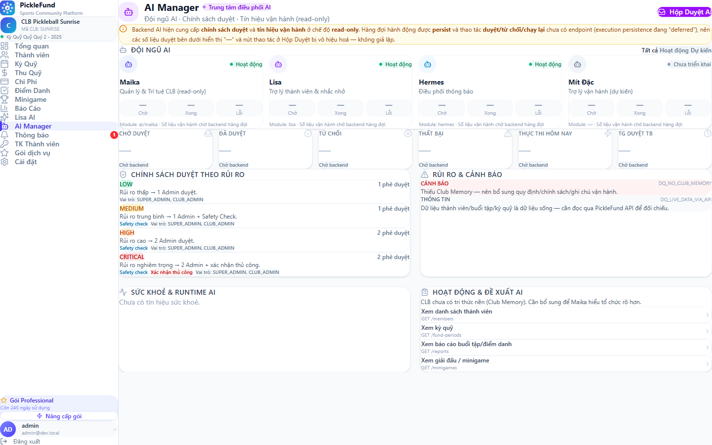
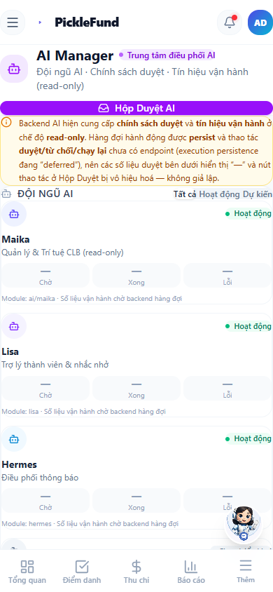
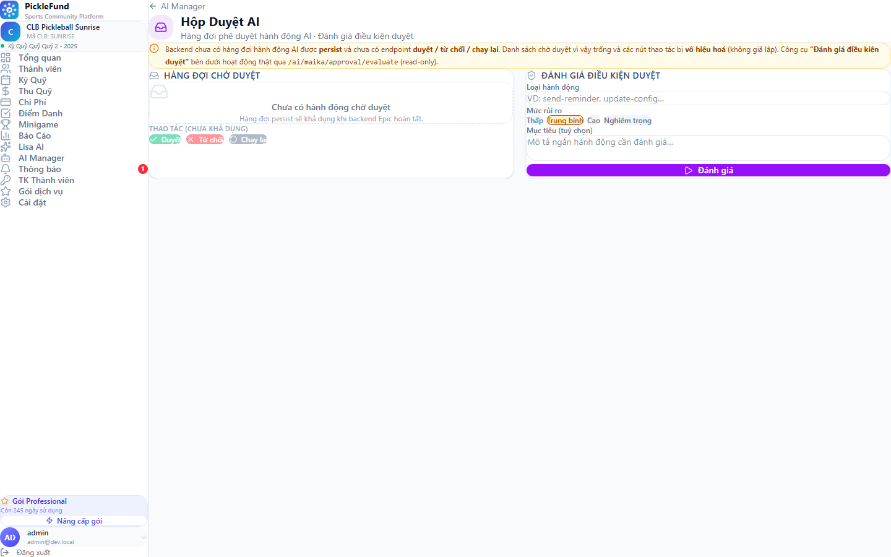
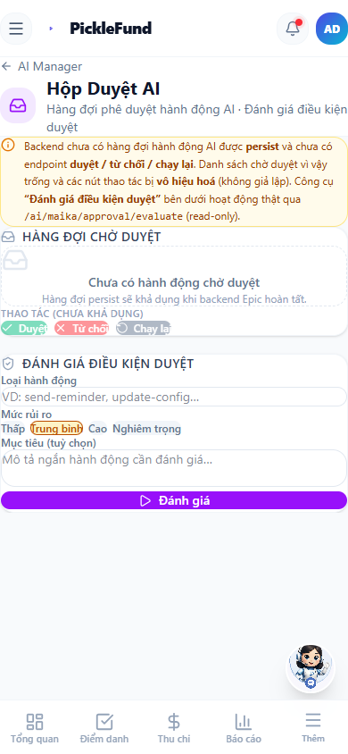

# Runtime Verify — EPIC4-AI-MANAGER-DASHBOARD-001

Kiểm thử runtime AI Manager Dashboard + Approval Inbox ở desktop & mobile.

## Routes tested
- `/admin/ai-manager` (AI Manager Dashboard)
- `/admin/ai-approvals` (Approval Inbox)

## Viewport sizes
- Desktop: **1440 × 900** (full-page)
- Mobile: **390 × 844** (viewport)

## Auth role used
- Authenticated using a local/dev admin session (**CLUB_ADMIN**) for runtime verification.
  Session chỉ được nạp ở runtime để kiểm thử — không sửa code/backend, không nhúng thông tin đăng nhập.
- Khi đã xác thực, các endpoint AI trả dữ liệu thật:
  `GET /ai/maika/approval/policies` = 200, `GET /ai/maika/organization-intelligence` = 200.

## Screenshot paths
| Màn | File |
|---|---|
| AI Manager — desktop | [`ai-manager-desktop-1440.png`](./ai-manager-desktop-1440.png) |
| AI Manager — mobile | [`ai-manager-mobile-390.png`](./ai-manager-mobile-390.png) |
| Approval Inbox — desktop | [`ai-approvals-desktop-1440.png`](./ai-approvals-desktop-1440.png) |
| Approval Inbox — mobile | [`ai-approvals-mobile-390.png`](./ai-approvals-mobile-390.png) |

## Overflow result
`document.scrollWidth > clientWidth` = **false** trên cả 4 màn (đo bằng Playwright). **Không tràn ngang.**

## Console error result
- **Không có console error do Epic 4 sinh ra.** `useAiManager` chỉ gọi `/ai/maika/*` (200) và bọc `Promise.allSettled` + try/catch.
- **1 lỗi 500 pre-existing, KHÔNG liên quan Epic 4**: `GET /api/attendance/my-sessions` → 500.
  - Nguồn gọi: `frontend/src/hooks/useApiSync.ts` (hook đồng bộ **toàn cục** của app-shell, chạy trên MỌI trang), **0 tham chiếu** trong code Epic 4.
  - Bằng chứng pre-existing/global: lỗi 500 **cũng xuất hiện trên `/dashboard`** (trang admin không thuộc Epic 4). Nguyên nhân: tài khoản admin không có `memberId` nên endpoint `/attendance/my-sessions` trả 500.
  - Ngoài phạm vi task (scope: “không sửa backend / không sửa module khác”) → **không sửa**, chỉ báo cáo.

## Visual / runtime findings
- Không màn nào rơi vào login/blank/error: `h1` = "AI Manager" / "Hộp Duyệt AI", body có nội dung.
- **Dashboard**: header + CTA tím "Hộp Duyệt AI"; roster 4 AI (Maika/Lisa/Hermes = Hoạt động, Mít Đặc = Chưa triển khai); KPI 6 thẻ (trạng thái "—/Chờ backend" trung thực); **Chính Sách Duyệt** (dữ liệu thật 4 mức); Rủi Ro & Cảnh Báo / Sức Khoẻ Runtime / Hoạt Động & Đề Xuất (dữ liệu thật từ organization-intelligence). Card đọc rõ.
- **Approval Inbox**: banner trung thực; queue empty state; nút Duyệt/Từ chối/Chạy lại **disabled** (không giả); **Đánh Giá Điều Kiện Duyệt** hoạt động thật (`/ai/maika/approval/evaluate`); detail drawer full-width trên mobile.
- **Mobile**: KPI/panel stack dọc, CTA + input full-width touch-friendly, bottom-nav hiển thị; sidebar (mobile hamburger) có mục "AI Manager".

## Fixes applied
- **Không có** — không phát hiện lỗi responsive/UI thuộc Epic 4. Chỉ thêm artifact xác thực (4 PNG + báo cáo này). Lỗi 500 là pre-existing/ngoài phạm vi (đã nêu rõ).

## Build / Lint Evidence
| Command | Result |
|---|---|
| `cd frontend && npm run build` | **PASS** (`vite build` thành công, 0 error TS) |
| Scoped eslint Epic 4 (`eslint src/App.tsx src/components/layout/Sidebar.tsx src/hooks/useAiManager.ts src/pages/admin/ai/AiManagerDashboard.tsx src/pages/admin/ai/AiApprovalInbox.tsx`) | **PASS** (0 error) |

- **No new warnings from Epic 4**: các file mới của Epic 4 (`useAiManager.ts`, `AiManagerDashboard.tsx`, `AiApprovalInbox.tsx`) lint 0 warning.
- `Sidebar.tsx:84` có 1 warning `@typescript-eslint/no-explicit-any` (`useHermesUnreadCount(user: any)`) — **pre-existing, KHÔNG do Epic 4 tạo ra** (thay đổi Epic 4 ở Sidebar chỉ thêm 1 mục điều hướng + import icon).
