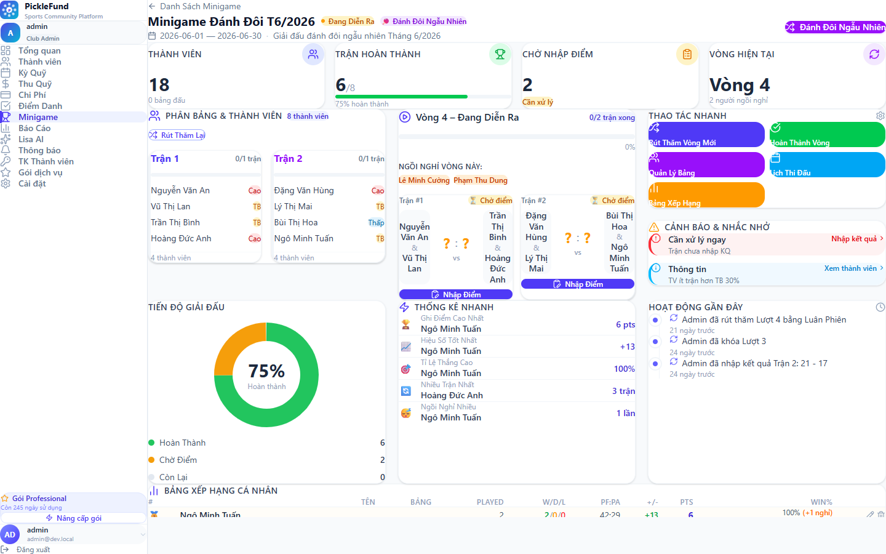
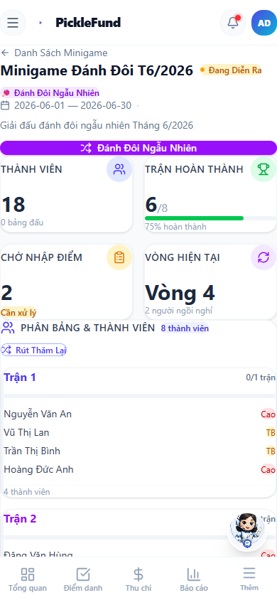

# UI Audit — Minigame Dashboard (UI-MINIGAME-DASHBOARD-POLISH-001)

Artifact kiểm thử giao diện cho màn hình **Minigame Dashboard** (định dạng Đánh Đôi Ngẫu Nhiên) ở trạng thái IN_PROGRESS.

## Route used
- `/minigames/mg-3` → `MinigameDashboard` → `MinigameDashboardPage` (nhánh `RANDOM_DOUBLES`).

## Viewport sizes
| Breakpoint | Kích thước | Ghi chú |
|---|---|---|
| Desktop | **1440 × 900** | Layout 3 cột |
| Mobile  | **390 × 844** | Xếp dọc, không tràn ngang |

## Data state used
- Nguồn: dữ liệu **mock client-side dev/demo** có sẵn trong `frontend/src/store/minigameStore.ts` (không phải dữ liệu backend production, không thêm seed giả mới).
- Minigame `mg-3`: `formatType = RANDOM_DOUBLES`, `status = IN_PROGRESS`.
- Vòng hiện tại: **Vòng 4** (`rnd-4` ACTIVE), có trận COMPLETED + PENDING, 2 người ngồi nghỉ, bảng xếp hạng, hoạt động gần đây, cảnh báo.
- Phiên đăng nhập kiểm thử: token **local** (`local-token-…`) role `CLUB_ADMIN`, inject qua `localStorage` chỉ trong runtime preview (dev-only). Local token khiến `useMinigameDetailSync` bỏ qua API → không phụ thuộc backend, không ghi dữ liệu thật.

## Screenshot file paths
Ảnh nhị phân **đã lưu vào repo** cạnh tài liệu này (UI-MINIGAME-DASHBOARD-POLISH-001-FINAL-ARTIFACT):

| Ảnh | File | Kiểu chụp |
|---|---|---|
| Desktop | [`desktop-1440.png`](./desktop-1440.png) | width 1440, **full-page** (bắt trọn dashboard) |
| Mobile  | [`mobile-390.png`](./mobile-390.png)   | **viewport 390×844** (app-shell cuộn nội bộ) |





### Cách tái tạo (reproduce)
```
1. cd frontend && npm run dev            # vite @ :5173
2. Inject localStorage 'auth-storage' với accessToken 'local-token-dev-admin',
   role 'CLUB_ADMIN' (local token → useMinigameDetailSync bỏ qua API).
3. Mở route /minigames/mg-3
4. Chụp: desktop 1440 (full-page) và mobile 390×844 (viewport).
```
> Ảnh chụp headless bằng `playwright-core` (channel `chrome`) chạy trong scratchpad (ngoài repo,
> KHÔNG thêm dependency vào `frontend/package.json`). Auth inject qua `addInitScript` chỉ ở runtime.

## Visual result summary
Kiểm chứng bằng screenshot + DOM inspection + console (0 error):

- **Top bar**: back-link, tiêu đề `Minigame Đánh Đôi T6/2026`, badge `Đang Diễn Ra` (pulse), pill định dạng, **nút CTA tím “Đánh Đôi Ngẫu Nhiên”** (mở DrawRoundModal thật).
- **KPI row**: Thành viên `18` · Trận hoàn thành `6/8` (75%, thanh xanh) · Chờ nhập điểm `2` (Cần xử lý) · Vòng hiện tại `Vòng 4` (2 ngồi nghỉ).
- **Desktop 3 cột**: Phân Bảng & Thành Viên | Vòng 4 – Đang Diễn Ra (progress, ngồi nghỉ, trận + Nhập Điểm) | Thao Tác Nhanh + Cảnh Báo & Nhắc Nhở.
- **Bottom**: Tiến Độ Giải Đấu (donut 75% + legend) · Thống Kê Nhanh · Hoạt Động Gần Đây · Bảng Xếp Hạng Cá Nhân.
- **Mobile 390**: KPI 2×2, các panel xếp dọc, CTA full-width (touch tốt), có bottom-nav. **Không tràn ngang** (`scrollWidth == clientWidth == 390`).
- **Console**: 0 lỗi runtime khi render.

## Polish fixes verified (UI-MINIGAME-DASHBOARD-POLISH-001)
- **Date.now() khỏi render path**: dùng `useState(() => Date.now())` (lazy initializer, tính 1 lần lúc mount) thay cho `Date.now()` gọi trực tiếp trong `formatRelativeTime` khi render. Lint `react-hooks/purity` sạch.
- **“Hoàn Thành Vòng” không no-op ngầm**:
  - `mg-3` (có vòng đang diễn ra): nút **enabled**, hành vi giữ nguyên.
  - `mg-1` (không có vòng): nút **disabled** (`disabled`, `aria-disabled`, `cursor-not-allowed`, `opacity-50`) + tooltip/title + dòng chữ **“Chưa có vòng đang diễn ra”**.
