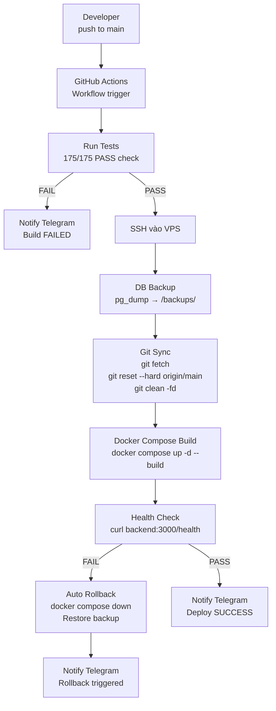

# Kiến trúc Deployment PickleFund

**Mục đích:** Mô tả quy trình CI/CD và deployment  
**Đối tượng:** DevOps, Developer  
**Cập nhật:** 2026-06-29

---

## 1. Sơ đồ CI/CD Pipeline V2



---

## 2. Docker Compose Services

```yaml
services:
  nginx:
    image: nginx:alpine
    ports: ["80:80", "443:443"]
    depends_on: [frontend, backend]

  frontend:
    build: ./frontend
    # Không expose port ra ngoài

  backend:
    build: ./backend
    # Không expose port ra ngoài
    env_file:
      - path: .env
        required: false  # QUAN TRỌNG: required: false
    depends_on: [postgres, redis]

  postgres:
    image: postgres:16-alpine
    # Không expose port ra ngoài
    volumes:
      - postgres_data:/var/lib/postgresql/data

  redis:
    image: redis:7-alpine
    # Không expose port ra ngoài
```

---

## 3. Nginx Configuration (quan trọng)

```nginx
upstream backend {
    server backend:3000;
}

server {
    listen 80;

    location / {
        root /usr/share/nginx/html;
        try_files $uri $uri/ /index.html;
    }

    location /api/ {
        proxy_pass http://backend/;  # ĐÚNG: dùng upstream name, không có port
        proxy_set_header Host $host;
        proxy_set_header X-Real-IP $remote_addr;
    }
}
```

**TUYỆT ĐỐI KHÔNG VIẾT:**
```nginx
proxy_pass http://backend:3000/;  # SAI khi đã có upstream block
```

---

## 4. Environment Variables (Production VPS)

Xem danh sách đầy đủ tại `.env` trên VPS. Không commit `.env` vào git.

**Biến quan trọng:**
- `DATABASE_URL` — PostgreSQL connection string
- `JWT_SECRET` — JWT signing secret
- `REDIS_URL` — Redis connection
- `VITE_API_URL` — Phải trỏ đến `https://api.picklefund.uk` (KHÔNG phải relative path)

---

## 5. Health Check

Backend expose `/health` endpoint. GitHub Actions kiểm tra sau deploy:
```bash
curl -f http://localhost:3000/health || exit 1
```

Nếu fail → auto rollback và notify Telegram.

---

## 6. Backup trước mỗi deploy

```bash
set -a; source .env; set +a
pg_dump $DATABASE_URL > /backups/backup_$(date +%Y%m%d_%H%M%S).sql
```

Giữ backup 7 ngày gần nhất.
