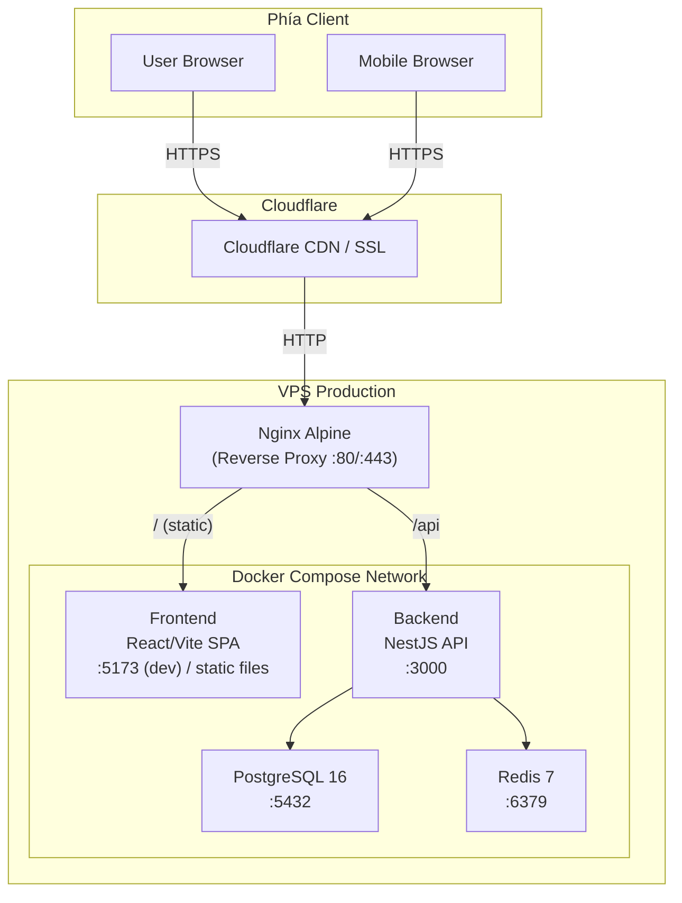

# Kiến trúc hệ thống PickleFund

**Mục đích:** Mô tả toàn bộ kiến trúc hệ thống  
**Đối tượng:** Developer, Architect, DevOps  
**Cập nhật:** 2026-06-29

---

## 1. Sơ đồ tổng thể



---

## 2. Các thành phần chính

### 2.1 Nginx Alpine (Reverse Proxy)
- Lắng nghe cổng 80 và 443
- Route `/` → serve React SPA static files
- Route `/api/` → proxy_pass đến backend NestJS
- SSL termination (qua Cloudflare hoặc trực tiếp)
- **Lưu ý quan trọng:** Khi đã có `upstream backend { server backend:3000; }` thì dùng `proxy_pass http://backend/` (không có port)

### 2.2 React/Vite Frontend
- SPA (Single Page Application)
- React 18 + TypeScript + Tailwind CSS
- State management: React Query + Zustand
- Routing: React Router v6
- Build output: static files được serve bởi Nginx

### 2.3 NestJS Backend
- REST API
- Module-based architecture
- TypeORM + PostgreSQL
- Redis cho session/cache
- Argon2 password hashing
- JWT + Refresh Token auth

### 2.4 PostgreSQL 16
- Database chính
- Multi-tenant: phân tách bằng `clubId` column
- Migrations qua TypeORM

### 2.5 Redis 7
- Lưu Refresh Token (có TTL)
- Cache dữ liệu tạm thời
- Không expose ra host network

---

## 3. Multi-tenant Architecture

PickleFund dùng **shared database, separate schemas** approach:
- Một database duy nhất
- Mỗi bảng có cột `clubId`
- Backend filter mọi query theo `clubId` từ JWT token
- Không có CLB nào có thể đọc dữ liệu CLB khác

---

## 4. Mạng nội bộ Docker

Tất cả services trong cùng Docker network, giao tiếp qua service name:
- `backend:3000` — NestJS
- `postgres:5432` — PostgreSQL
- `redis:6379` — Redis
- Backend KHÔNG expose port ra host (chỉ accessible qua Nginx)

---

## 5. Luồng xác thực

```
Client → POST /api/auth/login
  → Nginx → Backend
  → Kiểm tra email/password (Argon2 verify)
  → Tạo Access Token (short-lived)
  → Tạo Refresh Token (long-lived, hash + lưu Redis)
  → Trả về cả 2 token

Client → API request với Access Token (Authorization: Bearer)
  → Backend verify JWT
  → Extract clubId, userId từ payload
  → Xử lý request
```

---

## 6. Domain & SSL

| URL | Mục đích |
|---|---|
| app.picklefund.uk | Frontend SPA |
| api.picklefund.uk | Backend API |

Cloudflare quản lý SSL và CDN cho cả 2 domain.
