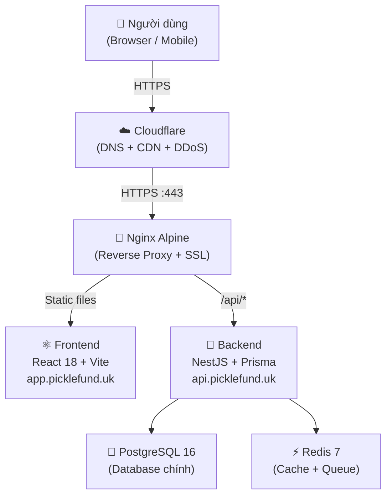

# Kiến trúc Hệ thống — PickleFund V2.0 RC1

> **Phiên bản:** V2.0 RC1 | **Ngày:** 2026-06-29  
> **Đối tượng:** Kỹ thuật viên, Kiến trúc sư hệ thống

---

## 1. Tổng quan kiến trúc

PickleFund V2.0 sử dụng kiến trúc **monolith container** với Docker Compose, triển khai trên một VPS duy nhất. Toàn bộ services được đóng gói trong Docker network riêng biệt, chỉ expose cổng qua Nginx reverse proxy.



---

## 2. Các thành phần chính

### 2.1 Nginx Alpine (Reverse Proxy)

| Thuộc tính | Giá trị |
|---|---|
| Image | `nginx:alpine` |
| Cổng expose | `443:443`, `80:80` |
| Chức năng | SSL termination, static file serving, API proxy |
| Config | `nginx/nginx.conf` |

**Routing rules:**
- `app.picklefund.uk` → Serve static files từ `/usr/share/nginx/html` (React SPA)
- `app.picklefund.uk/api/` → Proxy → `http://backend/api/`
- `api.picklefund.uk` → Proxy → `http://backend` (NestJS)
- HTTP 80 → Redirect 301 → HTTPS 443

### 2.2 Frontend (React / Vite)

| Thuộc tính | Giá trị |
|---|---|
| Framework | React 18 + TypeScript |
| Build tool | Vite 5 |
| Styling | Tailwind CSS 3 |
| Routing | React Router v6 |
| State | React hooks + Context |
| Build output | `/usr/share/nginx/html` (static) |

**Key pages:**
- `/` → Dashboard (ClubDashboard.tsx)
- `/attendance` → Điểm danh
- `/contributions` → Thu quỹ
- `/expenses` → Chi phí
- `/reports` → Báo cáo PDF
- `/minigames` → Quỹ Phụ / Minigame
- `/lisa` → Lisa AI Assistant

### 2.3 Backend (NestJS)

| Thuộc tính | Giá trị |
|---|---|
| Framework | NestJS 10 + TypeScript |
| ORM | Prisma 5 |
| Auth | JWT + Refresh Token + Argon2 |
| Port | 3000 (internal) |
| Health | `/health` endpoint |

**Modules:**
- `AuthModule` — đăng nhập, refresh token, Argon2 hashing
- `UsersModule` — quản lý tài khoản
- `ClubsModule` — quản lý CLB (multi-tenant)
- `FundPeriodsModule` — kỳ tài chính, carryForward
- `ContributionsModule` — thu quỹ
- `ExpensesModule` — chi phí
- `AttendanceModule` — điểm danh
- `ReportsModule` — báo cáo PDF
- `MinigamesModule` — quỹ phụ / minigame
- `LisaModule` — AI assistant
- `HealthModule` — `/health` check

### 2.4 PostgreSQL 16

| Thuộc tính | Giá trị |
|---|---|
| Image | `postgres:16-alpine` |
| Port | 5432 (internal only) |
| Volume | `picklefund_postgres_data` |
| Healthcheck | `pg_isready -U picklefund` |

**Không expose port ra host.** Chỉ backend container kết nối được.

### 2.5 Redis 7

| Thuộc tính | Giá trị |
|---|---|
| Image | `redis:7-alpine` |
| Port | 6379 (internal only) |
| Volume | `picklefund_redis_data` |
| Auth | Password bắt buộc |
| Dùng cho | Session cache, BullMQ queues |

---

## 3. Docker network

```
picklefund_network (bridge)
├── postgres      (picklefund-db)
├── redis         (picklefund-redis)
├── backend       (picklefund-api)
└── nginx         (picklefund-proxy)
```

Backend kết nối Postgres/Redis qua hostname nội bộ: `postgres:5432`, `redis:6379`.  
Nginx kết nối Backend qua upstream: `backend:3000`.  
**Không có port nào expose ra host ngoài nginx (443, 80).**

---

## 4. Luồng dữ liệu tài chính

```
[Thành viên đóng quỹ]
         │
         ▼
  ContributionsModule
  POST /api/contributions
         │
         ▼
  PostgreSQL: contributions table
         │
         ▼
  FundPeriodsModule.calculateSummary()
         │
         ├── financialCalculator.calculate(entries, options)
         │        options.carryForwardBalance = carryForward kỳ trước
         │
         ├── Quỹ Chính balance = Σthu - Σchi (chi phí sân + sinh hoạt)
         ├── Quỹ Phụ balance   = Σthu - Σchi (minigame)
         ├── Số dư chuyển kỳ   = balance kỳ đã đóng gần nhất
         └── Tổng tài sản CLB  = Quỹ Chính + Số dư chuyển kỳ
                                  (Quỹ Phụ KHÔNG cộng vào)
```

---

## 5. Luồng xác thực (Auth Flow)

```
[Client] POST /api/auth/login
         │
         ▼
[Backend] UsersService.validateUser()
  - Tìm user theo email
  - Argon2.verify(password, hash)
         │
         ▼
  Nếu valid:
  - Tạo accessToken (JWT, 15 phút)
  - Tạo refreshToken (JWT, 7 ngày, lưu hash vào DB)
  - Trả về: { accessToken, refreshToken, user }
         │
[Client] Gửi accessToken trong Authorization header
         │
[Backend] JwtAuthGuard verify → JwtStrategy → JwtUser
         │
         ▼
  Nếu accessToken hết hạn:
  POST /api/auth/refresh với refreshToken
  → Backend verify → cấp accessToken mới
```

---

## 6. CI/CD Pipeline

```
[Developer] git push origin main
         │
         ▼
[GitHub Actions] .github/workflows/deploy.yml
         │
         ├── 1. SSH vào VPS
         ├── 2. git fetch + reset --hard origin/main
         ├── 3. git clean -fd (bảo vệ .env, ssl/, *.sql)
         ├── 4. source .env → pg_dump backup
         ├── 5. docker compose build --no-cache
         ├── 6. docker compose down + up -d
         ├── 7. sleep 30
         ├── 8. Health check API + Frontend
         │
         ├── Thành công → Telegram notify ✅
         └── Thất bại   → git reset --hard PREV_COMMIT
                          docker compose rebuild
                          Health check lần 2
                          Telegram notify 🔄 / 🚨
```

---

## 7. Mô hình multi-tenant

PickleFund V2.0 hỗ trợ multi-tenant qua **Club isolation** ở tầng dữ liệu:

- Mỗi Club có `id` riêng
- Tất cả entities (FundPeriod, Contribution, Expense, Attendance) đều có `clubId`
- API endpoints luôn filter theo `clubId` từ JWT payload
- Admin có thể quản lý nhiều CLB
- Thành viên chỉ thấy dữ liệu CLB của mình

---

## 8. Chiến lược mở rộng (tương lai)

| Tầng | Hiện tại | Khi cần mở rộng |
|---|---|---|
| Compute | 1 VPS | Kubernetes / ECS |
| Database | PostgreSQL đơn | PostgreSQL + read replica |
| Cache | Redis đơn | Redis Cluster |
| File storage | Local volume | S3-compatible |
| Deploy | Docker Compose | Helm chart |
| Monitoring | Health check | Prometheus + Grafana |

---

## 9. Các quyết định kiến trúc quan trọng

### carryForward pattern
Calculator (`financial-calculator.service.ts`) là pure function — không truy vấn DB.  
`carryForwardBalance` được inject từ caller (`fund-periods.service.ts`) qua `CalculateOptions`.  
→ Dễ test, không side effect, tất cả existing tests không thay đổi.

### env_file: required: false
Docker Compose V2 syntax. Cho phép `docker compose config --env-file .env.example` chạy được trong CI mà không cần `.env` thật trên máy dev.

### git reset --hard thay git pull
`git pull` thất bại nếu VPS có local changes (ví dụ: `nginx.conf` bị edit trực tiếp).  
`git reset --hard origin/main` luôn thành công, đảm bảo VPS sync chính xác với main.

### Nginx upstream name (không dùng port)
Khi đã khai báo `upstream backend { server backend:3000; }`, dùng `proxy_pass http://backend/` thay vì `http://backend:3000/` để tránh lỗi "upstream already defines port".
